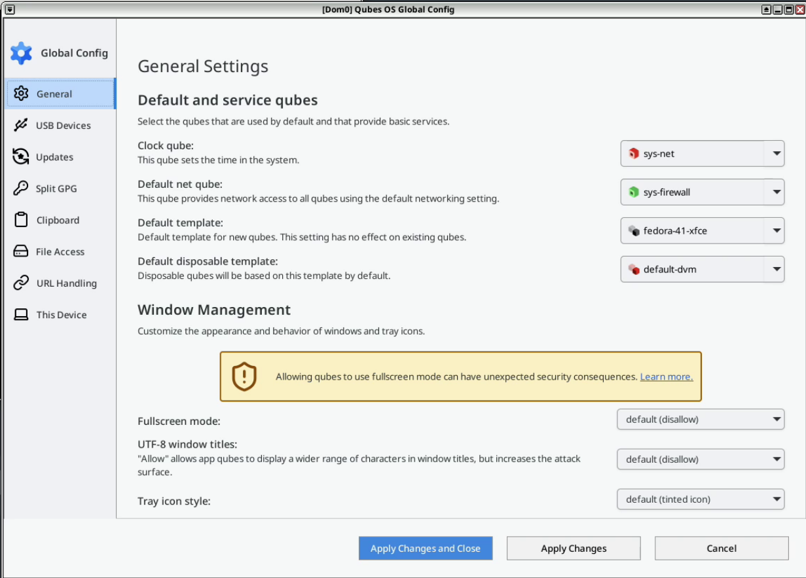

# Qubes OS updates Weekly Review - Y2025-W09

### Introduction

Weekly review of new packages uploaded to Qubes OS repositories. Link to previous version [here](https://forum.qubes-os.org/t/qubes-os-updates-weekly-review-y2025-w08/32471).

[details="Alphabetically sorted list of new packages uploaded to Qubes OS repositories"]
```bash
awesome-4.3-15.fc42.x86_64.rpm
awesome-doc-4.3-15.fc42.noarch.rpm
disk-password-gui-1.0.1-1.fc42.noarch.rpm
dummy-backlight-dom0-1.0.1-3.fc42.noarch.rpm
dummy-backlight-module-1.0.1-3.fc42.noarch.rpm
dummy-backlight-vm-1.0.1-3.fc42.noarch.rpm
dummy-psu-module-1.0.0-3.fc42.x86_64.rpm
dummy-psu-receiver-1.0.0-3.fc42.x86_64.rpm
dummy-psu-sender-1.0.0-3.fc42.x86_64.rpm
flashrom-1.3.0-1.fc41.x86_64.rpm
flashrom-devel-1.3.0-1.fc41.x86_64.rpm
fwupd-qubes-dom0-1.9.28-1.fc40.noarch.rpm
fwupd-qubes-dom0-1.9.28-1.fc41.noarch.rpm
fwupd-qubes-dom0-1.9.28-1.fc42.noarch.rpm
fwupd-qubes-vm_1.9.28-1+deb12u1_amd64.deb
fwupd-qubes-vm_1.9.28-1+deb13u1_amd64.deb
fwupd-qubes-vm-1.9.28-1.fc40.noarch.rpm
fwupd-qubes-vm-1.9.28-1.fc41.noarch.rpm
fwupd-qubes-vm-1.9.28-1.fc42.noarch.rpm
fwupd-qubes-vm_1.9.28-1+jammy1_amd64.deb
fwupd-qubes-vm_1.9.28-1+noble1_amd64.deb
grubby-dummy-9.0.0-4.fc42.noarch.rpm
i3-4.23-2.fc42.x86_64.rpm
i3-devel-4.23-2.fc42.x86_64.rpm
i3-devel-doc-4.23-2.fc42.noarch.rpm
i3-doc-4.23-2.fc42.noarch.rpm
i3-settings-qubes-1.12-1.fc42.noarch.rpm
kde-settings-qubes-6.2.0-2.fc42.noarch.rpm
kernel-6.12.16-1.qubes.fc37.x86_64.rpm
kernel-6.12.16-1.qubes.fc41.x86_64.rpm
kernel-6.6.77-1.qubes.fc37.x86_64.rpm
kernel-devel-6.12.16-1.qubes.fc37.x86_64.rpm
kernel-devel-6.12.16-1.qubes.fc41.x86_64.rpm
kernel-devel-6.6.77-1.qubes.fc37.x86_64.rpm
kernel-modules-6.12.16-1.qubes.fc37.x86_64.rpm
kernel-modules-6.12.16-1.qubes.fc41.x86_64.rpm
kernel-modules-6.6.77-1.qubes.fc37.x86_64.rpm
kernel-qubes-vm-6.12.16-1.qubes.fc37.x86_64.rpm
kernel-qubes-vm-6.12.16-1.qubes.fc41.x86_64.rpm
kernel-qubes-vm-6.6.77-1.qubes.fc37.x86_64.rpm
libqrexec-utils4_4.3.4-1+deb12u1_amd64.deb
libqrexec-utils4_4.3.4-1+deb13u1_amd64.deb
libqrexec-utils4_4.3.4-1+jammy1_amd64.deb
libqrexec-utils4_4.3.4-1+noble1_amd64.deb
libqrexec-utils4-dbgsym_4.3.4-1+deb12u1_amd64.deb
libqrexec-utils4-dbgsym_4.3.4-1+deb13u1_amd64.deb
libqrexec-utils-dev_4.3.4-1+deb12u1_amd64.deb
libqrexec-utils-dev_4.3.4-1+deb13u1_amd64.deb
libqrexec-utils-dev_4.3.4-1+jammy1_amd64.deb
libqrexec-utils-dev_4.3.4-1+noble1_amd64.deb
libqubes-pure0_4.3.8+deb12u1_amd64.deb
libqubes-pure0_4.3.8+deb13u1_amd64.deb
libqubes-pure0_4.3.8+jammy1_amd64.deb
libqubes-pure0_4.3.8+noble1_amd64.deb
libqubes-pure0-dbgsym_4.3.8+deb12u1_amd64.deb
libqubes-pure0-dbgsym_4.3.8+deb13u1_amd64.deb
libqubes-pure-dev_4.3.8+deb12u1_amd64.deb
libqubes-pure-dev_4.3.8+deb13u1_amd64.deb
libqubes-pure-dev_4.3.8+jammy1_amd64.deb
libqubes-pure-dev_4.3.8+noble1_amd64.deb
libqubes-rpc-filecopy2_4.3.8+deb12u1_amd64.deb
libqubes-rpc-filecopy2_4.3.8+deb13u1_amd64.deb
libqubes-rpc-filecopy2_4.3.8+jammy1_amd64.deb
libqubes-rpc-filecopy2_4.3.8+noble1_amd64.deb
libqubes-rpc-filecopy2-dbgsym_4.3.8+deb12u1_amd64.deb
libqubes-rpc-filecopy2-dbgsym_4.3.8+deb13u1_amd64.deb
libqubes-rpc-filecopy-dev_4.3.8+deb12u1_amd64.deb
libqubes-rpc-filecopy-dev_4.3.8+deb13u1_amd64.deb
libqubes-rpc-filecopy-dev_4.3.8+jammy1_amd64.deb
libqubes-rpc-filecopy-dev_4.3.8+noble1_amd64.deb
libwnck3-43.0-10.fc42.x86_64.rpm
libwnck3-devel-43.0-10.fc42.x86_64.rpm
pipewire-qubes_4.3.6-1+deb12u1_amd64.deb
pipewire-qubes_4.3.6-1+deb13u1_amd64.deb
pipewire-qubes-4.3.6-1.fc40.x86_64.rpm
pipewire-qubes-4.3.6-1.fc41.x86_64.rpm
pipewire-qubes-4.3.6-1.fc42.x86_64.rpm
pipewire-qubes_4.3.6-1+jammy1_amd64.deb
pipewire-qubes_4.3.6-1+noble1_amd64.deb
pipewire-qubes-4.3.6-1-x86_64.pkg.tar.zst
pipewire-qubes-dbgsym_4.3.6-1+deb12u1_amd64.deb
pipewire-qubes-dbgsym_4.3.6-1+deb13u1_amd64.deb
plasma-breeze-qubes-6.2.0-2.fc42.noarch.rpm
pulseaudio-qubes_4.3.6-1+deb12u1_amd64.deb
pulseaudio-qubes_4.3.6-1+deb13u1_amd64.deb
pulseaudio-qubes-4.3.6-1.fc40.x86_64.rpm
pulseaudio-qubes-4.3.6-1.fc41.x86_64.rpm
pulseaudio-qubes-4.3.6-1.fc42.x86_64.rpm
pulseaudio-qubes_4.3.6-1+jammy1_amd64.deb
pulseaudio-qubes_4.3.6-1+noble1_amd64.deb
pulseaudio-qubes-dbgsym_4.3.6-1+deb12u1_amd64.deb
pulseaudio-qubes-dbgsym_4.3.6-1+deb13u1_amd64.deb
python3-dnf-plugins-qubes-hooks-4.3.18-1.fc40.noarch.rpm
python3-objgraph-3.6.1-1.fc42.noarch.rpm
python3-qasync-0.27.1-1.fc42.noarch.rpm
python3-qrexec_4.3.4-1+deb12u1_amd64.deb
python3-qrexec_4.3.4-1+deb13u1_amd64.deb
python3-qrexec_4.3.4-1+jammy1_amd64.deb
python3-qrexec_4.3.4-1+noble1_amd64.deb
python3-qubesadmin-4.3.10-1.fc42.noarch.rpm
python3-qubesdb-4.2.7-1.fc42.x86_64.rpm
python3-qubesimgconverter-4.3.8-1.fc40.x86_64.rpm
python3-qubesimgconverter-4.3.8-1.fc41.x86_64.rpm
python3-qubesimgconverter-4.3.8-1.fc42.x86_64.rpm
python3-qubesimgconverter_4.3.8+deb12u1_amd64.deb
python3-qubesimgconverter_4.3.8+deb13u1_amd64.deb
python3-qubesimgconverter_4.3.8+jammy1_amd64.deb
python3-qubesimgconverter_4.3.8+noble1_amd64.deb
python3-xen-4.19.1-4.fc41.x86_64.rpm
python-objgraph-doc-3.6.1-1.fc42.noarch.rpm
qubes-app-shutdown-idle-1.0.11-1.fc42.noarch.rpm
qubes-artwork_4.3.6-1+deb12u1_amd64.deb
qubes-artwork_4.3.6-1+deb13u1_amd64.deb
qubes-artwork-4.3.6-1.fc40.noarch.rpm
qubes-artwork-4.3.6-1.fc41.noarch.rpm
qubes-artwork-4.3.6-1.fc42.noarch.rpm
qubes-artwork_4.3.6-1+jammy1_amd64.deb
qubes-artwork_4.3.6-1+noble1_amd64.deb
qubes-artwork-anaconda-4.3.6-1.fc40.noarch.rpm
qubes-artwork-anaconda-4.3.6-1.fc41.noarch.rpm
qubes-artwork-anaconda-4.3.6-1.fc42.noarch.rpm
qubes-artwork-efi-4.3.6-1.fc40.noarch.rpm
qubes-artwork-efi-4.3.6-1.fc41.noarch.rpm
qubes-artwork-efi-4.3.6-1.fc42.noarch.rpm
qubes-artwork-plymouth-4.3.6-1.fc40.noarch.rpm
qubes-artwork-plymouth-4.3.6-1.fc41.noarch.rpm
qubes-artwork-plymouth-4.3.6-1.fc42.noarch.rpm
qubes-audio-daemon-4.3.7-1.fc42.x86_64.rpm
qubes-audio-dom0-4.3.7-1.fc42.x86_64.rpm
qubes-core-admin-client-4.3.10-1.fc42.noarch.rpm
qubes-core-agent_4.3.18-1+deb12u1_amd64.deb
qubes-core-agent_4.3.18-1+deb13u1_amd64.deb
qubes-core-agent-4.3.18-1.fc40.x86_64.rpm
qubes-core-agent-4.3.18-1.fc41.x86_64.rpm
qubes-core-agent-4.3.18-1.fc42.x86_64.rpm
qubes-core-agent_4.3.18-1+jammy1_amd64.deb
qubes-core-agent_4.3.18-1+noble1_amd64.deb
qubes-core-agent-caja_4.3.18-1+deb12u1_amd64.deb
qubes-core-agent-caja_4.3.18-1+deb13u1_amd64.deb
qubes-core-agent-caja-4.3.18-1.fc40.x86_64.rpm
qubes-core-agent-caja-4.3.18-1.fc41.x86_64.rpm
qubes-core-agent-caja-4.3.18-1.fc42.x86_64.rpm
qubes-core-agent-caja_4.3.18-1+jammy1_amd64.deb
qubes-core-agent-caja_4.3.18-1+noble1_amd64.deb
qubes-core-agent-dbgsym_4.3.18-1+deb12u1_amd64.deb
qubes-core-agent-dbgsym_4.3.18-1+deb13u1_amd64.deb
qubes-core-agent-dom0-updates_4.3.18-1+deb12u1_amd64.deb
qubes-core-agent-dom0-updates_4.3.18-1+deb13u1_amd64.deb
qubes-core-agent-dom0-updates-4.3.18-1.fc40.noarch.rpm
qubes-core-agent-dom0-updates-4.3.18-1.fc41.noarch.rpm
qubes-core-agent-dom0-updates-4.3.18-1.fc42.noarch.rpm
qubes-core-agent-dom0-updates_4.3.18-1+jammy1_amd64.deb
qubes-core-agent-dom0-updates_4.3.18-1+noble1_amd64.deb
qubes-core-agent-nautilus_4.3.18-1+deb12u1_amd64.deb
qubes-core-agent-nautilus_4.3.18-1+deb13u1_amd64.deb
qubes-core-agent-nautilus-4.3.18-1.fc40.x86_64.rpm
qubes-core-agent-nautilus-4.3.18-1.fc41.x86_64.rpm
qubes-core-agent-nautilus-4.3.18-1.fc42.x86_64.rpm
qubes-core-agent-nautilus_4.3.18-1+jammy1_amd64.deb
qubes-core-agent-nautilus_4.3.18-1+noble1_amd64.deb
qubes-core-agent-networking_4.3.18-1+deb12u1_amd64.deb
qubes-core-agent-networking_4.3.18-1+deb13u1_amd64.deb
qubes-core-agent-networking-4.3.18-1.fc40.noarch.rpm
qubes-core-agent-networking-4.3.18-1.fc41.noarch.rpm
qubes-core-agent-networking-4.3.18-1.fc42.noarch.rpm
qubes-core-agent-networking_4.3.18-1+jammy1_amd64.deb
qubes-core-agent-networking_4.3.18-1+noble1_amd64.deb
qubes-core-agent-network-manager_4.3.18-1+deb12u1_amd64.deb
qubes-core-agent-network-manager_4.3.18-1+deb13u1_amd64.deb
qubes-core-agent-network-manager-4.3.18-1.fc40.noarch.rpm
qubes-core-agent-network-manager-4.3.18-1.fc41.noarch.rpm
qubes-core-agent-network-manager-4.3.18-1.fc42.noarch.rpm
qubes-core-agent-network-manager_4.3.18-1+jammy1_amd64.deb
qubes-core-agent-network-manager_4.3.18-1+noble1_amd64.deb
qubes-core-agent-passwordless-root_4.3.18-1+deb12u1_amd64.deb
qubes-core-agent-passwordless-root_4.3.18-1+deb13u1_amd64.deb
qubes-core-agent-passwordless-root-4.3.18-1.fc40.noarch.rpm
qubes-core-agent-passwordless-root-4.3.18-1.fc41.noarch.rpm
qubes-core-agent-passwordless-root-4.3.18-1.fc42.noarch.rpm
qubes-core-agent-passwordless-root_4.3.18-1+jammy1_amd64.deb
qubes-core-agent-passwordless-root_4.3.18-1+noble1_amd64.deb
qubes-core-agent-selinux-4.3.18-1.fc40.noarch.rpm
qubes-core-agent-selinux-4.3.18-1.fc41.noarch.rpm
qubes-core-agent-selinux-4.3.18-1.fc42.noarch.rpm
qubes-core-agent-systemd-4.3.18-1.fc40.x86_64.rpm
qubes-core-agent-systemd-4.3.18-1.fc41.x86_64.rpm
qubes-core-agent-systemd-4.3.18-1.fc42.x86_64.rpm
qubes-core-agent-thunar_4.3.18-1+deb12u1_amd64.deb
qubes-core-agent-thunar_4.3.18-1+deb13u1_amd64.deb
qubes-core-agent-thunar-4.3.18-1.fc40.x86_64.rpm
qubes-core-agent-thunar-4.3.18-1.fc41.x86_64.rpm
qubes-core-agent-thunar-4.3.18-1.fc42.x86_64.rpm
qubes-core-agent-thunar_4.3.18-1+jammy1_amd64.deb
qubes-core-agent-thunar_4.3.18-1+noble1_amd64.deb
qubes-core-dom0-4.3.19-1.fc41.noarch.rpm
qubes-core-qrexec_4.3.4-1+deb12u1_amd64.deb
qubes-core-qrexec_4.3.4-1+deb13u1_amd64.deb
qubes-core-qrexec-4.3.4-1.fc40.x86_64.rpm
qubes-core-qrexec-4.3.4-1.fc41.x86_64.rpm
qubes-core-qrexec-4.3.4-1.fc42.x86_64.rpm
qubes-core-qrexec_4.3.4-1+jammy1_amd64.deb
qubes-core-qrexec_4.3.4-1+noble1_amd64.deb
qubes-core-qrexec-dbgsym_4.3.4-1+deb12u1_amd64.deb
qubes-core-qrexec-dbgsym_4.3.4-1+deb13u1_amd64.deb
qubes-core-qrexec-devel-4.3.4-1.fc40.x86_64.rpm
qubes-core-qrexec-devel-4.3.4-1.fc41.x86_64.rpm
qubes-core-qrexec-devel-4.3.4-1.fc42.x86_64.rpm
qubes-core-qrexec-dom0-4.3.4-1.fc41.x86_64.rpm
qubes-core-qrexec-libs-4.3.4-1.fc40.x86_64.rpm
qubes-core-qrexec-libs-4.3.4-1.fc41.x86_64.rpm
qubes-core-qrexec-libs-4.3.4-1.fc42.x86_64.rpm
qubes-core-qrexec-vm-4.3.4-1.fc40.x86_64.rpm
qubes-core-qrexec-vm-4.3.4-1.fc41.x86_64.rpm
qubes-core-qrexec-vm-4.3.4-1.fc42.x86_64.rpm
qubes-core-qrexec-vm-selinux-4.3.4-1.fc40.x86_64.rpm
qubes-core-qrexec-vm-selinux-4.3.4-1.fc41.x86_64.rpm
qubes-core-qrexec-vm-selinux-4.3.4-1.fc42.x86_64.rpm
qubes-ctap-2.0.6-1.fc42.noarch.rpm
qubes-db-4.2.7-1.fc42.x86_64.rpm
qubes-db-devel-4.2.7-1.fc42.x86_64.rpm
qubes-db-libs-4.2.7-1.fc42.x86_64.rpm
qubes-db-vm-4.2.7-1.fc42.x86_64.rpm
qubes-db-vm-selinux-4.2.7-1.fc42.x86_64.rpm
qubes-desktop-linux-common-4.2.13-1.fc42.noarch.rpm
qubes-desktop-linux-manager-4.3.9-1.fc42.noarch.rpm
qubes-desktop-linux-menu-1.2.2-1.fc42.noarch.rpm
qubes-gpg-sign-1.0.0-1.fc42.x86_64.rpm
qubes-gpg-split-2.0.75-1.fc42.x86_64.rpm
qubes-gpg-split-tests-2.0.75-1.fc42.x86_64.rpm
qubes-gui-agent_4.3.6-1+deb12u1_amd64.deb
qubes-gui-agent_4.3.6-1+deb13u1_amd64.deb
qubes-gui-agent-4.3.6-1.fc40.x86_64.rpm
qubes-gui-agent-4.3.6-1.fc41.x86_64.rpm
qubes-gui-agent-4.3.6-1.fc42.x86_64.rpm
qubes-gui-agent_4.3.6-1+jammy1_amd64.deb
qubes-gui-agent_4.3.6-1+noble1_amd64.deb
qubes-gui-agent-dbgsym_4.3.6-1+deb12u1_amd64.deb
qubes-gui-agent-dbgsym_4.3.6-1+deb13u1_amd64.deb
qubes-gui-agent-selinux-4.3.6-1.fc40.noarch.rpm
qubes-gui-agent-selinux-4.3.6-1.fc41.noarch.rpm
qubes-gui-agent-selinux-4.3.6-1.fc42.noarch.rpm
qubes-gui-agent-xfce_4.3.6-1+deb12u1_amd64.deb
qubes-gui-agent-xfce_4.3.6-1+deb13u1_amd64.deb
qubes-gui-agent-xfce-4.3.6-1.fc40.x86_64.rpm
qubes-gui-agent-xfce-4.3.6-1.fc41.x86_64.rpm
qubes-gui-agent-xfce-4.3.6-1.fc42.x86_64.rpm
qubes-gui-agent-xfce_4.3.6-1+jammy1_amd64.deb
qubes-gui-agent-xfce_4.3.6-1+noble1_amd64.deb
qubes-gui-common-devel-4.3.0-1.fc42.noarch.rpm
qubes-gui-daemon-4.3.7-1.fc42.x86_64.rpm
qubes-gui-daemon-selinux-4.3.7-1.fc42.x86_64.rpm
qubes-gui-dom0-4.3.7-1.fc42.x86_64.rpm
qubes-gui-vnc_4.3.6-1+deb12u1_amd64.deb
qubes-gui-vnc_4.3.6-1+deb13u1_amd64.deb
qubes-gui-vnc-4.3.6-1.fc40.x86_64.rpm
qubes-gui-vnc-4.3.6-1.fc41.x86_64.rpm
qubes-gui-vnc-4.3.6-1.fc42.x86_64.rpm
qubes-gui-vnc_4.3.6-1+jammy1_amd64.deb
qubes-gui-vnc_4.3.6-1+noble1_amd64.deb
qubes-img-converter-1.2.18-1.fc42.noarch.rpm
qubes-input-proxy-1.0.40-1.fc42.x86_64.rpm
qubes-input-proxy-receiver-1.0.40-1.fc42.x86_64.rpm
qubes-input-proxy-sender-1.0.40-1.fc42.x86_64.rpm
qubes-kernel-vm-support-4.3.8-1.fc40.x86_64.rpm
qubes-kernel-vm-support-4.3.8-1.fc41.x86_64.rpm
qubes-kernel-vm-support-4.3.8-1.fc42.x86_64.rpm
qubes-kernel-vm-support_4.3.8+deb12u1_amd64.deb
qubes-kernel-vm-support_4.3.8+deb13u1_amd64.deb
qubes-kernel-vm-support_4.3.8+jammy1_amd64.deb
qubes-kernel-vm-support_4.3.8+noble1_amd64.deb
qubes-kernel-vm-support-dbgsym_4.3.8+deb12u1_amd64.deb
qubes-kernel-vm-support-dbgsym_4.3.8+deb13u1_amd64.deb
qubes-libvchan-xen-4.2.6-1.fc42.x86_64.rpm
qubes-libvchan-xen-devel-4.2.6-1.fc42.x86_64.rpm
qubes-manager-4.3.9-1.fc42.noarch.rpm
qubes-menus-4.2.13-1.fc42.noarch.rpm
qubes-mgmt-salt-4.2.2-1.fc42.noarch.rpm
qubes-mgmt-salt-admin-tools-4.2.2-1.fc42.noarch.rpm
qubes-mgmt-salt-base-4.3.0-1.fc42.noarch.rpm
qubes-mgmt-salt-base-config-4.1.2-1.fc42.noarch.rpm
qubes-mgmt-salt-base-topd-4.3.0-1.fc42.noarch.rpm
qubes-mgmt-salt-config-4.2.2-1.fc42.noarch.rpm
qubes-mgmt-salt-dom0-qubes-infrastructure-4.2.0-1.fc41.noarch.rpm
qubes-mgmt-salt-dom0-virtual-machines-4.3.0-1.fc41.noarch.rpm
qubes-mgmt-salt-shared-formulas-4.2.2-1.fc42.noarch.rpm
qubes-mgmt-salt-vm-connector-4.2.2-1.fc42.noarch.rpm
qubes-pdf-converter-2.1.23-1.fc42.noarch.rpm
qubes-repo-contrib-4.3.1-1.fc42.noarch.rpm
qubes-repo-templates-4.3.2-1.fc42.noarch.rpm
qubes-rpm-oxide-0.2.8-1.fc42.x86_64.rpm
qubes-snapd-helper-1.0.4-1.fc42.noarch.rpm
qubes-usb-proxy-4.3.0-1.fc42.noarch.rpm
qubes-utils-4.3.8-1.fc40.x86_64.rpm
qubes-utils-4.3.8-1.fc41.x86_64.rpm
qubes-utils-4.3.8-1.fc42.x86_64.rpm
qubes-utils_4.3.8+deb12u1_amd64.deb
qubes-utils_4.3.8+deb13u1_amd64.deb
qubes-utils_4.3.8+jammy1_amd64.deb
qubes-utils_4.3.8+noble1_amd64.deb
qubes-utils-dbgsym_4.3.8+deb12u1_amd64.deb
qubes-utils-dbgsym_4.3.8+deb13u1_amd64.deb
qubes-utils-devel-4.3.8-1.fc40.x86_64.rpm
qubes-utils-devel-4.3.8-1.fc41.x86_64.rpm
qubes-utils-devel-4.3.8-1.fc42.x86_64.rpm
qubes-utils-libs-4.3.8-1.fc40.x86_64.rpm
qubes-utils-libs-4.3.8-1.fc41.x86_64.rpm
qubes-utils-libs-4.3.8-1.fc42.x86_64.rpm
qubes-utils-selinux-4.3.8-1.fc40.x86_64.rpm
qubes-utils-selinux-4.3.8-1.fc41.x86_64.rpm
qubes-utils-selinux-4.3.8-1.fc42.x86_64.rpm
qubes-video-companion-1.1.4-1.fc42.noarch.rpm
qubes-video-companion-docs-1.1.4-1.fc42.noarch.rpm
qubes-video-companion-license-1.1.4-1.fc42.noarch.rpm
qubes-video-companion-receiver-1.1.4-1.fc42.noarch.rpm
qubes-video-companion-sender-1.1.4-1.fc42.noarch.rpm
qubes-vm-core-4.3.18-1-x86_64.pkg.tar.zst
qubes-vm-dependencies-4.3.1-1.fc42.noarch.rpm
qubes-vm-dom0-updates-4.3.18-1-x86_64.pkg.tar.zst
qubes-vm-gui-4.3.6-1-x86_64.pkg.tar.zst
qubes-vm-guivm-4.3.1-1.fc42.noarch.rpm
qubes-vm-kernel-support-4.3.8-1-x86_64.pkg.tar.zst
qubes-vm-keyring-4.3.18-1-x86_64.pkg.tar.zst
qubes-vm-meta-packages-4.3.1-1.fc42.noarch.rpm
qubes-vm-networking-4.3.18-1-x86_64.pkg.tar.zst
qubes-vm-passwordless-root-4.3.18-1-x86_64.pkg.tar.zst
qubes-vm-pulseaudio-4.3.6-1-x86_64.pkg.tar.zst
qubes-vm-qrexec-4.3.4-1-x86_64.pkg.tar.zst
qubes-vm-recommended-4.3.1-1.fc42.noarch.rpm
qubes-vm-utils-4.3.8-1-x86_64.pkg.tar.zst
qubes-vm-xen-4.19.1-4-x86_64.pkg.tar.zst
scrypt-1.3.2-1.fc42.x86_64.rpm
split-gpg2-1.1.3-1.fc42.noarch.rpm
split-gpg2-tests-1.1.3-1.fc42.noarch.rpm
thunderbird-qubes-2.0.8-1.fc42.noarch.rpm
xen-4.19.1-4.fc41.x86_64.rpm
xen-devel-4.19.1-4.fc41.x86_64.rpm
xen-doc-4.19.1-4.fc41.noarch.rpm
xen-hvm-stubdom-linux-4.3.3-1.fc41.x86_64.rpm
xen-hvm-stubdom-linux-full-4.3.3-1.fc41.x86_64.rpm
xen-hypervisor-4.19.1-4.fc41.x86_64.rpm
xen-libs-4.19.1-4.fc41.x86_64.rpm
xen-licenses-4.19.1-4.fc41.x86_64.rpm
xen-runtime-4.19.1-4.fc41.x86_64.rpm
xfce4-settings-qubes-4.2.3-1.fc42.noarch.rpm
xfdesktop-4.18.1-7.fc42.x86_64.rpm
xserver-xorg-input-qubes_4.3.6-1+deb12u1_amd64.deb
xserver-xorg-input-qubes_4.3.6-1+deb13u1_amd64.deb
xserver-xorg-input-qubes_4.3.6-1+jammy1_amd64.deb
xserver-xorg-input-qubes_4.3.6-1+noble1_amd64.deb
xserver-xorg-input-qubes-dbgsym_4.3.6-1+deb12u1_amd64.deb
xserver-xorg-input-qubes-dbgsym_4.3.6-1+deb13u1_amd64.deb
xserver-xorg-qubes-common_4.3.6-1+deb12u1_amd64.deb
xserver-xorg-qubes-common_4.3.6-1+deb13u1_amd64.deb
xserver-xorg-qubes-common_4.3.6-1+jammy1_amd64.deb
xserver-xorg-qubes-common_4.3.6-1+noble1_amd64.deb
xserver-xorg-qubes-common-dbgsym_4.3.6-1+deb12u1_amd64.deb
xserver-xorg-qubes-common-dbgsym_4.3.6-1+deb13u1_amd64.deb
xserver-xorg-video-dummyqbs_4.3.6-1+deb12u1_amd64.deb
xserver-xorg-video-dummyqbs_4.3.6-1+deb13u1_amd64.deb
xserver-xorg-video-dummyqbs_4.3.6-1+jammy1_amd64.deb
xserver-xorg-video-dummyqbs_4.3.6-1+noble1_amd64.deb
xserver-xorg-video-dummyqbs-dbgsym_4.3.6-1+deb12u1_amd64.deb
xserver-xorg-video-dummyqbs-dbgsym_4.3.6-1+deb13u1_amd64.deb
```
[/details]

### Highlights
- Fedora 42 testing repository is created.

### Details
In addition to the usual minor fixes and patches (full list [here](https://github.com/QubesOS/updates-status/issues?q=is%3Aissue+created%3A2025-02-24..2025-03-02)):

* **fwupd** [v1.9.28-1](https://github.com/QubesOS/qubes-fwupd/compare/v1.8.17-2...v1.9.28-1) (r4.3)
The 1st sign of a commit related to [Fedora 42 template](https://github.com/QubesOS/qubes-issues/issues/9807) preparation. Fedora 42 will unify `/usr/bin`, `/usr/sbin`, `/bin` & `/sbin` all together in one unique directory. And all others will be simply symlinks to the mentioned directory. More details [here](https://fedoraproject.org/wiki/Changes/Unify_bin_and_sbin). As a result of the mentioned decision, `qubes-fwupdmgr` binary which is the front-end to Richard Hughes's popular [LVFS/fwupd](https://en.wikipedia.org/wiki/Fwupd) Firmware upgrade utility for UEFI systems is moved to `/usr/bin`.

* **gui-agent-linux** [v4.3.6](https://github.com/QubesOS/qubes-gui-agent-linux/compare/v4.3.5...v4.3.6) (r4.3)
While building packages for Fedora 42, the new improved GCC 15 compiler complained on the wrong definition of a function argument (which is fixed here).

* **core-qrexec** [v4.3.4](https://github.com/QubesOS/qubes-core-qrexec/compare/v4.3.3...v4.3.4) (r4.3)
Minor fixes and some precautionary security hardening of qrexec. Dropping an unneeded package which is purged from Fedora 42.

* **linux-utils** [v4.3.8](https://github.com/QubesOS/qubes-linux-utils/compare/v4.3.7...v4.3.8) (r4.3)
. The C compiler in GCC 15 (in Fedora 42) is upgraded to use [C(20)23 standard revision](https://en.wikipedia.org/wiki/C23_(C_standard_revision)). This is a huge improvement and change to C language after previous standard ([C(20)17](https://en.wikipedia.org/wiki/C17_(C_standard_revision))). Unfortunately the changes in new standard broke compiling of qrexec UTF-8 string validator tests. Thus, the old standard is enforced here.
. Another patch related to unification of `bin` and `sbin`.
. Minor fixes

* **linux-kernel** [v6.12.16-1](https://github.com/QubesOS/qubes-linux-kernel/compare/v6.12.11-1-latest...v6.12.16-1) (r4.3)
  **linux-kernel-66** [v6.6.77-1](https://github.com/QubesOS/qubes-linux-kernel/compare/v6.6.75-1...v6.6.77-1) (r4.2)
Refer to the explanation from last week on how to find additional useful information on Kernel changes.

* **core-agent-linux** [v4.3.18](https://github.com/QubesOS/qubes-core-agent-linux/compare/v4.3.17...v4.3.18) (r4.3)

* **mgmt-salt-dom0-virtual-machines** [v4.3.0](https://github.com/QubesOS/qubes-mgmt-salt-dom0-virtual-machines/compare/v4.2.20...v4.3.0) (r4.3)
Assuring `nomodeset` Kernel option is not enabled for sys-gui-gpu.

* **core-admin** [v4.3.19](https://github.com/QubesOS/qubes-core-admin/compare/v4.3.18...v4.3.19) (r4.3)
. A new `prohibit-start` feature is introduced which will prevent start of a qube at all conditions (via qvm-run, qrexec, Qube Manager, Updater). This is useful for templates user really wants to keep in the original, unmodified state; known compromised qubes, waiting for some forensics analysis or restoring; qube that user wants to re-configure and need not running for this (for example change its template) but the qube is a target of a frequent qrexec calls). The feature value could have the rationale for the prohibition. Like below:


. The main part of filtering out `nomodeset` if GPU is attached to an HVM.

#### Epilogue
With the introduction of C23 and C++23 (actually both finalized in 2024), the good old programming language pair receive major improvements. While the memory safe languages such as Rust will have their own place, C is not going to go away. If you are looking for a modern statically strongly typed programming language, I would recommend you to take a 2nd look.
