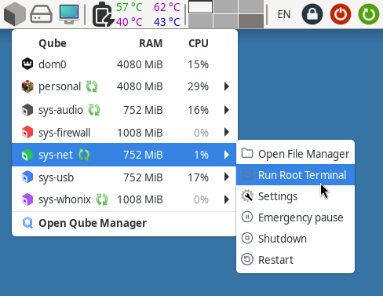
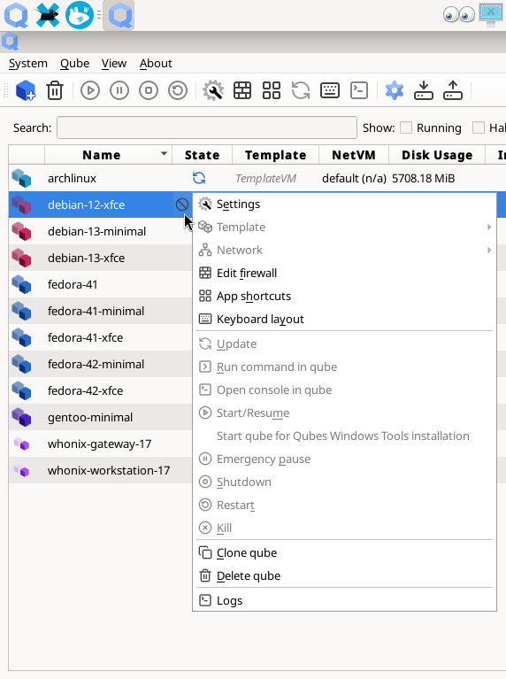
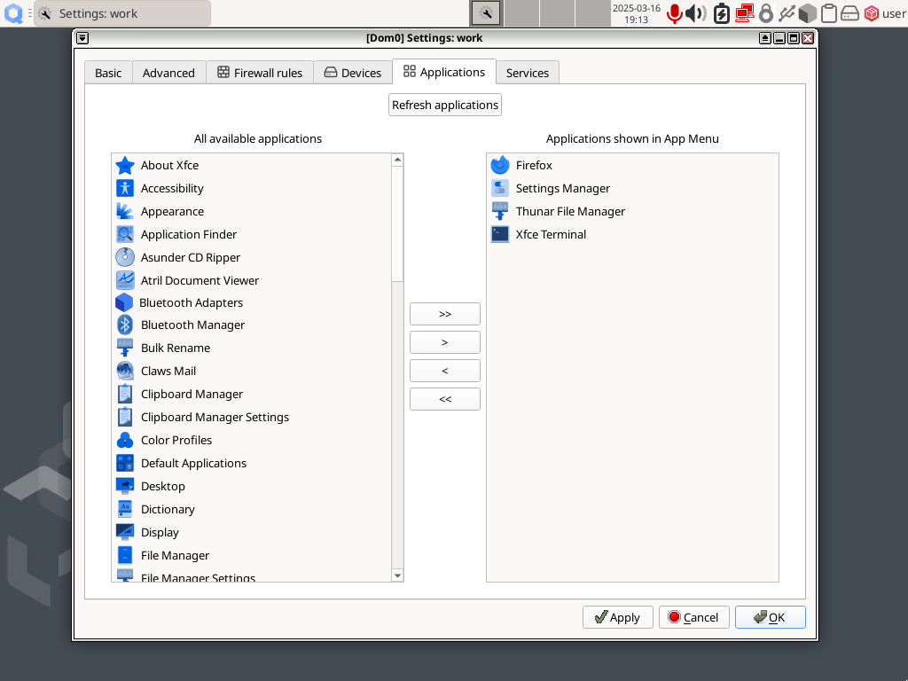

# Qubes OS updates Weekly Review - Y2025-W11

### Introduction

Weekly review of new packages uploaded to Qubes OS repositories. Link to previous version [here](https://forum.qubes-os.org/t/qubes-os-updates-weekly-review-y2025-w10/32794).

<details>
<summary>Alphabetically sorted list of new packages uploaded to Qubes OS repositories</summary>

```bash
amd-gpu-firmware-20250311-1.fc37.noarch.rpm
amd-gpu-firmware-20250311-1.fc41.noarch.rpm
amd-ucode-firmware-20250311-1.fc37.noarch.rpm
amd-ucode-firmware-20250311-1.fc41.noarch.rpm
atheros-firmware-20250311-1.fc37.noarch.rpm
atheros-firmware-20250311-1.fc41.noarch.rpm
brcmfmac-firmware-20250311-1.fc37.noarch.rpm
brcmfmac-firmware-20250311-1.fc41.noarch.rpm
cirrus-audio-firmware-20250311-1.fc37.noarch.rpm
cirrus-audio-firmware-20250311-1.fc41.noarch.rpm
dvb-firmware-20250311-1.fc37.noarch.rpm
dvb-firmware-20250311-1.fc41.noarch.rpm
intel-audio-firmware-20250311-1.fc37.noarch.rpm
intel-audio-firmware-20250311-1.fc41.noarch.rpm
intel-gpu-firmware-20250311-1.fc37.noarch.rpm
intel-gpu-firmware-20250311-1.fc41.noarch.rpm
intel-vsc-firmware-20250311-1.fc37.noarch.rpm
intel-vsc-firmware-20250311-1.fc41.noarch.rpm
iwlegacy-firmware-20250311-1.fc37.noarch.rpm
iwlegacy-firmware-20250311-1.fc41.noarch.rpm
iwlwifi-dvm-firmware-20250311-1.fc37.noarch.rpm
iwlwifi-dvm-firmware-20250311-1.fc41.noarch.rpm
iwlwifi-mvm-firmware-20250311-1.fc37.noarch.rpm
iwlwifi-mvm-firmware-20250311-1.fc41.noarch.rpm
kernel-515-5.15.179-1.qubes.fc37.x86_64.rpm
kernel-515-devel-5.15.179-1.qubes.fc37.x86_64.rpm
kernel-515-modules-5.15.179-1.qubes.fc37.x86_64.rpm
kernel-515-qubes-vm-5.15.179-1.qubes.fc37.x86_64.rpm
kernel-6.12.18-1.qubes.fc37.x86_64.rpm
kernel-6.12.18-1.qubes.fc41.x86_64.rpm
kernel-61-6.1.130-1.qubes.fc37.x86_64.rpm
kernel-61-devel-6.1.130-1.qubes.fc37.x86_64.rpm
kernel-61-modules-6.1.130-1.qubes.fc37.x86_64.rpm
kernel-61-qubes-vm-6.1.130-1.qubes.fc37.x86_64.rpm
kernel-66-6.6.82-1.qubes.fc37.x86_64.rpm
kernel-66-devel-6.6.82-1.qubes.fc37.x86_64.rpm
kernel-66-modules-6.6.82-1.qubes.fc37.x86_64.rpm
kernel-66-qubes-vm-6.6.82-1.qubes.fc37.x86_64.rpm
kernel-devel-6.12.18-1.qubes.fc37.x86_64.rpm
kernel-devel-6.12.18-1.qubes.fc41.x86_64.rpm
kernel-latest-6.13.6-1.qubes.fc37.x86_64.rpm
kernel-latest-6.13.6-1.qubes.fc41.x86_64.rpm
kernel-latest-devel-6.13.6-1.qubes.fc37.x86_64.rpm
kernel-latest-devel-6.13.6-1.qubes.fc41.x86_64.rpm
kernel-latest-modules-6.13.6-1.qubes.fc37.x86_64.rpm
kernel-latest-modules-6.13.6-1.qubes.fc41.x86_64.rpm
kernel-latest-qubes-vm-6.13.6-1.qubes.fc37.x86_64.rpm
kernel-latest-qubes-vm-6.13.6-1.qubes.fc41.x86_64.rpm
kernel-modules-6.12.18-1.qubes.fc37.x86_64.rpm
kernel-modules-6.12.18-1.qubes.fc41.x86_64.rpm
kernel-qubes-vm-6.12.18-1.qubes.fc37.x86_64.rpm
kernel-qubes-vm-6.12.18-1.qubes.fc41.x86_64.rpm
libertas-firmware-20250311-1.fc37.noarch.rpm
libertas-firmware-20250311-1.fc41.noarch.rpm
linux-firmware-20250311-1.fc37.noarch.rpm
linux-firmware-20250311-1.fc41.noarch.rpm
linux-firmware-whence-20250311-1.fc37.noarch.rpm
linux-firmware-whence-20250311-1.fc41.noarch.rpm
liquidio-firmware-20250311-1.fc37.noarch.rpm
liquidio-firmware-20250311-1.fc41.noarch.rpm
mlxsw_spectrum-firmware-20250311-1.fc37.noarch.rpm
mlxsw_spectrum-firmware-20250311-1.fc41.noarch.rpm
mrvlprestera-firmware-20250311-1.fc37.noarch.rpm
mrvlprestera-firmware-20250311-1.fc41.noarch.rpm
mt7xxx-firmware-20250311-1.fc37.noarch.rpm
mt7xxx-firmware-20250311-1.fc41.noarch.rpm
netronome-firmware-20250311-1.fc37.noarch.rpm
netronome-firmware-20250311-1.fc41.noarch.rpm
nvidia-gpu-firmware-20250311-1.fc37.noarch.rpm
nvidia-gpu-firmware-20250311-1.fc41.noarch.rpm
nxpwireless-firmware-20250311-1.fc37.noarch.rpm
nxpwireless-firmware-20250311-1.fc41.noarch.rpm
python3-qui_4.3.10-1+deb12u1_amd64.deb
python3-qui_4.3.10-1+deb13u1_amd64.deb
python3-qui_4.3.10-1+jammy1_amd64.deb
python3-qui_4.3.10-1+noble1_amd64.deb
python3-splitgpg2_1.1.4+deb12u1_amd64.deb
python3-splitgpg2_1.1.4+deb13u1_amd64.deb
python3-splitgpg2_1.1.4+jammy1_amd64.deb
python3-splitgpg2_1.1.4+noble1_amd64.deb
qcom-firmware-20250311-1.fc37.noarch.rpm
qcom-firmware-20250311-1.fc41.noarch.rpm
qed-firmware-20250311-1.fc37.noarch.rpm
qed-firmware-20250311-1.fc41.noarch.rpm
qubes-core-dom0-4.3.21-1.fc41.noarch.rpm
qubes-core-dom0-4.3.22-1.fc41.noarch.rpm
qubes-core-dom0-linux-4.2.33-1.fc37.x86_64.rpm
qubes-core-dom0-linux-4.3.12-1.fc41.x86_64.rpm
qubes-core-dom0-linux-kernel-install-4.2.33-1.fc37.x86_64.rpm
qubes-core-dom0-linux-kernel-install-4.3.12-1.fc41.x86_64.rpm
qubes-core-dom0-vaio-fixes-4.2.33-1.fc37.x86_64.rpm
qubes-core-dom0-vaio-fixes-4.3.12-1.fc41.x86_64.rpm
qubes-desktop-linux-manager_4.3.10-1+deb12u1_amd64.deb
qubes-desktop-linux-manager_4.3.10-1+deb13u1_amd64.deb
qubes-desktop-linux-manager-4.3.10-1.fc40.noarch.rpm
qubes-desktop-linux-manager-4.3.10-1.fc41.noarch.rpm
qubes-desktop-linux-manager-4.3.10-1.fc42.noarch.rpm
qubes-desktop-linux-manager_4.3.10-1+jammy1_amd64.deb
qubes-desktop-linux-manager_4.3.10-1+noble1_amd64.deb
qubes-gpg-split_2.0.76-1+deb12u1_amd64.deb
qubes-gpg-split_2.0.76-1+deb13u1_amd64.deb
qubes-gpg-split-2.0.76-1.fc40.x86_64.rpm
qubes-gpg-split-2.0.76-1.fc41.x86_64.rpm
qubes-gpg-split-2.0.76-1.fc42.x86_64.rpm
qubes-gpg-split_2.0.76-1+jammy1_amd64.deb
qubes-gpg-split_2.0.76-1+noble1_amd64.deb
qubes-gpg-split-2.0.76-1-x86_64.pkg.tar.zst
qubes-gpg-split-dbgsym_2.0.76-1+deb12u1_amd64.deb
qubes-gpg-split-dbgsym_2.0.76-1+deb13u1_amd64.deb
qubes-gpg-split-dom0-2.0.76-1.fc37.noarch.rpm
qubes-gpg-split-dom0-2.0.76-1.fc41.noarch.rpm
qubes-gpg-split-tests_2.0.76-1+deb12u1_amd64.deb
qubes-gpg-split-tests_2.0.76-1+deb13u1_amd64.deb
qubes-gpg-split-tests-2.0.76-1.fc40.x86_64.rpm
qubes-gpg-split-tests-2.0.76-1.fc41.x86_64.rpm
qubes-gpg-split-tests-2.0.76-1.fc42.x86_64.rpm
qubes-gpg-split-tests_2.0.76-1+jammy1_amd64.deb
qubes-gpg-split-tests_2.0.76-1+noble1_amd64.deb
qubes-manager_4.3.10-1+deb12u1_amd64.deb
qubes-manager_4.3.10-1+deb13u1_amd64.deb
qubes-manager-4.3.10-1.fc40.noarch.rpm
qubes-manager-4.3.10-1.fc41.noarch.rpm
qubes-manager-4.3.10-1.fc42.noarch.rpm
qubes-manager_4.3.10-1+noble1_amd64.deb
qubes-manager_4.3.11-1+deb12u1_amd64.deb
qubes-manager_4.3.11-1+deb13u1_amd64.deb
qubes-manager-4.3.11-1.fc40.noarch.rpm
qubes-manager-4.3.11-1.fc41.noarch.rpm
qubes-manager-4.3.11-1.fc42.noarch.rpm
qubes-manager_4.3.11-1+noble1_amd64.deb
qubes-mgmt-salt-dom0-qvm-4.3.3-1.fc41.noarch.rpm
qubes-template-debian-12-4.3.0-202503100307.noarch.rpm
qubes-template-debian-12-xfce-4.3.0-202503100307.noarch.rpm
realtek-firmware-20250311-1.fc37.noarch.rpm
realtek-firmware-20250311-1.fc41.noarch.rpm
split-gpg2-1.1.4-1.fc40.noarch.rpm
split-gpg2-1.1.4-1.fc41.noarch.rpm
split-gpg2-1.1.4-1.fc42.noarch.rpm
split-gpg2_1.1.4+deb12u1_all.deb
split-gpg2_1.1.4+deb13u1_all.deb
split-gpg2_1.1.4+jammy1_all.deb
split-gpg2_1.1.4+noble1_all.deb
split-gpg2-dom0-1.1.4-1.fc37.noarch.rpm
split-gpg2-dom0-1.1.4-1.fc41.noarch.rpm
split-gpg2-tests-1.1.4-1.fc40.noarch.rpm
split-gpg2-tests-1.1.4-1.fc41.noarch.rpm
split-gpg2-tests-1.1.4-1.fc42.noarch.rpm
split-gpg2-tests_1.1.4+deb12u1_all.deb
split-gpg2-tests_1.1.4+deb13u1_all.deb
split-gpg2-tests_1.1.4+jammy1_all.deb
split-gpg2-tests_1.1.4+noble1_all.deb
tiwilink-firmware-20250311-1.fc37.noarch.rpm
tiwilink-firmware-20250311-1.fc41.noarch.rpm
xfwm4_4.16.1-4+noble1_amd64.deb
xfwm4_4.18.0-2+deb12u1_amd64.deb
xfwm4-4.18.0-2.fc40.x86_64.rpm
xfwm4-4.18.0-2.fc41.x86_64.rpm
xfwm4_4.18.0-2+noble1_amd64.deb
xfwm4_4.20.0-1+deb13u1_amd64.deb
xfwm4-4.20.0-1.fc42.x86_64.rpm
xfwm4_4.20.0-1+jammy1_amd64.deb
xfwm4-dbgsym_4.18.0-2+deb12u1_amd64.deb
xfwm4-dbgsym_4.20.0-1+deb13u1_amd64.deb
```

</details>

### Highlights
- Enormous progress on **QWT** support for _Windows 10 & 11_ (see epilog)
- Multiple GUI improvements
- XFCE 4.20 for Fedora 42 & Debian 13 based GUIVMs.

### Details
In addition to the usual minor fixes and patches (full list [here](https://github.com/QubesOS/updates-status/issues?q=is%3Aissue+created%3A2025-03-10..2025-03-16)):

* **linux-kernel-515** (LTS) v5.15.179-1 (only r4.2)
  **linux-kernel** (stable) v6.12.18-1 (r4.2 & r4.3)
  **linux-kernel-latest** v6.13.6-1-latest (r4.2 & r4.3)
  **linux-kernel-66** (old stable) v6.6.82-1 (r4.2)

A fresh set of updated Linux kernels. Official announcement [here](https://lwn.net/Articles/1013396/)

* **linux-firmware** v20250311-1 (r4.2 & r4.3)

Upated hardware Firmwares for Kernel

* **desktop-linux-manager** [v4.3.10](https://github.com/QubesOS/qubes-desktop-linux-manager/compare/v4.3.9...v4.3.10) (r4.3)

. Assuring Qui widgets will work with KDE Plasma 6 on Wayland.
. Qubes GUI Updater window is now wider to allow enough details for update progress information.
. Qubes with `prohibit-start` feature  will show the user provided reason as a tooltip in GUI Updater.
. In Qui Domains widget, holding "Shift" key while clicking "Run Terminal" will toggle it to "Run Root Terminal" (picture below). This is specifically very excellent if the qube has no passwordless root package installed.



* **manager** [v 4.3.10-1 & v4.3.11-1](https://github.com/QubesOS/qubes-manager/compare/v4.3.10-1...v4.3.11-1) (r4.3)

. Icons for Qube Manager are further improved and unified. They look much better (picture below)
. Qube Manager will honour `prohibit-start`, shows a "ban" icon for qubes with such feature. And will deactivate update, run, start, ... options for it (picture below). This is only for cosmetic reasons as Core would prevent those options at 1st place.
. Drag-and-drop is Qubes Settings GUI application tab is fixed.
. Qubes Settings GUI applications tab will show App icons (picture below)




* **app-linux-split-gpg2** [v1.1.4](https://github.com/QubesOS/qubes-app-linux-split-gpg2/compare/v1.1.3...v1.1.4) (r4.3)
  **app-linux-split-gpg** [v2.0.76](https://github.com/QubesOS/qubes-app-linux-split-gpg/compare/v2.0.75...v2.0.76) (r4.3)

Thunderbird specific unit tests just for Whonix.

* **core-admin-linux** [v4.3.12](https://github.com/QubesOS/qubes-core-admin-linux/compare/v4.3.11...v4.3.12) (r4.3)

Yet another fix for the notorious SELinux labelling bug of memory ballooning.

* **core-admin-linux** [v4.2.33](https://github.com/QubesOS/qubes-core-admin-linux/compare/v4.2.32...v4.2.33) (r4.2)

Many updates related improvements and patches which were thoroughly tested on r4.3 are now backported to r4.2

* **core-admin** [v4.3.22](https://github.com/QubesOS/qubes-core-admin/compare/v4.3.21...v4.3.22) (r4.3)

More of in-vm hardened kernel boot modes options which is currently under development for Whonix.

* **mgmt-salt-dom0-qvm** [v4.3.3](https://github.com/QubesOS/qubes-mgmt-salt-dom0-qvm/compare/v4.3.2...v4.3.3) (r4.3)

Assuring salt recognizes in-place upgraded templates correctly.

* **qubes-template-debian-12** 4.3.0-202503100307 (r4.3)
  **qubes-template-debian-12-xfce** 4.3.0-202503100307 (r4.3)

A fresh build of Debian (GNOME) and XFCE templates. Strangely no new minimal.

* **desktop-linux-xfce4-xfwm4-420** v4.20.0-1 (r4.3)
  **desktop-linux-xfce4-xfwm4** v4.18.0-2 (r4.3)
  **desktop-linux-xfce4-xfwm4** v4.16.1-4 (r4.2)

XFCE builds diverged from this point. **XFCE 4.20** for Fedora 42+ and Debian 13+ and XFCE 4.18 for older releases. There are multiple improvements to the light venerable desktop environment. Here is a [tour](https://xfce.org/about/tour) with some screenshots. Tabs & list view for Thunar file manager, increased performance and many many other bug fixes, visual & functionality improvements. This does not include the experimental Wayland support as Xfwm4 itself will not run at all on Wayland.

### Epilogue
There has been significant enormous patches to QWT submitted/merged during last few weeks. Including but not Limited to:

| Repository                                    | Lines of code |
| --------------------------------------------- | ------------- |
| **qubes-vmm-xen-windows-pvdrivers**           | 500+          |
| **qubes-builderv2**                           | ~3000         |
| **qubes-installer-qubes-os-windows-tools**    | 1500+         |
| **qubes-gui-agent-windows**                   | ~3500         |
| **qubes-core-agent-windows**                  | ~4000         |
| **qubes-windows-utils**                       | ~1000         |
| **qubes-core-vchan-xen**                      | ~500          |

So we are talking about roughly 15k lines of code here (mostly C language). Considering an average professional programmer writes somewhere between 50 to 100 lines of quality lines of code/day, we might be talking about the result of 300 working days of Rafał Wojdyła. In the meantime, the CI/CD infrastructure for QWT builds is up again and running. You can see the video result of one of such recent tests [here](https://openqa.qubes-os.org/tests/132729/video?filename=video.webm). The underlying mechanism for video driver has completely changed between Windows 7 and Windows 10/11 (XPDM vs WDDM). As a result of that, it would be most likely that the new QWT will not support Windows 7 at all

There are also (unsigned) nightly builds of QWT binaries published. Which brings us to the discussion of considerable **cost burden** to Qubes OS project for continues development and improvement of QWT. The previous version of QWT (for Qubes OS 4.1) relied on pre-built binaries from Citrix which were co-signed by Citrix & Microsoft. Many things have changed since that time. Citrix does not provide the signed binaries anymore to unpaid customers (at least not directly). Subsequently Qubes OS project most probably should do the driver signing themselves. This would involve EV certs, passing the costly driver signing certification, etc. Add the required Windows license costs for developers, development machines which should be sanely fast enough to support Visual Studio (vim, emacs & MinGW alone can not be used anymore), etc. This is only the beginning. Once the host GPU acceleration support mechanism is developed, a custom WDDM driver will be needed to enable GPU acceleration within Windows.

So if you have been looking for QWT and better Qubes OS support for Microsoft Windows, maybe if you could afford a Windows license or MS-Office license, you should also consider donating to Qubes OS project too (donation link [here](https://www.qubes-os.org/donate/)).
