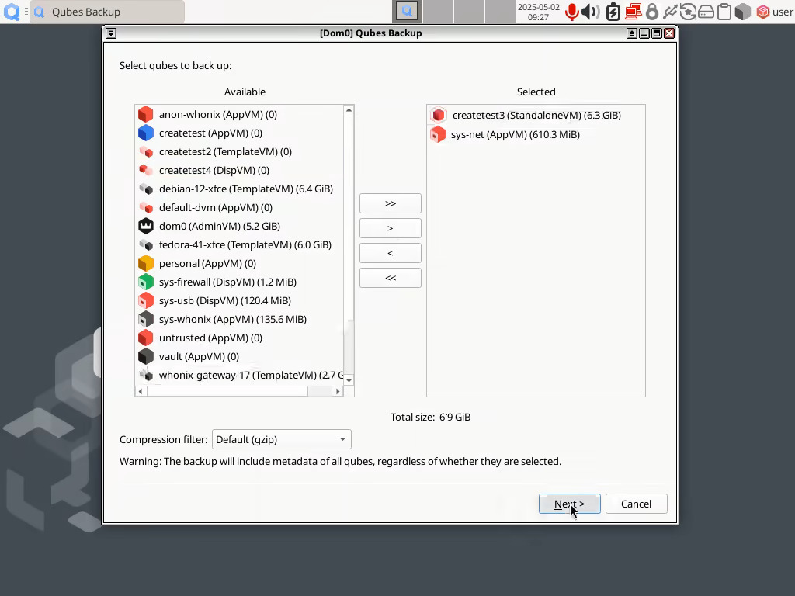
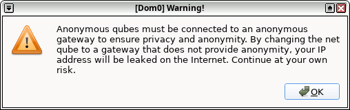

# Qubes OS updates Weekly Review - Y2025-W18

### Introduction

Weekly review of new packages uploaded to Qubes OS repositories. Link to previous newsletter [here](https://github.com/QubesOS/updates-status/issues?q=is%3Aissue+created%3A2025-04-28..2025-05-04).

<details>
<summary>Alphabetically sorted list of new packages uploaded to Qubes OS repositories</summary>

```bash
kernel-515-5.15.180-1.qubes.fc37.x86_64.rpm
kernel-515-devel-5.15.180-1.qubes.fc37.x86_64.rpm
kernel-515-modules-5.15.180-1.qubes.fc37.x86_64.rpm
kernel-515-qubes-vm-5.15.180-1.qubes.fc37.x86_64.rpm
kernel-6.12.25-1.qubes.fc37.x86_64.rpm
kernel-6.12.25-1.qubes.fc41.x86_64.rpm
kernel-61-6.1.135-1.qubes.fc37.x86_64.rpm
kernel-61-devel-6.1.135-1.qubes.fc37.x86_64.rpm
kernel-61-modules-6.1.135-1.qubes.fc37.x86_64.rpm
kernel-61-qubes-vm-6.1.135-1.qubes.fc37.x86_64.rpm
kernel-66-6.6.88-1.qubes.fc37.x86_64.rpm
kernel-66-devel-6.6.88-1.qubes.fc37.x86_64.rpm
kernel-66-modules-6.6.88-1.qubes.fc37.x86_64.rpm
kernel-66-qubes-vm-6.6.88-1.qubes.fc37.x86_64.rpm
kernel-devel-6.12.25-1.qubes.fc37.x86_64.rpm
kernel-devel-6.12.25-1.qubes.fc41.x86_64.rpm
kernel-modules-6.12.25-1.qubes.fc37.x86_64.rpm
kernel-modules-6.12.25-1.qubes.fc41.x86_64.rpm
kernel-qubes-vm-6.12.25-1.qubes.fc37.x86_64.rpm
kernel-qubes-vm-6.12.25-1.qubes.fc41.x86_64.rpm
qubes-core-dom0-4.3.26-1.fc41.noarch.rpm
qubes-core-dom0-4.3.27-1.fc41.noarch.rpm
qubes-manager_4.3.13-1+deb12u1_amd64.deb
qubes-manager_4.3.13-1+deb13u1_amd64.deb
qubes-manager-4.3.13-1.fc40.noarch.rpm
qubes-manager-4.3.13-1.fc41.noarch.rpm
qubes-manager-4.3.13-1.fc42.noarch.rpm
qubes-manager_4.3.13-1+noble1_amd64.deb
```

</details>

### Highlights
- Fresh set of Kernels
- Introduction of qube notes

### Details
In addition to the usual minor fixes and patches (full list [here](https://github.com/QubesOS/updates-status/issues?q=is%3Aissue+created%3A2025-04-28..2025-05-04)):

* **core-admin** [v4.3.27](https://github.com/QubesOS/qubes-core-admin/compare/v4.3.26...v4.3.27) (r4.3)

This version is a patch release. It has a fix for one important issue. While resuming from suspend, sometimes USB devices and/or Network devices did not work properly. Last time this issue happened was during the automated tests for Kernel 6.14.4 on Dasharo FidelisGuard (MSI) Z690 (notes on automated tests in the epilogue). The behavior was not always reproducible. The fix increases the service resume timeout from 5 seconds to 60 seconds after system resumes from suspend.

* **core-admin** [v4.3.26](https://github.com/QubesOS/qubes-core-admin/compare/v4.3.25...v4.3.26) (r4.3)

. Assuring (emergency) paused qubes remain paused after system resumes from S3 suspend (previously they were automatically unpaused). Be aware that due to a [known Xen issue](https://github.com/QubesOS/qubes-issues/issues/7404#issuecomment-1113299850), it may take a while for such qubes to become responsive after unpausing and sometimes they might even hang. A workaround exist for qubes you might want to pause and keep paused during system suspend (see the link).
. Additional unittests for Qubes Air.
. A fix and additional unittest for PCI Path.
. The core API part for Qubes Notes. Each qube note could be upto 256KB of clear text, allowing most UTF-8 characters (e.g. Chinese, Cyrllic, most Emoji, ...) but prohibiting some other (e.g. RTL characters) due to security limitations. There are pending PRs for a CLI tool (`qvm-notes`) as well as a new tab for Qube Settings to allow qube notes. 

* **qubes-template-whonix-workstation-17** [4.3.0-202504291137](https://github.com/QubesOS/updates-status/issues/5608) (r4.2 & r4.3) _(failed to build)_
  **qubes-template-whonix-gateway-17** [4.3.0-202504291137](https://github.com/QubesOS/updates-status/issues/5607) (r4.2 & r4.3) _(failed to build)_

Building the above two templates failed once more. Sadly download of packages via Tor during build times-out randomly (for both Qubes or Debian repositories). There is an [open issue](https://github.com/QubesOS/qubes-issues/issues/9936) and technical discussion on this problem.

* **manager** [v4.3.13-1](https://github.com/QubesOS/qubes-manager/compare/v4.3.12-1...v4.3.13-1) (r4.3)

. Showing qube label icon during backup operation (please take note that the compression filter selection option in the below screenshot is not yet approved/merged/released).

. A warning box if you set a non-anon (non-whonix) gateway for an anon qube in Setting Dialog or via Qube Manager.


* **linux-kernel-515** (ancient LTS) v5.15.180-1 (only r4.2) (already in stable branch).
  **linux-kernel-61** (older LTS) LTS [v6.1.135-1](https://github.com/QubesOS/updates-status/issues/5599) (r4.2)
  **linux-kernel-66** (old LTS) LTS v6.6.88-1 (only r4.2) (already in stable branch).
  **linux-kernel** (current LTS i.e. the default) [v6.12.25-1](https://github.com/QubesOS/updates-status/issues/5598) (r4.2 & r4.3)

A new set of LTS Kernels of different branches to satisfy people with different needs and different hardware. 

As long as you do not fill your `/boot`, you could install as many Kernel branches as you want in dom0 (system will usually retain 3 latest of each branch and allow you select them via GRUB at boot time):
```bash
sudo qubes-dom0-update kernel-515 kernel-61 kernel-66
```
Or if you want to temporarily enable the testing repo and install one from testing repo:
```bash
sudo qubes-dom0-update --enablerepo=qubes-dom0-current-testing kernel-515 kernel-61 kernel-66 kernel
```
Similarly for VM Kernels, you could try installing `kernel-515-qubes-vm`, `kernel-61-qubes-vm`, `kernel-66-qubes-vm`, `kernel-qubes-vm` and of course `kernel-latest-qubesvm`. These are stored at `/var/lib/qubes/vm-kernels/`. And you can set the default via `qubes-prefs default_kernel ...` or via `qvm-prefs VM kernel ...`

#### Epilogue
In 2022, [an article](https://www.qubes-os.org/news/2022/05/05/automated-os-testing-on-physical-laptops/) was posted on Qubes OS website about the Automated OS testing on physical laptops. Currently Kernel/Xen releases are automatically tested on certified laptops/desktops via that method. And some cool robotics (via servo motors that power-on machines) and Artificial Intelligence (image recognition of HDMI output from those hardware via OpenCV) is involved in the process. You could see the result video from those tests [here](https://openqa.qubes-os.org/group_overview/12), by clicking on each test-set, clicking on any of the green circles, going to `Logs & Assets` and then `Video`. Here is the table of tested hardware (many have Dasharo or other custom Firmware):

| Machine | Brand                        | Model                      |
|---------|------------------------------|----------------------------|
|hw1      | HP                           | ProBook 445 G7             |
|hw2      | Micro-Star International Co. | MS-7D25                    |
|hw5      | Lenovo                       | Thinkpad X230 (with Heads) |
|hw6      | Nitrokey                     | NitroPad T430              |
|hw7      | Star Labs                    | StarBook                   |
|hw8      | NovaCustom                   | v54x_6x_TU                 |
|hw9      | Gigabyte Technology Co. Ltd. | Z97M-D3H                   |
|hw10     | NovaCustom                   | NV4xPZ                     |
|hw11     | Micro Computer (HK)          | UM773 Lite                 |
|hw13     | Micro-Star International Co. | MS-7E06                    |
|hw16     | Star Labs                    | StarFighter                |

Ideally the above list should be longer and more vendors should send machines for testing and agree for the related costs (Electricity, PiKVM, Rack, Infrastructure, ...). But since we are not in the ideal world, the community could help. For example power users (many of the audience of this newsletter) could try testing Kernel/Package, then provide some feedback via:

1. Give a Thumbs-up to the open issue in [updates-status](https://github.com/QubesOS/updates-status/issues) repository if it is working well on their machine. Or thumbs-down plus comment on what is wrong (this is the preferred method).
2. Communicate via Matrix channel.
3. Communicate via mailing list.
4. Communicate via forum.

Otherwise, the update (kernel, dom0 specific package, template package, ...) might stay in testing branch for days, weeks or even months until it is assured that it is working well in the field. 

As an example, the [core-agent-linux update](https://github.com/QubesOS/updates-status/issues/5587) for r4.2 which includes the highly requested fix for Debian based templates outdated notification has currently received ZERO feedback. While it is relatively easy to test it in a clone of a Debian template with testing repos enabled.
