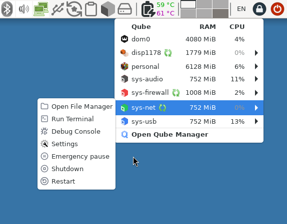

# Qubes OS updates Weekly Review - Y2025-W19

### Introduction
Weekly review of new packages uploaded to Qubes OS repositories. Link to previous Newsletter [here](https://forum.qubes-os.org/t/qubes-os-updates-weekly-review-y2025-w18).

<details>
<summary>Alphabetically sorted list of new packages uploaded to Qubes OS repositories</summary>

```bash
kernel-515-5.15.181-1.qubes.fc37.x86_64.rpm
kernel-515-devel-5.15.181-1.qubes.fc37.x86_64.rpm
kernel-515-modules-5.15.181-1.qubes.fc37.x86_64.rpm
kernel-515-qubes-vm-5.15.181-1.qubes.fc37.x86_64.rpm
kernel-61-6.1.136-1.qubes.fc37.x86_64.rpm
kernel-61-devel-6.1.136-1.qubes.fc37.x86_64.rpm
kernel-61-modules-6.1.136-1.qubes.fc37.x86_64.rpm
kernel-61-qubes-vm-6.1.136-1.qubes.fc37.x86_64.rpm
kernel-66-6.6.89-1.qubes.fc37.x86_64.rpm
kernel-66-devel-6.6.89-1.qubes.fc37.x86_64.rpm
kernel-66-modules-6.6.89-1.qubes.fc37.x86_64.rpm
kernel-66-qubes-vm-6.6.89-1.qubes.fc37.x86_64.rpm
python3-qubesadmin_4.3.15-1+deb12u1_amd64.deb
python3-qubesadmin_4.3.15-1+deb13u1_amd64.deb
python3-qubesadmin-4.3.15-1.fc40.noarch.rpm
python3-qubesadmin-4.3.15-1.fc41.noarch.rpm
python3-qubesadmin-4.3.15-1.fc42.noarch.rpm
python3-qubesadmin_4.3.15-1+jammy1_amd64.deb
python3-qubesadmin_4.3.15-1+noble1_amd64.deb
python3-qui_4.3.12-1+deb12u1_amd64.deb
python3-qui_4.3.12-1+deb13u1_amd64.deb
python3-qui_4.3.12-1+jammy1_amd64.deb
python3-qui_4.3.12-1+noble1_amd64.deb
qubes-core-admin-client_4.3.15-1+deb12u1_amd64.deb
qubes-core-admin-client_4.3.15-1+deb13u1_amd64.deb
qubes-core-admin-client-4.3.15-1.fc40.noarch.rpm
qubes-core-admin-client-4.3.15-1.fc41.noarch.rpm
qubes-core-admin-client-4.3.15-1.fc42.noarch.rpm
qubes-core-admin-client_4.3.15-1+jammy1_amd64.deb
qubes-core-admin-client_4.3.15-1+noble1_amd64.deb
qubes-desktop-linux-manager_4.3.12-1+deb12u1_amd64.deb
qubes-desktop-linux-manager_4.3.12-1+deb13u1_amd64.deb
qubes-desktop-linux-manager-4.3.12-1.fc40.noarch.rpm
qubes-desktop-linux-manager-4.3.12-1.fc41.noarch.rpm
qubes-desktop-linux-manager-4.3.12-1.fc42.noarch.rpm
qubes-desktop-linux-manager_4.3.12-1+jammy1_amd64.deb
qubes-desktop-linux-manager_4.3.12-1+noble1_amd64.deb
qubes-template-kicksecure-17-4.3.0-202505050102.noarch.rpm
qubes-vm-qrexec-4.3.7-1-x86_64.pkg.tar.zst
xscreensaver-6.08-4.fc37.x86_64.rpm
xscreensaver-6.08-4.fc41.x86_64.rpm
xscreensaver-base-6.08-4.fc37.x86_64.rpm
xscreensaver-base-6.08-4.fc41.x86_64.rpm
xscreensaver-extras-6.08-4.fc37.x86_64.rpm
xscreensaver-extras-6.08-4.fc41.x86_64.rpm
xscreensaver-extras-base-6.08-4.fc37.x86_64.rpm
xscreensaver-extras-base-6.08-4.fc41.x86_64.rpm
xscreensaver-extras-gss-6.08-4.fc37.x86_64.rpm
xscreensaver-extras-gss-6.08-4.fc41.x86_64.rpm
xscreensaver-gl-base-6.08-4.fc37.x86_64.rpm
xscreensaver-gl-base-6.08-4.fc41.x86_64.rpm
xscreensaver-gl-extras-6.08-4.fc37.x86_64.rpm
xscreensaver-gl-extras-6.08-4.fc41.x86_64.rpm
xscreensaver-gl-extras-gss-6.08-4.fc37.x86_64.rpm
xscreensaver-gl-extras-gss-6.08-4.fc41.x86_64.rpm
```

</details>

### Highlights
- Relatively calm week with some updates.

### Details
In addition to the usual minor fixes and patches (full list [here](https://github.com/QubesOS/updates-status/issues?q=is%3Aissue+created%3A2025-05-05..2025-05-11)):

* **core-admin-client** [v4.3.15](https://github.com/QubesOS/updates-status/issues/5623) (r4.3)

To ease looking up the device with other tools (e.g. lspci), `--with-sbdf` or `--resolve-paths` options are added to `qvm-pci` command.

* **desktop-linux-manager** [v4.3.12](https://github.com/QubesOS/updates-status/issues/5621) (r4.3)

. Qui Domains widget will show restart required icon for DispVMs if the TemplateVM of their disposable template has been restarted (for both named disposables e.g. sys-firewall & sys-usb or unnamed DispVMs e.g. disp178 in the below picture).

. A new `expert-mode` feature is introduced which will enable `Debug Console` for a qube with that feature or for all if set for dom0.

. Setting or un-setting `internal` feature will properly hide/unhide domain from Qui Domains widget



* **xscreensaver** [v6.08-4](https://github.com/QubesOS/updates-status/issues/5618) (r4.3)

A manpage file was unnecessarily executable. It is fixed.

* **linux-kernel-515** (very old LTS) [v5.15.181-1](https://github.com/QubesOS/updates-status/issues/5612) (r4.2)

* **linux-kernel-61** (older LTS) [v6.1.136-1](https://github.com/QubesOS/updates-status/issues/5615) (r4.2)

* **linux-kernel-66** (old LTS) [v6.6.89-1](https://github.com/QubesOS/updates-status/issues/5614) (r4.2)

* **qubes-template-kicksecure-17** [4.3.0-202505050102](https://github.com/QubesOS/updates-status/issues/5613) (r4.3)

Kicksecure template for r4.3 testing is available

#### Epilogue
Since I made few mistakes with links in last week's newsletter (e.g. link to the newsletter for the week before was broken), I made a script to automate generation of the newsletter template via Github API and some glue logic. Package URLs are also changed. Instead of `diff` links, the issue links in `updates-status` are used. You could easily click `"Changes since previous version"` links there to go to `diff` pages. This was done to encourage testing users to easily give the relevant issue a thumbs-up/down to facilitate its progress to stable branch.
