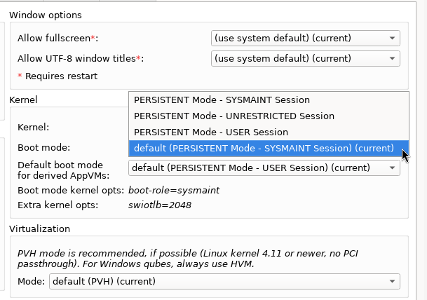

# Qubes OS updates Weekly Review - Y2025-W22

### Introduction
Weekly review of new packages uploaded to Qubes OS repositories. Link to previous Newsletter [here](https://forum.qubes-os.org/t/qubes-os-updates-weekly-review-y2025-w21).

<details>
<summary>Alphabetically sorted list of new packages uploaded to Qubes OS repositories</summary>

```bash
libqrexec-utils-dev_4.3.9-1+deb12u1_amd64.deb
libqrexec-utils-dev_4.3.9-1+deb13u1_amd64.deb
libqrexec-utils-dev_4.3.9-1+jammy1_amd64.deb
libqrexec-utils-dev_4.3.9-1+noble1_amd64.deb
libqrexec-utils4-dbgsym_4.3.9-1+deb12u1_amd64.deb
libqrexec-utils4-dbgsym_4.3.9-1+deb13u1_amd64.deb
libqrexec-utils4_4.3.9-1+deb12u1_amd64.deb
libqrexec-utils4_4.3.9-1+deb13u1_amd64.deb
libqrexec-utils4_4.3.9-1+jammy1_amd64.deb
libqrexec-utils4_4.3.9-1+noble1_amd64.deb
libqubes-pure-dev_4.3.10+deb12u1_amd64.deb
libqubes-pure-dev_4.3.10+deb13u1_amd64.deb
libqubes-pure-dev_4.3.10+jammy1_amd64.deb
libqubes-pure-dev_4.3.10+noble1_amd64.deb
libqubes-pure0-dbgsym_4.3.10+deb12u1_amd64.deb
libqubes-pure0-dbgsym_4.3.10+deb13u1_amd64.deb
libqubes-pure0_4.3.10+deb12u1_amd64.deb
libqubes-pure0_4.3.10+deb13u1_amd64.deb
libqubes-pure0_4.3.10+jammy1_amd64.deb
libqubes-pure0_4.3.10+noble1_amd64.deb
libqubes-rpc-filecopy-dev_4.3.10+deb12u1_amd64.deb
libqubes-rpc-filecopy-dev_4.3.10+deb13u1_amd64.deb
libqubes-rpc-filecopy-dev_4.3.10+jammy1_amd64.deb
libqubes-rpc-filecopy-dev_4.3.10+noble1_amd64.deb
libqubes-rpc-filecopy2-dbgsym_4.3.10+deb12u1_amd64.deb
libqubes-rpc-filecopy2-dbgsym_4.3.10+deb13u1_amd64.deb
libqubes-rpc-filecopy2_4.3.10+deb12u1_amd64.deb
libqubes-rpc-filecopy2_4.3.10+deb13u1_amd64.deb
libqubes-rpc-filecopy2_4.3.10+jammy1_amd64.deb
libqubes-rpc-filecopy2_4.3.10+noble1_amd64.deb
python3-dnf-plugins-qubes-hooks-4.3.25-1.fc40.noarch.rpm
python3-qrexec_4.3.9-1+deb12u1_amd64.deb
python3-qrexec_4.3.9-1+deb13u1_amd64.deb
python3-qrexec_4.3.9-1+jammy1_amd64.deb
python3-qrexec_4.3.9-1+noble1_amd64.deb
python3-qubesadmin-4.3.17-1.fc40.noarch.rpm
python3-qubesadmin-4.3.17-1.fc41.noarch.rpm
python3-qubesadmin-4.3.17-1.fc42.noarch.rpm
python3-qubesadmin_4.3.17-1+deb12u1_amd64.deb
python3-qubesadmin_4.3.17-1+deb13u1_amd64.deb
python3-qubesadmin_4.3.17-1+jammy1_amd64.deb
python3-qubesadmin_4.3.17-1+noble1_amd64.deb
python3-qubesimgconverter-4.3.10-1.fc40.x86_64.rpm
python3-qubesimgconverter-4.3.10-1.fc41.x86_64.rpm
python3-qubesimgconverter-4.3.10-1.fc42.x86_64.rpm
python3-qubesimgconverter_4.3.10+deb12u1_amd64.deb
python3-qubesimgconverter_4.3.10+deb13u1_amd64.deb
python3-qubesimgconverter_4.3.10+jammy1_amd64.deb
python3-qubesimgconverter_4.3.10+noble1_amd64.deb
python3-xen-4.19.2-3.fc41.x86_64.rpm
qubes-artwork-4.3.7-1.fc40.noarch.rpm
qubes-artwork-4.3.7-1.fc41.noarch.rpm
qubes-artwork-4.3.7-1.fc42.noarch.rpm
qubes-artwork-anaconda-4.3.7-1.fc40.noarch.rpm
qubes-artwork-anaconda-4.3.7-1.fc41.noarch.rpm
qubes-artwork-anaconda-4.3.7-1.fc42.noarch.rpm
qubes-artwork-efi-4.3.7-1.fc40.noarch.rpm
qubes-artwork-efi-4.3.7-1.fc41.noarch.rpm
qubes-artwork-efi-4.3.7-1.fc42.noarch.rpm
qubes-artwork-plymouth-4.3.7-1.fc40.noarch.rpm
qubes-artwork-plymouth-4.3.7-1.fc41.noarch.rpm
qubes-artwork-plymouth-4.3.7-1.fc42.noarch.rpm
qubes-artwork_4.3.7-1+deb12u1_amd64.deb
qubes-artwork_4.3.7-1+deb13u1_amd64.deb
qubes-artwork_4.3.7-1+jammy1_amd64.deb
qubes-artwork_4.3.7-1+noble1_amd64.deb
qubes-core-admin-client-4.3.17-1.fc40.noarch.rpm
qubes-core-admin-client-4.3.17-1.fc41.noarch.rpm
qubes-core-admin-client-4.3.17-1.fc42.noarch.rpm
qubes-core-admin-client_4.3.17-1+deb12u1_amd64.deb
qubes-core-admin-client_4.3.17-1+deb13u1_amd64.deb
qubes-core-admin-client_4.3.17-1+jammy1_amd64.deb
qubes-core-admin-client_4.3.17-1+noble1_amd64.deb
qubes-core-agent-4.3.25-1.fc40.x86_64.rpm
qubes-core-agent-4.3.25-1.fc41.x86_64.rpm
qubes-core-agent-4.3.25-1.fc42.x86_64.rpm
qubes-core-agent-caja-4.3.25-1.fc40.x86_64.rpm
qubes-core-agent-caja-4.3.25-1.fc41.x86_64.rpm
qubes-core-agent-caja-4.3.25-1.fc42.x86_64.rpm
qubes-core-agent-caja_4.3.25-1+deb12u1_amd64.deb
qubes-core-agent-caja_4.3.25-1+deb13u1_amd64.deb
qubes-core-agent-caja_4.3.25-1+jammy1_amd64.deb
qubes-core-agent-caja_4.3.25-1+noble1_amd64.deb
qubes-core-agent-dbgsym_4.3.25-1+deb12u1_amd64.deb
qubes-core-agent-dbgsym_4.3.25-1+deb13u1_amd64.deb
qubes-core-agent-dom0-updates-4.3.25-1.fc40.noarch.rpm
qubes-core-agent-dom0-updates-4.3.25-1.fc41.noarch.rpm
qubes-core-agent-dom0-updates-4.3.25-1.fc42.noarch.rpm
qubes-core-agent-dom0-updates_4.3.25-1+deb12u1_amd64.deb
qubes-core-agent-dom0-updates_4.3.25-1+deb13u1_amd64.deb
qubes-core-agent-dom0-updates_4.3.25-1+jammy1_amd64.deb
qubes-core-agent-dom0-updates_4.3.25-1+noble1_amd64.deb
qubes-core-agent-nautilus-4.3.25-1.fc40.x86_64.rpm
qubes-core-agent-nautilus-4.3.25-1.fc41.x86_64.rpm
qubes-core-agent-nautilus-4.3.25-1.fc42.x86_64.rpm
qubes-core-agent-nautilus_4.3.25-1+deb12u1_amd64.deb
qubes-core-agent-nautilus_4.3.25-1+deb13u1_amd64.deb
qubes-core-agent-nautilus_4.3.25-1+jammy1_amd64.deb
qubes-core-agent-nautilus_4.3.25-1+noble1_amd64.deb
qubes-core-agent-network-manager-4.3.25-1.fc40.noarch.rpm
qubes-core-agent-network-manager-4.3.25-1.fc41.noarch.rpm
qubes-core-agent-network-manager-4.3.25-1.fc42.noarch.rpm
qubes-core-agent-network-manager_4.3.25-1+deb12u1_amd64.deb
qubes-core-agent-network-manager_4.3.25-1+deb13u1_amd64.deb
qubes-core-agent-network-manager_4.3.25-1+jammy1_amd64.deb
qubes-core-agent-network-manager_4.3.25-1+noble1_amd64.deb
qubes-core-agent-networking-4.3.25-1.fc40.noarch.rpm
qubes-core-agent-networking-4.3.25-1.fc41.noarch.rpm
qubes-core-agent-networking-4.3.25-1.fc42.noarch.rpm
qubes-core-agent-networking_4.3.25-1+deb12u1_amd64.deb
qubes-core-agent-networking_4.3.25-1+deb13u1_amd64.deb
qubes-core-agent-networking_4.3.25-1+jammy1_amd64.deb
qubes-core-agent-networking_4.3.25-1+noble1_amd64.deb
qubes-core-agent-passwordless-root-4.3.25-1.fc40.noarch.rpm
qubes-core-agent-passwordless-root-4.3.25-1.fc41.noarch.rpm
qubes-core-agent-passwordless-root-4.3.25-1.fc42.noarch.rpm
qubes-core-agent-passwordless-root_4.3.25-1+deb12u1_amd64.deb
qubes-core-agent-passwordless-root_4.3.25-1+deb13u1_amd64.deb
qubes-core-agent-passwordless-root_4.3.25-1+jammy1_amd64.deb
qubes-core-agent-passwordless-root_4.3.25-1+noble1_amd64.deb
qubes-core-agent-selinux-4.3.25-1.fc40.noarch.rpm
qubes-core-agent-selinux-4.3.25-1.fc41.noarch.rpm
qubes-core-agent-selinux-4.3.25-1.fc42.noarch.rpm
qubes-core-agent-systemd-4.3.25-1.fc40.x86_64.rpm
qubes-core-agent-systemd-4.3.25-1.fc41.x86_64.rpm
qubes-core-agent-systemd-4.3.25-1.fc42.x86_64.rpm
qubes-core-agent-thunar-4.3.25-1.fc40.x86_64.rpm
qubes-core-agent-thunar-4.3.25-1.fc41.x86_64.rpm
qubes-core-agent-thunar-4.3.25-1.fc42.x86_64.rpm
qubes-core-agent-thunar_4.3.25-1+deb12u1_amd64.deb
qubes-core-agent-thunar_4.3.25-1+deb13u1_amd64.deb
qubes-core-agent-thunar_4.3.25-1+jammy1_amd64.deb
qubes-core-agent-thunar_4.3.25-1+noble1_amd64.deb
qubes-core-agent_4.3.25-1+deb12u1_amd64.deb
qubes-core-agent_4.3.25-1+deb13u1_amd64.deb
qubes-core-agent_4.3.25-1+jammy1_amd64.deb
qubes-core-agent_4.3.25-1+noble1_amd64.deb
qubes-core-dom0-4.3.28-1.fc41.noarch.rpm
qubes-core-qrexec-4.3.9-1.fc40.x86_64.rpm
qubes-core-qrexec-4.3.9-1.fc41.x86_64.rpm
qubes-core-qrexec-4.3.9-1.fc42.x86_64.rpm
qubes-core-qrexec-dbgsym_4.3.9-1+deb12u1_amd64.deb
qubes-core-qrexec-dbgsym_4.3.9-1+deb13u1_amd64.deb
qubes-core-qrexec-devel-4.3.9-1.fc40.x86_64.rpm
qubes-core-qrexec-devel-4.3.9-1.fc41.x86_64.rpm
qubes-core-qrexec-devel-4.3.9-1.fc42.x86_64.rpm
qubes-core-qrexec-dom0-4.3.9-1.fc41.x86_64.rpm
qubes-core-qrexec-libs-4.3.9-1.fc40.x86_64.rpm
qubes-core-qrexec-libs-4.3.9-1.fc41.x86_64.rpm
qubes-core-qrexec-libs-4.3.9-1.fc42.x86_64.rpm
qubes-core-qrexec-vm-4.3.9-1.fc40.x86_64.rpm
qubes-core-qrexec-vm-4.3.9-1.fc41.x86_64.rpm
qubes-core-qrexec-vm-4.3.9-1.fc42.x86_64.rpm
qubes-core-qrexec-vm-selinux-4.3.9-1.fc40.x86_64.rpm
qubes-core-qrexec-vm-selinux-4.3.9-1.fc41.x86_64.rpm
qubes-core-qrexec-vm-selinux-4.3.9-1.fc42.x86_64.rpm
qubes-core-qrexec_4.3.9-1+deb12u1_amd64.deb
qubes-core-qrexec_4.3.9-1+deb13u1_amd64.deb
qubes-core-qrexec_4.3.9-1+jammy1_amd64.deb
qubes-core-qrexec_4.3.9-1+noble1_amd64.deb
qubes-input-proxy-1.0.42-1-x86_64.pkg.tar.zst
qubes-kernel-vm-support-4.3.10-1.fc40.x86_64.rpm
qubes-kernel-vm-support-4.3.10-1.fc41.x86_64.rpm
qubes-kernel-vm-support-4.3.10-1.fc42.x86_64.rpm
qubes-kernel-vm-support-dbgsym_4.3.10+deb12u1_amd64.deb
qubes-kernel-vm-support-dbgsym_4.3.10+deb13u1_amd64.deb
qubes-kernel-vm-support_4.3.10+deb12u1_amd64.deb
qubes-kernel-vm-support_4.3.10+deb13u1_amd64.deb
qubes-kernel-vm-support_4.3.10+jammy1_amd64.deb
qubes-kernel-vm-support_4.3.10+noble1_amd64.deb
qubes-release-4.3-0.6.fc41.noarch.rpm
qubes-release-notes-4.3-0.6.fc41.noarch.rpm
qubes-rpm-oxide-0.2.9-1-x86_64.pkg.tar.zst
qubes-rpm-oxide-0.2.9-1.fc40.x86_64.rpm
qubes-rpm-oxide-0.2.9-1.fc41.x86_64.rpm
qubes-rpm-oxide-0.2.9-1.fc42.x86_64.rpm
qubes-rpm-oxide_0.2.9-1+deb12u1_all.deb
qubes-rpm-oxide_0.2.9-1+deb13u1_all.deb
qubes-rpm-oxide_0.2.9-1+jammy1_all.deb
qubes-rpm-oxide_0.2.9-1+noble1_all.deb
qubes-template-whonix-gateway-17-4.3.0-202505301314.noarch.rpm
qubes-template-whonix-workstation-17-4.3.0-202505301314.noarch.rpm
qubes-utils-4.3.10-1.fc40.x86_64.rpm
qubes-utils-4.3.10-1.fc41.x86_64.rpm
qubes-utils-4.3.10-1.fc42.x86_64.rpm
qubes-utils-dbgsym_4.3.10+deb12u1_amd64.deb
qubes-utils-dbgsym_4.3.10+deb13u1_amd64.deb
qubes-utils-devel-4.3.10-1.fc40.x86_64.rpm
qubes-utils-devel-4.3.10-1.fc41.x86_64.rpm
qubes-utils-devel-4.3.10-1.fc42.x86_64.rpm
qubes-utils-libs-4.3.10-1.fc40.x86_64.rpm
qubes-utils-libs-4.3.10-1.fc41.x86_64.rpm
qubes-utils-libs-4.3.10-1.fc42.x86_64.rpm
qubes-utils-selinux-4.3.10-1.fc40.x86_64.rpm
qubes-utils-selinux-4.3.10-1.fc41.x86_64.rpm
qubes-utils-selinux-4.3.10-1.fc42.x86_64.rpm
qubes-utils_4.3.10+deb12u1_amd64.deb
qubes-utils_4.3.10+deb13u1_amd64.deb
qubes-utils_4.3.10+jammy1_amd64.deb
qubes-utils_4.3.10+noble1_amd64.deb
qubes-vm-core-4.3.24-1-x86_64.pkg.tar.zst
qubes-vm-core-4.3.25-1-x86_64.pkg.tar.zst
qubes-vm-dom0-updates-4.3.24-1-x86_64.pkg.tar.zst
qubes-vm-dom0-updates-4.3.25-1-x86_64.pkg.tar.zst
qubes-vm-kernel-support-4.3.10-1-x86_64.pkg.tar.zst
qubes-vm-keyring-4.3.24-1-x86_64.pkg.tar.zst
qubes-vm-keyring-4.3.25-1-x86_64.pkg.tar.zst
qubes-vm-networking-4.3.24-1-x86_64.pkg.tar.zst
qubes-vm-networking-4.3.25-1-x86_64.pkg.tar.zst
qubes-vm-passwordless-root-4.3.24-1-x86_64.pkg.tar.zst
qubes-vm-passwordless-root-4.3.25-1-x86_64.pkg.tar.zst
qubes-vm-qrexec-4.3.8-1-x86_64.pkg.tar.zst
qubes-vm-qrexec-4.3.9-1-x86_64.pkg.tar.zst
qubes-vm-utils-4.3.10-1-x86_64.pkg.tar.zst
qubes-vm-xen-4.19.2-3-x86_64.pkg.tar.zst
xen-4.19.2-3.fc41.x86_64.rpm
xen-devel-4.19.2-3.fc41.x86_64.rpm
xen-doc-4.19.2-3.fc41.noarch.rpm
xen-hypervisor-4.19.2-3.fc41.x86_64.rpm
xen-libs-4.19.2-3.fc41.x86_64.rpm
xen-licenses-4.19.2-3.fc41.x86_64.rpm
xen-runtime-4.19.2-3.fc41.x86_64.rpm
```

</details>

### Highlights
- Major work on Archlinux template
- Last steps for Fedora 42 template

### Details
In addition to the usual minor fixes and patches (full list [here](https://github.com/QubesOS/updates-status/issues?q=is%3Aissue+created%3A2025-05-26..2025-06-01)):

* **core-qrexec** [v4.3.10](https://github.com/QubesOS/updates-status/issues/5673) (r4.3)

Fixing an issue with qrexec restart (during upgrade) on Fedora templates with SELinux enabled.

* **core-agent-linux** [v4.3.25](https://github.com/QubesOS/updates-status/issues/5671) (r4.3)

Mostly patches related to Archlinux template:
. Assuring dnf5 is installed on Archlinux template (In case a NetVM based on it is to be used for dom0 update proxy or template download proxy).
. Fixing pacman post-upgrade updates status notification.
. Fixing `custom persist` on Archlinux templates. Custom persist was discussed few weeks earlier.

* **qubes-template-whonix-workstation-17** [4.3.0-202505301314](https://github.com/QubesOS/updates-status/issues/5670) (r4.3)
  **qubes-template-whonix-gateway-17** [4.3.0-202505301314](https://github.com/QubesOS/updates-status/issues/5669) (r4.3)

Two new Whonix templates for r4.3

* **linux-utils** [v4.3.10](https://github.com/QubesOS/updates-status/issues/5668) (r4.3)

. Fixing a dependency issue with openSUSE (probable template).
. Including `gptfix` (for 4K drives) and `swapon` for Archlinux initramfs.
. Fixing order of mkinitcpio hooks for Archlinux.
. A fix for memory ballooning scrubbing during startup on Archlinux templates (to speed up boot).

* **core-qrexec** [v4.3.9](https://github.com/QubesOS/updates-status/issues/5667) (r4.3)

. Internal qubes are excluded from "ask" policy (full explanation in forthcoming newsletters).
. Using glib's native asyncio instead of gbulb (necessary for Fedora 42 based GUIVMs). Similar patches for Qube Manager and Qui/Desktop Manager tools are merged but were not released last week.
. Restarting qubes-qrexec-agent on Archlinux template update

* **artwork** [v4.3.7-1](https://github.com/QubesOS/updates-status/issues/5666) (r4.3)

Including desktop background image in `jxl` format (since Fedora 42 expects it).

* **core-admin** [v4.3.28](https://github.com/QubesOS/updates-status/issues/5664) (r4.3)

. The core part of VM Boot modes (allowing different users). A part of Kicksecure/Whonix(workstation) `sysmaint` hardning. While this patch is a part of qubes core, it enables the previously patched Qube Manager kernel boot mode setting to work. See screenshot below for `kicksecure-17` template settings:



* **core-admin-client** [v4.3.17](https://github.com/QubesOS/updates-status/issues/5663) (r4.3)

. Improving `qvm-backup-restore` for paranoid mode restore. Also assuring it will not clutter `~/QubesIncomming` with temporarily files and directories.
. Introduction of `qvm-notes` CLI utility. It will allow adding notes (up to 256KB of clear text) for each qube.

* **rpm-oxide** [v0.2.9](https://github.com/QubesOS/updates-status/issues/5661) (r4.3)

Packaging rpm oxide for Archlinux (a Rust library to process RPM packages. Unfortunately the repo has no README file for further explanation).

* **qubes-release** [v4.3-0.6](https://github.com/QubesOS/updates-status/issues/5659) (r4.3)

`dnfdragora-updater` was included on r4.3 (testing). Obviously it won't work on dom0 as it has no internet connection. If you have it on your r4.3 (testing) system in dom0, you may remove it.

* **vmm-xen** [v4.19.2-3](https://github.com/QubesOS/updates-status/issues/5658) (r4.3)

Including a patch for Archlinux build.

#### Epilogue
With the last blockers for Fedora 42 template being solved, we should expect its backporting to r4.2 (testing) soon. In the meanwhile, the very few blockers for Qubes OS r4.3 are being finalized. The work on r4.2 -> r4.3 upgrade tool is started in the past few hours.
