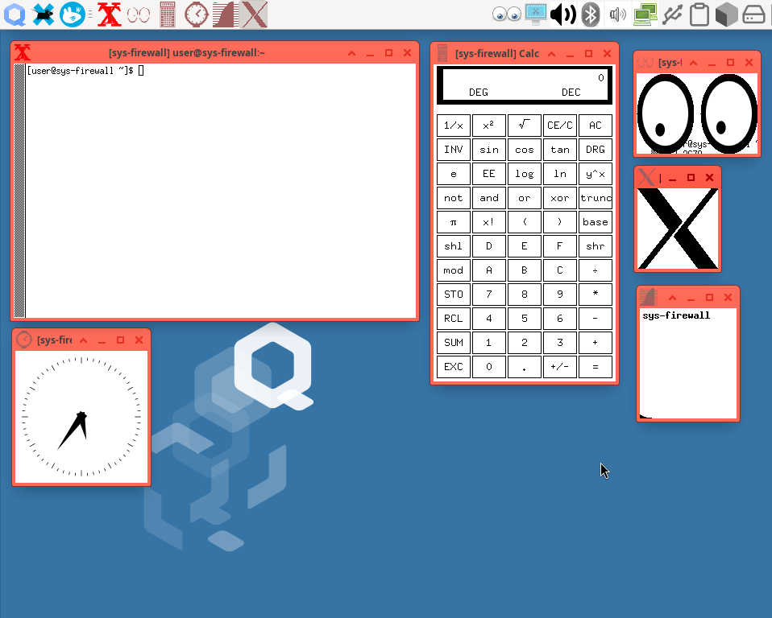
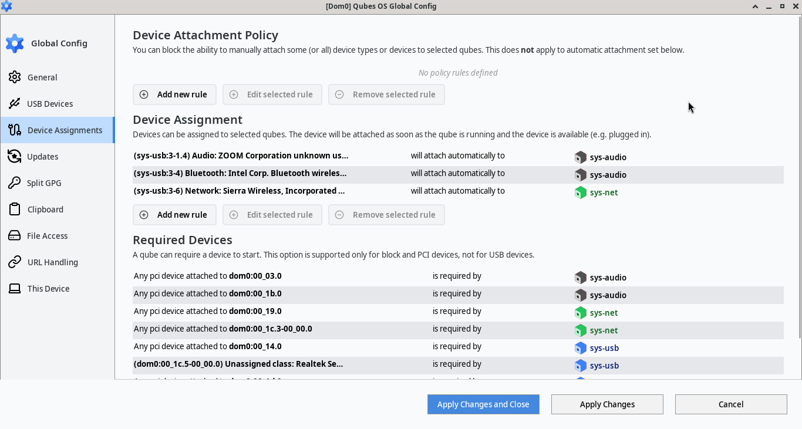
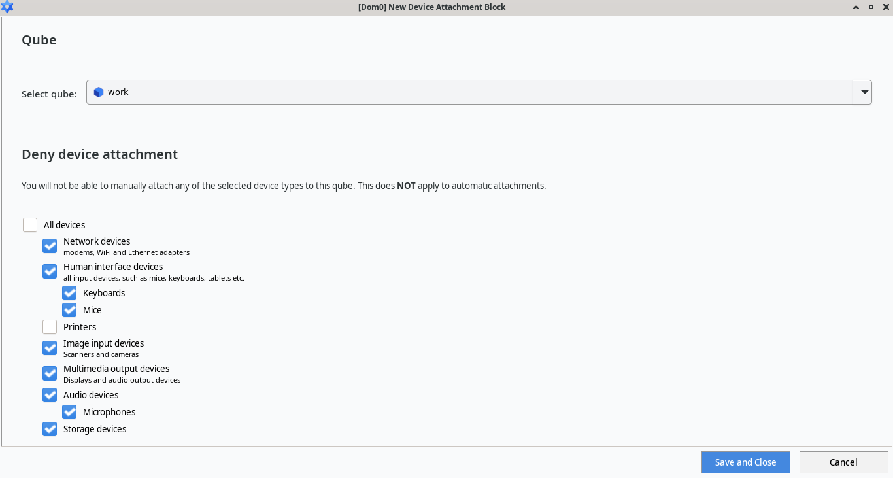

# Qubes OS updates Weekly Review - Y2025-W24

### Introduction
Weekly review of new packages uploaded to Qubes OS repositories. Link to previous Newsletter [here](https://forum.qubes-os.org/t/qubes-os-updates-weekly-review-y2025-w23).

<details>
<summary>Alphabetically sorted list of new packages uploaded to Qubes OS repositories</summary>

```bash
kernel-515-5.15.185-1.qubes.fc37.x86_64.rpm
kernel-515-devel-5.15.185-1.qubes.fc37.x86_64.rpm
kernel-515-modules-5.15.185-1.qubes.fc37.x86_64.rpm
kernel-515-qubes-vm-5.15.185-1.qubes.fc37.x86_64.rpm
kernel-6.12.32-1.qubes.fc37.x86_64.rpm
kernel-6.12.32-1.qubes.fc41.x86_64.rpm
kernel-61-6.1.141-1.qubes.fc37.x86_64.rpm
kernel-61-devel-6.1.141-1.qubes.fc37.x86_64.rpm
kernel-61-modules-6.1.141-1.qubes.fc37.x86_64.rpm
kernel-61-qubes-vm-6.1.141-1.qubes.fc37.x86_64.rpm
kernel-66-6.6.93-1.qubes.fc37.x86_64.rpm
kernel-66-devel-6.6.93-1.qubes.fc37.x86_64.rpm
kernel-66-modules-6.6.93-1.qubes.fc37.x86_64.rpm
kernel-66-qubes-vm-6.6.93-1.qubes.fc37.x86_64.rpm
kernel-devel-6.12.32-1.qubes.fc37.x86_64.rpm
kernel-devel-6.12.32-1.qubes.fc41.x86_64.rpm
kernel-latest-6.14.11-1.qubes.fc37.x86_64.rpm
kernel-latest-6.14.11-1.qubes.fc41.x86_64.rpm
kernel-latest-devel-6.14.11-1.qubes.fc37.x86_64.rpm
kernel-latest-devel-6.14.11-1.qubes.fc41.x86_64.rpm
kernel-latest-modules-6.14.11-1.qubes.fc37.x86_64.rpm
kernel-latest-modules-6.14.11-1.qubes.fc41.x86_64.rpm
kernel-latest-qubes-vm-6.14.11-1.qubes.fc37.x86_64.rpm
kernel-latest-qubes-vm-6.14.11-1.qubes.fc41.x86_64.rpm
kernel-modules-6.12.32-1.qubes.fc37.x86_64.rpm
kernel-modules-6.12.32-1.qubes.fc41.x86_64.rpm
kernel-qubes-vm-6.12.32-1.qubes.fc37.x86_64.rpm
kernel-qubes-vm-6.12.32-1.qubes.fc41.x86_64.rpm
pipewire-qubes-4.3.7-1-x86_64.pkg.tar.zst
pipewire-qubes-4.3.7-1.fc40.x86_64.rpm
pipewire-qubes-4.3.7-1.fc41.x86_64.rpm
pipewire-qubes-4.3.7-1.fc42.x86_64.rpm
pipewire-qubes-dbgsym_4.3.7-1+deb12u1_amd64.deb
pipewire-qubes-dbgsym_4.3.7-1+deb13u1_amd64.deb
pipewire-qubes_4.3.7-1+deb12u1_amd64.deb
pipewire-qubes_4.3.7-1+deb13u1_amd64.deb
pipewire-qubes_4.3.7-1+jammy1_amd64.deb
pipewire-qubes_4.3.7-1+noble1_amd64.deb
pulseaudio-qubes-4.3.7-1.fc40.x86_64.rpm
pulseaudio-qubes-4.3.7-1.fc41.x86_64.rpm
pulseaudio-qubes-4.3.7-1.fc42.x86_64.rpm
pulseaudio-qubes-dbgsym_4.3.7-1+deb12u1_amd64.deb
pulseaudio-qubes-dbgsym_4.3.7-1+deb13u1_amd64.deb
pulseaudio-qubes_4.3.7-1+deb12u1_amd64.deb
pulseaudio-qubes_4.3.7-1+deb13u1_amd64.deb
pulseaudio-qubes_4.3.7-1+jammy1_amd64.deb
pulseaudio-qubes_4.3.7-1+noble1_amd64.deb
python3-qui_4.3.14-1+deb12u1_amd64.deb
python3-qui_4.3.14-1+deb13u1_amd64.deb
python3-qui_4.3.14-1+jammy1_amd64.deb
python3-qui_4.3.14-1+noble1_amd64.deb
python3-splitgpg2_1.1.7+deb12u1_amd64.deb
python3-splitgpg2_1.1.7+deb13u1_amd64.deb
python3-splitgpg2_1.1.7+jammy1_amd64.deb
python3-splitgpg2_1.1.7+noble1_amd64.deb
qubes-audio-daemon-4.3.9-1.fc40.x86_64.rpm
qubes-audio-daemon-4.3.9-1.fc41.x86_64.rpm
qubes-audio-daemon-4.3.9-1.fc42.x86_64.rpm
qubes-audio-daemon-dbgsym_4.3.9-1+deb12u1_amd64.deb
qubes-audio-daemon-dbgsym_4.3.9-1+deb13u1_amd64.deb
qubes-audio-daemon_4.3.9-1+deb12u1_amd64.deb
qubes-audio-daemon_4.3.9-1+deb13u1_amd64.deb
qubes-audio-daemon_4.3.9-1+jammy1_amd64.deb
qubes-audio-daemon_4.3.9-1+noble1_amd64.deb
qubes-audio-dom0-4.3.9-1.fc40.x86_64.rpm
qubes-audio-dom0-4.3.9-1.fc41.x86_64.rpm
qubes-audio-dom0-4.3.9-1.fc42.x86_64.rpm
qubes-desktop-linux-manager-4.3.14-1.fc40.noarch.rpm
qubes-desktop-linux-manager-4.3.14-1.fc41.noarch.rpm
qubes-desktop-linux-manager-4.3.14-1.fc42.noarch.rpm
qubes-desktop-linux-manager_4.3.14-1+deb12u1_amd64.deb
qubes-desktop-linux-manager_4.3.14-1+deb13u1_amd64.deb
qubes-desktop-linux-manager_4.3.14-1+jammy1_amd64.deb
qubes-desktop-linux-manager_4.3.14-1+noble1_amd64.deb
qubes-gpg-split-2.0.78-1-x86_64.pkg.tar.zst
qubes-gpg-split-2.0.78-1.fc40.x86_64.rpm
qubes-gpg-split-2.0.78-1.fc41.x86_64.rpm
qubes-gpg-split-2.0.78-1.fc42.x86_64.rpm
qubes-gpg-split-dbgsym_2.0.78-1+deb12u1_amd64.deb
qubes-gpg-split-dbgsym_2.0.78-1+deb13u1_amd64.deb
qubes-gpg-split-dom0-2.0.78-1.fc37.noarch.rpm
qubes-gpg-split-dom0-2.0.78-1.fc41.noarch.rpm
qubes-gpg-split-tests-2.0.78-1.fc40.x86_64.rpm
qubes-gpg-split-tests-2.0.78-1.fc41.x86_64.rpm
qubes-gpg-split-tests-2.0.78-1.fc42.x86_64.rpm
qubes-gpg-split-tests_2.0.78-1+deb12u1_amd64.deb
qubes-gpg-split-tests_2.0.78-1+deb13u1_amd64.deb
qubes-gpg-split-tests_2.0.78-1+jammy1_amd64.deb
qubes-gpg-split-tests_2.0.78-1+noble1_amd64.deb
qubes-gpg-split_2.0.78-1+deb12u1_amd64.deb
qubes-gpg-split_2.0.78-1+deb13u1_amd64.deb
qubes-gpg-split_2.0.78-1+jammy1_amd64.deb
qubes-gpg-split_2.0.78-1+noble1_amd64.deb
qubes-gui-agent-4.3.7-1.fc40.x86_64.rpm
qubes-gui-agent-4.3.7-1.fc41.x86_64.rpm
qubes-gui-agent-4.3.7-1.fc42.x86_64.rpm
qubes-gui-agent-dbgsym_4.3.7-1+deb12u1_amd64.deb
qubes-gui-agent-dbgsym_4.3.7-1+deb13u1_amd64.deb
qubes-gui-agent-selinux-4.3.7-1.fc40.noarch.rpm
qubes-gui-agent-selinux-4.3.7-1.fc41.noarch.rpm
qubes-gui-agent-selinux-4.3.7-1.fc42.noarch.rpm
qubes-gui-agent-xfce-4.3.7-1.fc40.x86_64.rpm
qubes-gui-agent-xfce-4.3.7-1.fc41.x86_64.rpm
qubes-gui-agent-xfce-4.3.7-1.fc42.x86_64.rpm
qubes-gui-agent-xfce_4.3.7-1+deb12u1_amd64.deb
qubes-gui-agent-xfce_4.3.7-1+deb13u1_amd64.deb
qubes-gui-agent-xfce_4.3.7-1+jammy1_amd64.deb
qubes-gui-agent-xfce_4.3.7-1+noble1_amd64.deb
qubes-gui-agent_4.3.7-1+deb12u1_amd64.deb
qubes-gui-agent_4.3.7-1+deb13u1_amd64.deb
qubes-gui-agent_4.3.7-1+jammy1_amd64.deb
qubes-gui-agent_4.3.7-1+noble1_amd64.deb
qubes-gui-daemon-4.3.9-1.fc40.x86_64.rpm
qubes-gui-daemon-4.3.9-1.fc41.x86_64.rpm
qubes-gui-daemon-4.3.9-1.fc42.x86_64.rpm
qubes-gui-daemon-dbgsym_4.3.9-1+deb12u1_amd64.deb
qubes-gui-daemon-dbgsym_4.3.9-1+deb13u1_amd64.deb
qubes-gui-daemon-pulseaudio_4.3.9-1+deb12u1_amd64.deb
qubes-gui-daemon-pulseaudio_4.3.9-1+deb13u1_amd64.deb
qubes-gui-daemon-pulseaudio_4.3.9-1+jammy1_amd64.deb
qubes-gui-daemon-pulseaudio_4.3.9-1+noble1_amd64.deb
qubes-gui-daemon-selinux-4.3.9-1.fc40.x86_64.rpm
qubes-gui-daemon-selinux-4.3.9-1.fc41.x86_64.rpm
qubes-gui-daemon-selinux-4.3.9-1.fc42.x86_64.rpm
qubes-gui-daemon_4.3.9-1+deb12u1_amd64.deb
qubes-gui-daemon_4.3.9-1+deb13u1_amd64.deb
qubes-gui-daemon_4.3.9-1+jammy1_amd64.deb
qubes-gui-daemon_4.3.9-1+noble1_amd64.deb
qubes-gui-dom0-4.3.9-1.fc40.x86_64.rpm
qubes-gui-dom0-4.3.9-1.fc41.x86_64.rpm
qubes-gui-dom0-4.3.9-1.fc42.x86_64.rpm
qubes-gui-vnc-4.3.7-1.fc40.x86_64.rpm
qubes-gui-vnc-4.3.7-1.fc41.x86_64.rpm
qubes-gui-vnc-4.3.7-1.fc42.x86_64.rpm
qubes-gui-vnc_4.3.7-1+deb12u1_amd64.deb
qubes-gui-vnc_4.3.7-1+deb13u1_amd64.deb
qubes-gui-vnc_4.3.7-1+jammy1_amd64.deb
qubes-gui-vnc_4.3.7-1+noble1_amd64.deb
qubes-template-fedora-42-4.2.0-202506082132.noarch.rpm
qubes-template-fedora-42-minimal-4.2.0-202506090022.noarch.rpm
qubes-template-fedora-42-xfce-4.2.0-202506082132.noarch.rpm
qubes-vm-gui-4.3.7-1-x86_64.pkg.tar.zst
qubes-vm-pulseaudio-4.3.7-1-x86_64.pkg.tar.zst
split-gpg2-1.1.7-1.fc40.noarch.rpm
split-gpg2-1.1.7-1.fc41.noarch.rpm
split-gpg2-1.1.7-1.fc42.noarch.rpm
split-gpg2-dom0-1.1.7-1.fc37.noarch.rpm
split-gpg2-dom0-1.1.7-1.fc41.noarch.rpm
split-gpg2-tests-1.1.7-1.fc40.noarch.rpm
split-gpg2-tests-1.1.7-1.fc41.noarch.rpm
split-gpg2-tests-1.1.7-1.fc42.noarch.rpm
split-gpg2-tests_1.1.7+deb12u1_all.deb
split-gpg2-tests_1.1.7+deb13u1_all.deb
split-gpg2-tests_1.1.7+jammy1_all.deb
split-gpg2-tests_1.1.7+noble1_all.deb
split-gpg2_1.1.7+deb12u1_all.deb
split-gpg2_1.1.7+deb13u1_all.deb
split-gpg2_1.1.7+jammy1_all.deb
split-gpg2_1.1.7+noble1_all.deb
xscreensaver-6.10.1-1.fc40.x86_64.rpm
xscreensaver-6.10.1-1.fc41.x86_64.rpm
xscreensaver-6.10.1-1.fc42.x86_64.rpm
xscreensaver-base-6.10.1-1.fc40.x86_64.rpm
xscreensaver-base-6.10.1-1.fc41.x86_64.rpm
xscreensaver-base-6.10.1-1.fc42.x86_64.rpm
xscreensaver-extras-6.10.1-1.fc40.x86_64.rpm
xscreensaver-extras-6.10.1-1.fc41.x86_64.rpm
xscreensaver-extras-6.10.1-1.fc42.x86_64.rpm
xscreensaver-extras-base-6.10.1-1.fc40.x86_64.rpm
xscreensaver-extras-base-6.10.1-1.fc41.x86_64.rpm
xscreensaver-extras-base-6.10.1-1.fc42.x86_64.rpm
xscreensaver-extras-gss-6.10.1-1.fc40.x86_64.rpm
xscreensaver-extras-gss-6.10.1-1.fc41.x86_64.rpm
xscreensaver-extras-gss-6.10.1-1.fc42.x86_64.rpm
xscreensaver-gl-base-6.10.1-1.fc40.x86_64.rpm
xscreensaver-gl-base-6.10.1-1.fc41.x86_64.rpm
xscreensaver-gl-base-6.10.1-1.fc42.x86_64.rpm
xscreensaver-gl-extras-6.10.1-1.fc40.x86_64.rpm
xscreensaver-gl-extras-6.10.1-1.fc41.x86_64.rpm
xscreensaver-gl-extras-6.10.1-1.fc42.x86_64.rpm
xscreensaver-gl-extras-gss-6.10.1-1.fc40.x86_64.rpm
xscreensaver-gl-extras-gss-6.10.1-1.fc41.x86_64.rpm
xscreensaver-gl-extras-gss-6.10.1-1.fc42.x86_64.rpm
xserver-xorg-input-qubes-dbgsym_4.3.7-1+deb12u1_amd64.deb
xserver-xorg-input-qubes-dbgsym_4.3.7-1+deb13u1_amd64.deb
xserver-xorg-input-qubes_4.3.7-1+deb12u1_amd64.deb
xserver-xorg-input-qubes_4.3.7-1+deb13u1_amd64.deb
xserver-xorg-input-qubes_4.3.7-1+jammy1_amd64.deb
xserver-xorg-input-qubes_4.3.7-1+noble1_amd64.deb
xserver-xorg-qubes-common-dbgsym_4.3.7-1+deb12u1_amd64.deb
xserver-xorg-qubes-common-dbgsym_4.3.7-1+deb13u1_amd64.deb
xserver-xorg-qubes-common_4.3.7-1+deb12u1_amd64.deb
xserver-xorg-qubes-common_4.3.7-1+deb13u1_amd64.deb
xserver-xorg-qubes-common_4.3.7-1+jammy1_amd64.deb
xserver-xorg-qubes-common_4.3.7-1+noble1_amd64.deb
xserver-xorg-video-dummyqbs-dbgsym_4.3.7-1+deb12u1_amd64.deb
xserver-xorg-video-dummyqbs-dbgsym_4.3.7-1+deb13u1_amd64.deb
xserver-xorg-video-dummyqbs_4.3.7-1+deb12u1_amd64.deb
xserver-xorg-video-dummyqbs_4.3.7-1+deb13u1_amd64.deb
xserver-xorg-video-dummyqbs_4.3.7-1+jammy1_amd64.deb
xserver-xorg-video-dummyqbs_4.3.7-1+noble1_amd64.deb
```

</details>

### Highlights
- Busy week with many major updates
- Major work for better support of HiDPI displays
- Significant work for the new devices API GUI front-end 

### Details
In addition to the usual minor fixes and patches (full list [here](https://github.com/QubesOS/updates-status/issues?q=is%3Aissue+created%3A2025-06-09..2025-06-15)):

* **gui-agent-linux** [v4.3.7](https://github.com/QubesOS/updates-status/issues/5767) (r4.3)
. Five individual commits to support building gui agent for openSUSE.
. One commit to allow building it on Windows.
. Fixing a problem with Qubes virtual pointing device dummy driver to assure programs (mostly games) sensitive to relative mouse movements would behave correctly.
. Fix to show Xterm icon (as well as other legacy X apps). Screenshot for nostalgic people:

. End of very long truncated window titles (currently over 128 bytes) are changed to `…`
. The most significant change to the gui agent is for better support of high resolution displays. Reducing emulated video RAM usage on on minimal qubes (e.g. sys-net, sys-usb, sys-firewall) as well as all other Qubes. Better handling of dynamic connection of high resolution displays.

* **desktop-linux-manager** [v4.3.14](https://github.com/QubesOS/updates-status/issues/5766) (r4.3)
Major addition to global config to introduce the highly anticipated front-end for the new device API. This addition is relatively big and has over 10K lines additions and 6.5K lines deletions. While some of the changes are due to a change in maximum number of allowed characters on a single line (88 chars vs 80 on other repos) and Python black auto formatter, also the changes to glade files, the overall work is very significant and the outcome is very impressive.
. Screenshot for the main **Device Assignments** page:

. Screenshot for the **Device Attachment Block** dialog;

. Screenshot for the individual **Device Assignment** dialog:

. Screenshot for **Required Devices** dialog:
Y2025-W24-Required-Device.png


* **app-linux-split-gpg2** [v1.1.7](https://github.com/QubesOS/updates-status/issues/5762) (r4.3)
  **app-linux-split-gpg2** [v1.1.7](https://github.com/QubesOS/updates-status/issues/5760) (r4.2)
  **app-linux-split-gpg** [v2.0.78](https://github.com/QubesOS/updates-status/issues/5759) (r4.3)
  **app-linux-split-gpg** [v2.0.78](https://github.com/QubesOS/updates-status/issues/5757) (r4.2)
Fixing an issue with split gpg on Whonix due to introduction of `user-sysmaint-split`.

* **gui-daemon** [v4.3.9](https://github.com/QubesOS/updates-status/issues/5755) (r4.3)
. Assuring pop-up windows open over their parent window (on Xmonad WM)
. Daemon part of changing the end of very long window titles to `…`

* **xscreensaver** [v6.10.1-1](https://github.com/QubesOS/updates-status/issues/5753) (r4.3)
. Updating Qubes OS version on Xscreensaver unlock screen.
. While Xscreensaver was updated in this patch for r4.3 development branch, it is likely for Qubes OS r4.3 final release to ditch Xscreensaver in favor of xfce4-screensaver. More information about it [here](https://github.com/QubesOS/qubes-issues/issues/9317#issuecomment-2964357263).

* **linux-kernel-latest (stable)** [v6.14.11-1-latest](https://github.com/QubesOS/updates-status/issues/5764) (r4.3)
  **linux-kernel-latest (stable)** [v6.14.11-1-latest](https://github.com/QubesOS/updates-status/issues/5763) (r4.2)
  **linux-kernel (lts)** [v6.12.32-1](https://github.com/QubesOS/updates-status/issues/5749) (r4.2)
  **linux-kernel (lts)** [v6.12.32-1](https://github.com/QubesOS/updates-status/issues/5748) (r4.3)
  **linux-kernel-66 (old lts)** [v6.6.93-1](https://github.com/QubesOS/updates-status/issues/5752) (r4.2)
  **linux-kernel-61 (older lts)** [v6.1.141-1](https://github.com/QubesOS/updates-status/issues/5750) (r4.2)
  **linux-kernel-515 (ancient lts)** [v5.15.185-1](https://github.com/QubesOS/updates-status/issues/5751) (r4.2)
. A new set of Linux kernels for r4.2 & r4.3.
. I decided to include individual links for Kernels to make it easier for the testing users to give feedback on how they perform on their machines.

#### Epilogue
Due to some personal matters, there might be irregularities with the forthcoming weekly newsletters. I will still try to keep a consistent schedule (hopefully).
