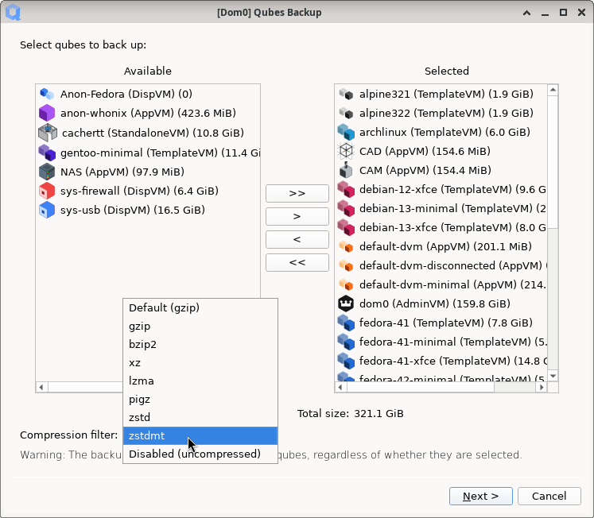
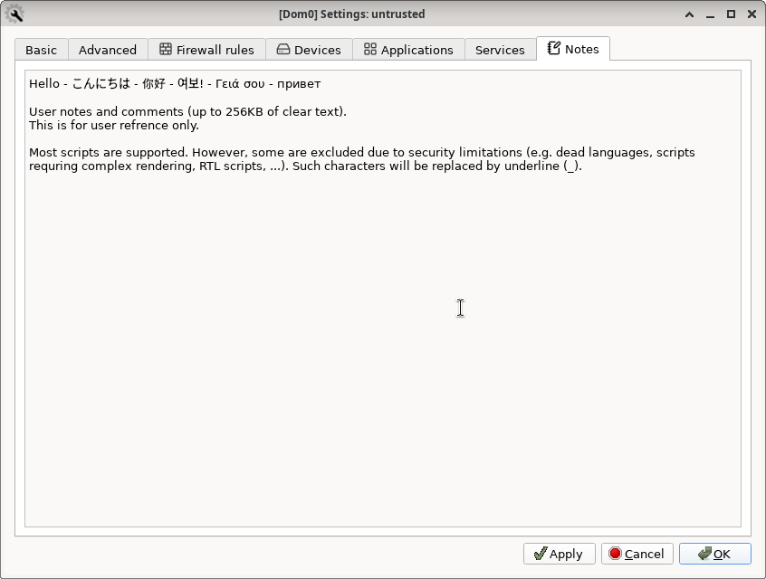
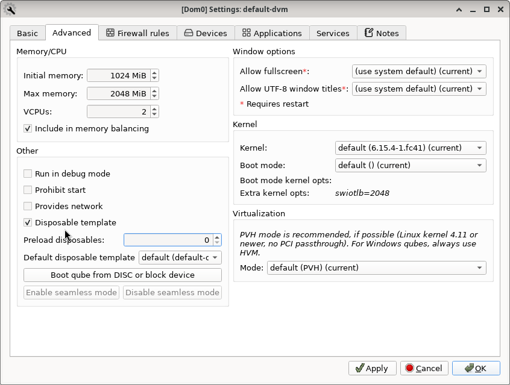

# Qubes OS updates Weekly Review - Y2025-W26

### Introduction
Weekly review of new packages uploaded to Qubes OS repositories. Link to previous Newsletter [here](https://forum.qubes-os.org/t/qubes-os-updates-weekly-review-y2025-w25).

<details>
<summary>Alphabetically sorted list of new packages uploaded to Qubes OS repositories</summary>

```bash
amd-gpu-firmware-20250627-1.fc37.noarch.rpm
amd-gpu-firmware-20250627-1.fc41.noarch.rpm
amd-ucode-firmware-20250627-1.fc37.noarch.rpm
amd-ucode-firmware-20250627-1.fc41.noarch.rpm
atheros-firmware-20250627-1.fc37.noarch.rpm
atheros-firmware-20250627-1.fc41.noarch.rpm
brcmfmac-firmware-20250627-1.fc37.noarch.rpm
brcmfmac-firmware-20250627-1.fc41.noarch.rpm
cirrus-audio-firmware-20250627-1.fc37.noarch.rpm
cirrus-audio-firmware-20250627-1.fc41.noarch.rpm
dvb-firmware-20250627-1.fc37.noarch.rpm
dvb-firmware-20250627-1.fc41.noarch.rpm
i3-settings-qubes-1.13-1.fc40.noarch.rpm
i3-settings-qubes-1.13-1.fc41.noarch.rpm
i3-settings-qubes-1.13-1.fc42.noarch.rpm
i3-settings-qubes_1.13-1+deb12u1_amd64.deb
i3-settings-qubes_1.13-1+deb13u1_amd64.deb
i3-settings-qubes_1.13-1+jammy1_amd64.deb
i3-settings-qubes_1.13-1+noble1_amd64.deb
intel-audio-firmware-20250627-1.fc37.noarch.rpm
intel-audio-firmware-20250627-1.fc41.noarch.rpm
intel-gpu-firmware-20250627-1.fc37.noarch.rpm
intel-gpu-firmware-20250627-1.fc41.noarch.rpm
intel-vsc-firmware-20250627-1.fc37.noarch.rpm
intel-vsc-firmware-20250627-1.fc41.noarch.rpm
iwlegacy-firmware-20250627-1.fc37.noarch.rpm
iwlegacy-firmware-20250627-1.fc41.noarch.rpm
iwlwifi-dvm-firmware-20250627-1.fc37.noarch.rpm
iwlwifi-dvm-firmware-20250627-1.fc41.noarch.rpm
iwlwifi-mvm-firmware-20250627-1.fc37.noarch.rpm
iwlwifi-mvm-firmware-20250627-1.fc41.noarch.rpm
kernel-latest-6.15.4-1.qubes.fc37.x86_64.rpm
kernel-latest-6.15.4-1.qubes.fc41.x86_64.rpm
kernel-latest-devel-6.15.4-1.qubes.fc37.x86_64.rpm
kernel-latest-devel-6.15.4-1.qubes.fc41.x86_64.rpm
kernel-latest-modules-6.15.4-1.qubes.fc37.x86_64.rpm
kernel-latest-modules-6.15.4-1.qubes.fc41.x86_64.rpm
kernel-latest-qubes-vm-6.15.4-1.qubes.fc37.x86_64.rpm
kernel-latest-qubes-vm-6.15.4-1.qubes.fc41.x86_64.rpm
libertas-firmware-20250627-1.fc37.noarch.rpm
libertas-firmware-20250627-1.fc41.noarch.rpm
linux-firmware-20250627-1.fc37.noarch.rpm
linux-firmware-20250627-1.fc41.noarch.rpm
linux-firmware-whence-20250627-1.fc37.noarch.rpm
linux-firmware-whence-20250627-1.fc41.noarch.rpm
liquidio-firmware-20250627-1.fc37.noarch.rpm
liquidio-firmware-20250627-1.fc41.noarch.rpm
mlxsw_spectrum-firmware-20250627-1.fc37.noarch.rpm
mlxsw_spectrum-firmware-20250627-1.fc41.noarch.rpm
mrvlprestera-firmware-20250627-1.fc37.noarch.rpm
mrvlprestera-firmware-20250627-1.fc41.noarch.rpm
mt7xxx-firmware-20250627-1.fc37.noarch.rpm
mt7xxx-firmware-20250627-1.fc41.noarch.rpm
netronome-firmware-20250627-1.fc37.noarch.rpm
netronome-firmware-20250627-1.fc41.noarch.rpm
nvidia-gpu-firmware-20250627-1.fc37.noarch.rpm
nvidia-gpu-firmware-20250627-1.fc41.noarch.rpm
nxpwireless-firmware-20250627-1.fc37.noarch.rpm
nxpwireless-firmware-20250627-1.fc41.noarch.rpm
pipewire-qubes-4.3.8-1-x86_64.pkg.tar.zst
pipewire-qubes-4.3.8-1.fc40.x86_64.rpm
pipewire-qubes-4.3.8-1.fc41.x86_64.rpm
pipewire-qubes-4.3.8-1.fc42.x86_64.rpm
pipewire-qubes-dbgsym_4.3.8-1+deb12u1_amd64.deb
pipewire-qubes-dbgsym_4.3.8-1+deb13u1_amd64.deb
pipewire-qubes_4.3.8-1+deb12u1_amd64.deb
pipewire-qubes_4.3.8-1+deb13u1_amd64.deb
pipewire-qubes_4.3.8-1+jammy1_amd64.deb
pipewire-qubes_4.3.8-1+noble1_amd64.deb
pulseaudio-qubes-4.3.8-1.fc40.x86_64.rpm
pulseaudio-qubes-4.3.8-1.fc41.x86_64.rpm
pulseaudio-qubes-4.3.8-1.fc42.x86_64.rpm
pulseaudio-qubes-dbgsym_4.3.8-1+deb12u1_amd64.deb
pulseaudio-qubes-dbgsym_4.3.8-1+deb13u1_amd64.deb
pulseaudio-qubes_4.3.8-1+deb12u1_amd64.deb
pulseaudio-qubes_4.3.8-1+deb13u1_amd64.deb
pulseaudio-qubes_4.3.8-1+jammy1_amd64.deb
pulseaudio-qubes_4.3.8-1+noble1_amd64.deb
python3-dnf-plugins-qubes-hooks-4.3.26-1.fc40.noarch.rpm
python3-qubes-menu_1.2.5-1+deb12u1_amd64.deb
python3-qubes-menu_1.2.5-1+deb13u1_amd64.deb
python3-qubes-menu_1.2.5-1+jammy1_amd64.deb
python3-qubes-menu_1.2.5-1+noble1_amd64.deb
python3-qubes-menu_1.2.6-1+deb12u1_amd64.deb
python3-qubes-menu_1.2.6-1+deb13u1_amd64.deb
python3-qubes-menu_1.2.6-1+jammy1_amd64.deb
python3-qubes-menu_1.2.6-1+noble1_amd64.deb
python3-qubesadmin-4.3.18-1.fc40.noarch.rpm
python3-qubesadmin-4.3.18-1.fc41.noarch.rpm
python3-qubesadmin-4.3.18-1.fc42.noarch.rpm
python3-qubesadmin_4.3.18-1+deb12u1_amd64.deb
python3-qubesadmin_4.3.18-1+deb13u1_amd64.deb
python3-qubesadmin_4.3.18-1+jammy1_amd64.deb
python3-qubesadmin_4.3.18-1+noble1_amd64.deb
python3-xen-4.17.5-8.fc37.x86_64.rpm
python3-xen-4.17.5-9.fc37.x86_64.rpm
qcom-firmware-20250627-1.fc37.noarch.rpm
qcom-firmware-20250627-1.fc41.noarch.rpm
qed-firmware-20250627-1.fc37.noarch.rpm
qed-firmware-20250627-1.fc41.noarch.rpm
qubes-audio-daemon-4.3.10-1.fc40.x86_64.rpm
qubes-audio-daemon-4.3.10-1.fc41.x86_64.rpm
qubes-audio-daemon-4.3.10-1.fc42.x86_64.rpm
qubes-audio-daemon-dbgsym_4.3.10-1+deb12u1_amd64.deb
qubes-audio-daemon-dbgsym_4.3.10-1+deb13u1_amd64.deb
qubes-audio-daemon_4.3.10-1+deb12u1_amd64.deb
qubes-audio-daemon_4.3.10-1+deb13u1_amd64.deb
qubes-audio-daemon_4.3.10-1+jammy1_amd64.deb
qubes-audio-daemon_4.3.10-1+noble1_amd64.deb
qubes-audio-dom0-4.3.10-1.fc40.x86_64.rpm
qubes-audio-dom0-4.3.10-1.fc41.x86_64.rpm
qubes-audio-dom0-4.3.10-1.fc42.x86_64.rpm
qubes-core-admin-client-4.3.18-1.fc40.noarch.rpm
qubes-core-admin-client-4.3.18-1.fc41.noarch.rpm
qubes-core-admin-client-4.3.18-1.fc42.noarch.rpm
qubes-core-admin-client_4.3.18-1+deb12u1_amd64.deb
qubes-core-admin-client_4.3.18-1+deb13u1_amd64.deb
qubes-core-admin-client_4.3.18-1+jammy1_amd64.deb
qubes-core-admin-client_4.3.18-1+noble1_amd64.deb
qubes-core-agent-4.3.26-1.fc40.x86_64.rpm
qubes-core-agent-4.3.26-1.fc41.x86_64.rpm
qubes-core-agent-4.3.26-1.fc42.x86_64.rpm
qubes-core-agent-caja-4.3.26-1.fc40.x86_64.rpm
qubes-core-agent-caja-4.3.26-1.fc41.x86_64.rpm
qubes-core-agent-caja-4.3.26-1.fc42.x86_64.rpm
qubes-core-agent-caja_4.3.26-1+deb12u1_amd64.deb
qubes-core-agent-caja_4.3.26-1+deb13u1_amd64.deb
qubes-core-agent-caja_4.3.26-1+jammy1_amd64.deb
qubes-core-agent-caja_4.3.26-1+noble1_amd64.deb
qubes-core-agent-dbgsym_4.3.26-1+deb12u1_amd64.deb
qubes-core-agent-dbgsym_4.3.26-1+deb13u1_amd64.deb
qubes-core-agent-dom0-updates-4.3.26-1.fc40.noarch.rpm
qubes-core-agent-dom0-updates-4.3.26-1.fc41.noarch.rpm
qubes-core-agent-dom0-updates-4.3.26-1.fc42.noarch.rpm
qubes-core-agent-dom0-updates_4.3.26-1+deb12u1_amd64.deb
qubes-core-agent-dom0-updates_4.3.26-1+deb13u1_amd64.deb
qubes-core-agent-dom0-updates_4.3.26-1+jammy1_amd64.deb
qubes-core-agent-dom0-updates_4.3.26-1+noble1_amd64.deb
qubes-core-agent-nautilus-4.3.26-1.fc40.x86_64.rpm
qubes-core-agent-nautilus-4.3.26-1.fc41.x86_64.rpm
qubes-core-agent-nautilus-4.3.26-1.fc42.x86_64.rpm
qubes-core-agent-nautilus_4.3.26-1+deb12u1_amd64.deb
qubes-core-agent-nautilus_4.3.26-1+deb13u1_amd64.deb
qubes-core-agent-nautilus_4.3.26-1+jammy1_amd64.deb
qubes-core-agent-nautilus_4.3.26-1+noble1_amd64.deb
qubes-core-agent-network-manager-4.3.26-1.fc40.noarch.rpm
qubes-core-agent-network-manager-4.3.26-1.fc41.noarch.rpm
qubes-core-agent-network-manager-4.3.26-1.fc42.noarch.rpm
qubes-core-agent-network-manager_4.3.26-1+deb12u1_amd64.deb
qubes-core-agent-network-manager_4.3.26-1+deb13u1_amd64.deb
qubes-core-agent-network-manager_4.3.26-1+jammy1_amd64.deb
qubes-core-agent-network-manager_4.3.26-1+noble1_amd64.deb
qubes-core-agent-networking-4.3.26-1.fc40.noarch.rpm
qubes-core-agent-networking-4.3.26-1.fc41.noarch.rpm
qubes-core-agent-networking-4.3.26-1.fc42.noarch.rpm
qubes-core-agent-networking_4.3.26-1+deb12u1_amd64.deb
qubes-core-agent-networking_4.3.26-1+deb13u1_amd64.deb
qubes-core-agent-networking_4.3.26-1+jammy1_amd64.deb
qubes-core-agent-networking_4.3.26-1+noble1_amd64.deb
qubes-core-agent-passwordless-root-4.3.26-1.fc40.noarch.rpm
qubes-core-agent-passwordless-root-4.3.26-1.fc41.noarch.rpm
qubes-core-agent-passwordless-root-4.3.26-1.fc42.noarch.rpm
qubes-core-agent-passwordless-root_4.3.26-1+deb12u1_amd64.deb
qubes-core-agent-passwordless-root_4.3.26-1+deb13u1_amd64.deb
qubes-core-agent-passwordless-root_4.3.26-1+jammy1_amd64.deb
qubes-core-agent-passwordless-root_4.3.26-1+noble1_amd64.deb
qubes-core-agent-selinux-4.3.26-1.fc40.noarch.rpm
qubes-core-agent-selinux-4.3.26-1.fc41.noarch.rpm
qubes-core-agent-selinux-4.3.26-1.fc42.noarch.rpm
qubes-core-agent-systemd-4.3.26-1.fc40.x86_64.rpm
qubes-core-agent-systemd-4.3.26-1.fc41.x86_64.rpm
qubes-core-agent-systemd-4.3.26-1.fc42.x86_64.rpm
qubes-core-agent-thunar-4.3.26-1.fc40.x86_64.rpm
qubes-core-agent-thunar-4.3.26-1.fc41.x86_64.rpm
qubes-core-agent-thunar-4.3.26-1.fc42.x86_64.rpm
qubes-core-agent-thunar_4.3.26-1+deb12u1_amd64.deb
qubes-core-agent-thunar_4.3.26-1+deb13u1_amd64.deb
qubes-core-agent-thunar_4.3.26-1+jammy1_amd64.deb
qubes-core-agent-thunar_4.3.26-1+noble1_amd64.deb
qubes-core-agent_4.3.26-1+deb12u1_amd64.deb
qubes-core-agent_4.3.26-1+deb13u1_amd64.deb
qubes-core-agent_4.3.26-1+jammy1_amd64.deb
qubes-core-agent_4.3.26-1+noble1_amd64.deb
qubes-core-dom0-4.3.29-1.fc41.noarch.rpm
qubes-core-dom0-linux-4.2.35-1.fc37.x86_64.rpm
qubes-core-dom0-linux-4.3.16-1.fc41.x86_64.rpm
qubes-core-dom0-linux-kernel-install-4.2.35-1.fc37.x86_64.rpm
qubes-core-dom0-linux-kernel-install-4.3.16-1.fc41.x86_64.rpm
qubes-core-dom0-vaio-fixes-4.2.35-1.fc37.x86_64.rpm
qubes-core-dom0-vaio-fixes-4.3.16-1.fc41.x86_64.rpm
qubes-desktop-linux-common-4.2.14-1.fc40.noarch.rpm
qubes-desktop-linux-common-4.2.14-1.fc41.noarch.rpm
qubes-desktop-linux-common-4.2.14-1.fc42.noarch.rpm
qubes-desktop-linux-common_4.2.14-1+deb12u1_amd64.deb
qubes-desktop-linux-common_4.2.14-1+deb13u1_amd64.deb
qubes-desktop-linux-common_4.2.14-1+jammy1_amd64.deb
qubes-desktop-linux-common_4.2.14-1+noble1_amd64.deb
qubes-desktop-linux-menu-1.2.5-1.fc40.noarch.rpm
qubes-desktop-linux-menu-1.2.5-1.fc41.noarch.rpm
qubes-desktop-linux-menu-1.2.5-1.fc42.noarch.rpm
qubes-desktop-linux-menu-1.2.6-1.fc40.noarch.rpm
qubes-desktop-linux-menu-1.2.6-1.fc41.noarch.rpm
qubes-desktop-linux-menu-1.2.6-1.fc42.noarch.rpm
qubes-desktop-linux-menu_1.2.5-1+deb12u1_amd64.deb
qubes-desktop-linux-menu_1.2.5-1+deb13u1_amd64.deb
qubes-desktop-linux-menu_1.2.5-1+jammy1_amd64.deb
qubes-desktop-linux-menu_1.2.5-1+noble1_amd64.deb
qubes-desktop-linux-menu_1.2.6-1+deb12u1_amd64.deb
qubes-desktop-linux-menu_1.2.6-1+deb13u1_amd64.deb
qubes-desktop-linux-menu_1.2.6-1+jammy1_amd64.deb
qubes-desktop-linux-menu_1.2.6-1+noble1_amd64.deb
qubes-gui-agent-4.3.8-1.fc40.x86_64.rpm
qubes-gui-agent-4.3.8-1.fc41.x86_64.rpm
qubes-gui-agent-4.3.8-1.fc42.x86_64.rpm
qubes-gui-agent-dbgsym_4.3.8-1+deb12u1_amd64.deb
qubes-gui-agent-dbgsym_4.3.8-1+deb13u1_amd64.deb
qubes-gui-agent-selinux-4.3.8-1.fc40.noarch.rpm
qubes-gui-agent-selinux-4.3.8-1.fc41.noarch.rpm
qubes-gui-agent-selinux-4.3.8-1.fc42.noarch.rpm
qubes-gui-agent-xfce-4.3.8-1.fc40.x86_64.rpm
qubes-gui-agent-xfce-4.3.8-1.fc41.x86_64.rpm
qubes-gui-agent-xfce-4.3.8-1.fc42.x86_64.rpm
qubes-gui-agent-xfce_4.3.8-1+deb12u1_amd64.deb
qubes-gui-agent-xfce_4.3.8-1+deb13u1_amd64.deb
qubes-gui-agent-xfce_4.3.8-1+jammy1_amd64.deb
qubes-gui-agent-xfce_4.3.8-1+noble1_amd64.deb
qubes-gui-agent_4.3.8-1+deb12u1_amd64.deb
qubes-gui-agent_4.3.8-1+deb13u1_amd64.deb
qubes-gui-agent_4.3.8-1+jammy1_amd64.deb
qubes-gui-agent_4.3.8-1+noble1_amd64.deb
qubes-gui-daemon-4.3.10-1.fc40.x86_64.rpm
qubes-gui-daemon-4.3.10-1.fc41.x86_64.rpm
qubes-gui-daemon-4.3.10-1.fc42.x86_64.rpm
qubes-gui-daemon-dbgsym_4.3.10-1+deb12u1_amd64.deb
qubes-gui-daemon-dbgsym_4.3.10-1+deb13u1_amd64.deb
qubes-gui-daemon-pulseaudio_4.3.10-1+deb12u1_amd64.deb
qubes-gui-daemon-pulseaudio_4.3.10-1+deb13u1_amd64.deb
qubes-gui-daemon-pulseaudio_4.3.10-1+jammy1_amd64.deb
qubes-gui-daemon-pulseaudio_4.3.10-1+noble1_amd64.deb
qubes-gui-daemon-selinux-4.3.10-1.fc40.x86_64.rpm
qubes-gui-daemon-selinux-4.3.10-1.fc41.x86_64.rpm
qubes-gui-daemon-selinux-4.3.10-1.fc42.x86_64.rpm
qubes-gui-daemon_4.3.10-1+deb12u1_amd64.deb
qubes-gui-daemon_4.3.10-1+deb13u1_amd64.deb
qubes-gui-daemon_4.3.10-1+jammy1_amd64.deb
qubes-gui-daemon_4.3.10-1+noble1_amd64.deb
qubes-gui-dom0-4.3.10-1.fc40.x86_64.rpm
qubes-gui-dom0-4.3.10-1.fc41.x86_64.rpm
qubes-gui-dom0-4.3.10-1.fc42.x86_64.rpm
qubes-gui-vnc-4.3.8-1.fc40.x86_64.rpm
qubes-gui-vnc-4.3.8-1.fc41.x86_64.rpm
qubes-gui-vnc-4.3.8-1.fc42.x86_64.rpm
qubes-gui-vnc_4.3.8-1+deb12u1_amd64.deb
qubes-gui-vnc_4.3.8-1+deb13u1_amd64.deb
qubes-gui-vnc_4.3.8-1+jammy1_amd64.deb
qubes-gui-vnc_4.3.8-1+noble1_amd64.deb
qubes-manager-4.3.14-1.fc40.noarch.rpm
qubes-manager-4.3.14-1.fc41.noarch.rpm
qubes-manager-4.3.14-1.fc42.noarch.rpm
qubes-manager_4.3.14-1+deb12u1_amd64.deb
qubes-manager_4.3.14-1+deb13u1_amd64.deb
qubes-manager_4.3.14-1+noble1_amd64.deb
qubes-menus-4.2.14-1.fc40.noarch.rpm
qubes-menus-4.2.14-1.fc41.noarch.rpm
qubes-menus-4.2.14-1.fc42.noarch.rpm
qubes-menus_4.2.14-1+deb12u1_amd64.deb
qubes-menus_4.2.14-1+deb13u1_amd64.deb
qubes-menus_4.2.14-1+jammy1_amd64.deb
qubes-menus_4.2.14-1+noble1_amd64.deb
qubes-mgmt-salt-base-topd-4.3.1-1.fc40.noarch.rpm
qubes-mgmt-salt-base-topd-4.3.1-1.fc41.noarch.rpm
qubes-mgmt-salt-base-topd-4.3.1-1.fc42.noarch.rpm
qubes-mgmt-salt-base-topd_4.3.1-1+deb13u1_all.deb
qubes-mgmt-salt-base-topd_4.3.1-1+jammy1_all.deb
qubes-mgmt-salt-base-topd_4.3.1-1+noble1_all.deb
qubes-mgmt-salt-dom0-qvm-4.3.5-1.fc41.noarch.rpm
qubes-vm-core-4.3.26-1-x86_64.pkg.tar.zst
qubes-vm-dom0-updates-4.3.26-1-x86_64.pkg.tar.zst
qubes-vm-gui-4.3.8-1-x86_64.pkg.tar.zst
qubes-vm-keyring-4.3.26-1-x86_64.pkg.tar.zst
qubes-vm-networking-4.3.26-1-x86_64.pkg.tar.zst
qubes-vm-passwordless-root-4.3.26-1-x86_64.pkg.tar.zst
qubes-vm-pulseaudio-4.3.8-1-x86_64.pkg.tar.zst
qubes-vm-xen-4.17.5-9-x86_64.pkg.tar.zst
realtek-firmware-20250627-1.fc37.noarch.rpm
realtek-firmware-20250627-1.fc41.noarch.rpm
tiwilink-firmware-20250627-1.fc37.noarch.rpm
tiwilink-firmware-20250627-1.fc41.noarch.rpm
xen-4.17.5-8.fc37.x86_64.rpm
xen-4.17.5-9.fc37.x86_64.rpm
xen-devel-4.17.5-8.fc37.x86_64.rpm
xen-devel-4.17.5-9.fc37.x86_64.rpm
xen-doc-4.17.5-8.fc37.noarch.rpm
xen-doc-4.17.5-9.fc37.noarch.rpm
xen-hypervisor-4.17.5-8.fc37.x86_64.rpm
xen-hypervisor-4.17.5-9.fc37.x86_64.rpm
xen-libs-4.17.5-8.fc37.x86_64.rpm
xen-libs-4.17.5-9.fc37.x86_64.rpm
xen-licenses-4.17.5-8.fc37.x86_64.rpm
xen-licenses-4.17.5-9.fc37.x86_64.rpm
xen-runtime-4.17.5-8.fc37.x86_64.rpm
xen-runtime-4.17.5-9.fc37.x86_64.rpm
xserver-xorg-input-qubes-dbgsym_4.3.8-1+deb12u1_amd64.deb
xserver-xorg-input-qubes-dbgsym_4.3.8-1+deb13u1_amd64.deb
xserver-xorg-input-qubes_4.3.8-1+deb12u1_amd64.deb
xserver-xorg-input-qubes_4.3.8-1+deb13u1_amd64.deb
xserver-xorg-input-qubes_4.3.8-1+jammy1_amd64.deb
xserver-xorg-input-qubes_4.3.8-1+noble1_amd64.deb
xserver-xorg-qubes-common-dbgsym_4.3.8-1+deb12u1_amd64.deb
xserver-xorg-qubes-common-dbgsym_4.3.8-1+deb13u1_amd64.deb
xserver-xorg-qubes-common_4.3.8-1+deb12u1_amd64.deb
xserver-xorg-qubes-common_4.3.8-1+deb13u1_amd64.deb
xserver-xorg-qubes-common_4.3.8-1+jammy1_amd64.deb
xserver-xorg-qubes-common_4.3.8-1+noble1_amd64.deb
xserver-xorg-video-dummyqbs-dbgsym_4.3.8-1+deb12u1_amd64.deb
xserver-xorg-video-dummyqbs-dbgsym_4.3.8-1+deb13u1_amd64.deb
xserver-xorg-video-dummyqbs_4.3.8-1+deb12u1_amd64.deb
xserver-xorg-video-dummyqbs_4.3.8-1+deb13u1_amd64.deb
xserver-xorg-video-dummyqbs_4.3.8-1+jammy1_amd64.deb
xserver-xorg-video-dummyqbs_4.3.8-1+noble1_amd64.deb
```

</details>

### Highlights
- Extremely busy week with many exciting improvements and changes.
- Introduction of highly anticipated **Preloaded Disposables** (only Qubes OS r4.3).

### Abstract
Preloaded disposables are started in the background and kept hidden from the user when not in use. They are interrupted (paused or suspended, as appropriate) and resumed (transparently) when a disposable qube is requested by the user (e.g. directly from the App Menu, as a Debug Console interface, Salt worker, Qubes Builder worker, ...).

### Details
In addition to the usual minor fixes and patches (full list [here](https://github.com/QubesOS/updates-status/issues?q=is%3Aissue+created%3A2025-06-23..2025-06-29)):

* **core-admin-linux** [v4.2.35](https://github.com/QubesOS/updates-status/issues/5800) (r4.2)
. Backporting of many of updating mechanism improvements from ~3 months ago to r4.2 (mostly related to dnf5).
. Allowing users with Renesas USB controller to unlock their LUKS password with a USB keyboard.

* **vmm-xen** [v4.17.5-9](https://github.com/QubesOS/updates-status/issues/5799) (r4.2)
  **vmm-xen** [v4.17.5-8](https://github.com/QubesOS/updates-status/issues/5798) (r4.2)
. Backporting of patches from r4.2 which were discussed in earlier Newsletters.
. One patch is related to AMD Zen5
. One patch is to support Wacom Multitouch sensor (a device without legacy IRQ)
. Fix for XSA-469

* **linux-kernel-latest** [v6.15.4-1-latest](https://github.com/QubesOS/updates-status/issues/5797) (r4.2)
  **linux-kernel-latest** [v6.15.4-1-latest](https://github.com/QubesOS/updates-status/issues/5796) (r4.3)
A fresh set of new stable Kernels.

* **linux-firmware** [v20250627-1](https://github.com/QubesOS/updates-status/issues/5795) (r4.2)
  **linux-firmware** [v20250627-1](https://github.com/QubesOS/updates-status/issues/5792) (r4.3)
. This version contains considerable updates for AMD GPU firmware.
. Some updates for Broadcom and Qualcomm devices.

* **desktop-linux-menu** [v1.2.6](https://github.com/QubesOS/updates-status/issues/5794) (r4.3)
  **desktop-linux-menu** [v1.2.5](https://github.com/QubesOS/updates-status/issues/5783) (r4.3)
. Fixing a bug in App Menu with search with dashes in search text.
. Adding dynamic handler to show/hide qubes with `internal` feature from App Menu. This is mostly related to the new **Preloaded Disposables** and assuring they will not be present in the App menu until needed.

* **desktop-linux-i3-settings-qubes** [v1.13-1](https://github.com/QubesOS/updates-status/issues/5793) (r4.3)
Enable notifications for i3 desktop manager (by installing a missing daemon).

* **mgmt-salt-dom0-qvm** [v4.3.5](https://github.com/QubesOS/updates-status/issues/5791) (r4.3)
Making `provides_network` synonym to `provides-network`.

* **desktop-linux-common** [v4.2.14](https://github.com/QubesOS/updates-status/issues/5790) (r4.3)
Providing proper error message for `qvm-sync-appmenus` with a non-running qube.

* **core-admin-client** [v4.3.18](https://github.com/QubesOS/updates-status/issues/5789) (r4.3)
. Documentation for **Preloaded Disposables**, `preload-dispvm-max` & `preload-dispvm` features. As well as some other essential internal features used to spawn and handle preloaded disposables.
. `qvm-pci list` broke after introduction of PCI paths. It is now fixed.
. As a side effect of patch to the core for **Preloaded Disposables**, a patch was necessary to properly load the audio daemon.
. Preloaded disposables paused before session (until they are needed) will have a working GUI when session starts.

* **manager** [v4.3.14-1](https://github.com/QubesOS/updates-status/issues/5788) (r4.3)
. Hiding `Host Bridge` and `PCI Bridge` devices from Qube Settings GUI (Devices Tab). Since assigning any of them to a qube effectively prevents it from booting.
. Allowing user to select compression filter in Qubes Backup GUI. User has to manually install auxiliary optional compression filters they need. Screenshot:

. Free-form text for qube notes, comments, ... is added to Qube Settings. Screenshot:

. Showing (Qube) Manager application icons in KDE/Plasma
. **Preloaded Disposables** settings is added to Qube Settings GUI. Screenshot:


* **core-admin** [v4.3.29](https://github.com/QubesOS/updates-status/issues/5786) (r4.3)
. Fix for in-vm kernel support in Archlinux.
. The core part of **Preloaded Disposables**. The changes are significant with over 1.5K lines additions and 34 changed files.
. Systemd service which are responsible to handle preloaded disposables (`qubes-preload-dispvm.service`).

* **gui-daemon** [v4.3.10](https://github.com/QubesOS/updates-status/issues/5785) (r4.3)
. Previously the gui daemon always connected to Audio Recording Stream but attached it to the agent side on user request. Subsequently the record indicator of Xfce4 Pulseaudio plugin was always turned-on. Some users have noticed this and was worried if any malicious software is recording in the background. This is now fixed.

* **core-admin-linux** [v4.3.16](https://github.com/QubesOS/updates-status/issues/5784) (r4.3)
When fetching dnf metadata, answer `yes` to import signing keys from local data.

* **gui-agent-linux** [v4.3.8](https://github.com/QubesOS/updates-status/issues/5781) (r4.3)
. The stray `$env` variable is unset after it served its purpose.
. There was a fix two weeks ago to support relative mouse movements (e.g. for games). This made some of GTK applications consider the pointer as tablet (e.g. it was impossible to double-click to select text in xfce4-terminal). A proper identifier is added to the virtual pointing device to fix this issue.
. Reverting a change to paused pipewire playback streams.

#### Epilogue
- Preloaded disposables has been in development for a long time. Development of this new advanced feature turned out to be highly involving, requiring many patches to different parts of the operating system. Most of the design & implementation is done by Ben Grande. It is for sure one of the major highlights of the r4.3.
- I had the intention of combine newsletter for week 26 & 27 together. But since there are too many new changes in both, they will be their separate posts.
