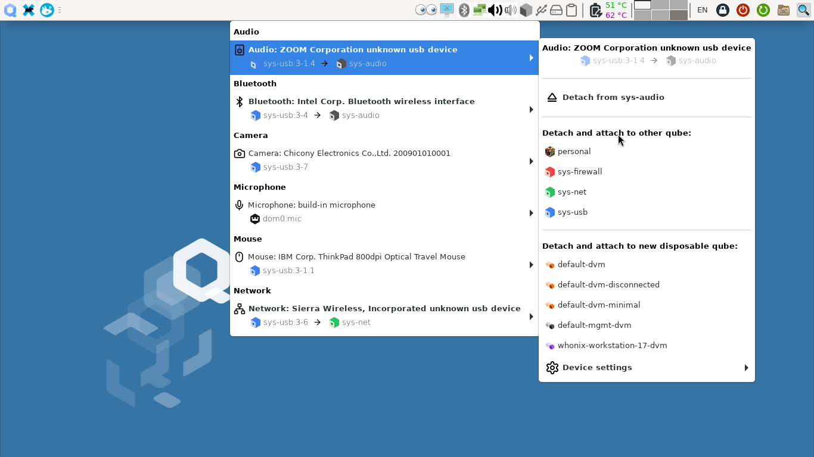
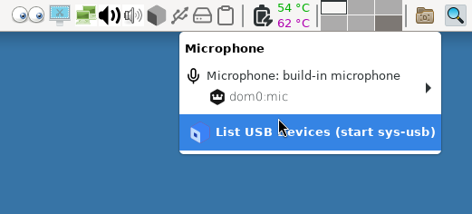

# Qubes OS updates Weekly Review - Y2025-W29

### Introduction
Weekly review of new packages uploaded to Qubes OS repositories. Link to previous Newsletter [here](https://forum.qubes-os.org/t/qubes-os-updates-weekly-review-y2025-w28).

<details>
<summary>Alphabetically sorted list of new packages uploaded to Qubes OS repositories</summary>

```bash
kernel-515-5.15.187-1.qubes.fc37.x86_64.rpm
kernel-515-devel-5.15.187-1.qubes.fc37.x86_64.rpm
kernel-515-modules-5.15.187-1.qubes.fc37.x86_64.rpm
kernel-515-qubes-vm-5.15.187-1.qubes.fc37.x86_64.rpm
kernel-6.12.37-1.qubes.fc37.x86_64.rpm
kernel-6.12.37-1.qubes.fc41.x86_64.rpm
kernel-61-6.1.144-1.qubes.fc37.x86_64.rpm
kernel-61-devel-6.1.144-1.qubes.fc37.x86_64.rpm
kernel-61-modules-6.1.144-1.qubes.fc37.x86_64.rpm
kernel-61-qubes-vm-6.1.144-1.qubes.fc37.x86_64.rpm
kernel-66-6.6.97-1.qubes.fc37.x86_64.rpm
kernel-66-devel-6.6.97-1.qubes.fc37.x86_64.rpm
kernel-66-modules-6.6.97-1.qubes.fc37.x86_64.rpm
kernel-66-qubes-vm-6.6.97-1.qubes.fc37.x86_64.rpm
kernel-devel-6.12.37-1.qubes.fc37.x86_64.rpm
kernel-devel-6.12.37-1.qubes.fc41.x86_64.rpm
kernel-latest-6.15.6-1.qubes.fc37.x86_64.rpm
kernel-latest-6.15.6-1.qubes.fc41.x86_64.rpm
kernel-latest-devel-6.15.6-1.qubes.fc37.x86_64.rpm
kernel-latest-devel-6.15.6-1.qubes.fc41.x86_64.rpm
kernel-latest-modules-6.15.6-1.qubes.fc37.x86_64.rpm
kernel-latest-modules-6.15.6-1.qubes.fc41.x86_64.rpm
kernel-latest-qubes-vm-6.15.6-1.qubes.fc37.x86_64.rpm
kernel-latest-qubes-vm-6.15.6-1.qubes.fc41.x86_64.rpm
kernel-modules-6.12.37-1.qubes.fc37.x86_64.rpm
kernel-modules-6.12.37-1.qubes.fc41.x86_64.rpm
kernel-qubes-vm-6.12.37-1.qubes.fc37.x86_64.rpm
kernel-qubes-vm-6.12.37-1.qubes.fc41.x86_64.rpm
python3-qubes-menu_1.2.7-1+deb12u1_amd64.deb
python3-qubes-menu_1.2.7-1+deb13u1_amd64.deb
python3-qubes-menu_1.2.7-1+jammy1_amd64.deb
python3-qubes-menu_1.2.7-1+noble1_amd64.deb
python3-qubesadmin-4.3.19-1.fc40.noarch.rpm
python3-qubesadmin-4.3.19-1.fc41.noarch.rpm
python3-qubesadmin_4.3.19-1+deb12u1_amd64.deb
python3-qubesadmin_4.3.19-1+deb13u1_amd64.deb
python3-qubesadmin_4.3.19-1+jammy1_amd64.deb
python3-qubesadmin_4.3.19-1+noble1_amd64.deb
python3-qui_4.3.15-1+deb12u1_amd64.deb
python3-qui_4.3.15-1+deb13u1_amd64.deb
python3-qui_4.3.15-1+jammy1_amd64.deb
python3-qui_4.3.15-1+noble1_amd64.deb
python3-xen-4.17.5-11.fc37.x86_64.rpm
qubes-core-admin-client-4.3.19-1.fc40.noarch.rpm
qubes-core-admin-client-4.3.19-1.fc41.noarch.rpm
qubes-core-admin-client_4.3.19-1+deb12u1_amd64.deb
qubes-core-admin-client_4.3.19-1+deb13u1_amd64.deb
qubes-core-admin-client_4.3.19-1+jammy1_amd64.deb
qubes-core-admin-client_4.3.19-1+noble1_amd64.deb
qubes-core-dom0-linux-4.2.36-1.fc37.x86_64.rpm
qubes-core-dom0-linux-4.3.17-1.fc41.x86_64.rpm
qubes-core-dom0-linux-kernel-install-4.2.36-1.fc37.x86_64.rpm
qubes-core-dom0-linux-kernel-install-4.3.17-1.fc41.x86_64.rpm
qubes-core-dom0-vaio-fixes-4.2.36-1.fc37.x86_64.rpm
qubes-core-dom0-vaio-fixes-4.3.17-1.fc41.x86_64.rpm
qubes-desktop-linux-manager-4.3.15-1.fc40.noarch.rpm
qubes-desktop-linux-manager-4.3.15-1.fc41.noarch.rpm
qubes-desktop-linux-manager-4.3.15-1.fc42.noarch.rpm
qubes-desktop-linux-manager_4.3.15-1+deb12u1_amd64.deb
qubes-desktop-linux-manager_4.3.15-1+deb13u1_amd64.deb
qubes-desktop-linux-manager_4.3.15-1+jammy1_amd64.deb
qubes-desktop-linux-manager_4.3.15-1+noble1_amd64.deb
qubes-desktop-linux-menu-1.2.7-1.fc40.noarch.rpm
qubes-desktop-linux-menu-1.2.7-1.fc41.noarch.rpm
qubes-desktop-linux-menu-1.2.7-1.fc42.noarch.rpm
qubes-desktop-linux-menu_1.2.7-1+deb12u1_amd64.deb
qubes-desktop-linux-menu_1.2.7-1+deb13u1_amd64.deb
qubes-desktop-linux-menu_1.2.7-1+jammy1_amd64.deb
qubes-desktop-linux-menu_1.2.7-1+noble1_amd64.deb
qubes-mgmt-salt-dom0-virtual-machines-4.3.3-1.fc41.noarch.rpm
qubes-usb-proxy-4.3.1-1-x86_64.pkg.tar.zst
qubes-usb-proxy-4.3.1-1.fc40.noarch.rpm
qubes-usb-proxy-4.3.1-1.fc41.noarch.rpm
qubes-usb-proxy-4.3.1-1.fc42.noarch.rpm
qubes-usb-proxy-dom0-4.3.1-1.fc41.noarch.rpm
qubes-usb-proxy_4.3.1+deb12u1_amd64.deb
qubes-usb-proxy_4.3.1+deb13u1_amd64.deb
qubes-vm-xen-4.17.5-11-x86_64.pkg.tar.zst
split-gpg2-1.1.8-1.fc40.noarch.rpm
split-gpg2-tests-1.1.8-1.fc40.noarch.rpm
xen-4.17.5-11.fc37.x86_64.rpm
xen-devel-4.17.5-11.fc37.x86_64.rpm
xen-doc-4.17.5-11.fc37.noarch.rpm
xen-hypervisor-4.17.5-11.fc37.x86_64.rpm
xen-libs-4.17.5-11.fc37.x86_64.rpm
xen-licenses-4.17.5-11.fc37.x86_64.rpm
xen-runtime-4.17.5-11.fc37.x86_64.rpm
```

</details>

### Highlights
- Improvements to Qui Devices widget.

### Details
In addition to the usual minor fixes and patches (full list [here](https://github.com/QubesOS/updates-status/issues?q=is%3Aissue+created%3A2025-07-14..2025-07-20)):

* **desktop-linux-manager** [v4.3.16](https://github.com/QubesOS/updates-status/issues/5846) (r4.3)
  **desktop-linux-manager** [v4.3.15](https://github.com/QubesOS/updates-status/issues/5838) (r4.3)

. A visual notification is added to Qui Updates widget to notify user once the installed Qubes OS is end-of-life. When the core team decides the EOL date, an update will set the `os-eol` feature of dom0 (most probably weeks or months in advance). And once the time arrives, user will get the notification. Mock screenshot below:


. Some updated unittests for preloaded disposables.

. A `"Saving changes"` dialog is added to Global Config.


. New improved icons for Qui Devices widget. Option to show/hide child devices (e.g. for USB storage -> main block device -> child block devices). Option to open Global Settings devices assignments tab from Qui Devices widget. Improved microphone connection handling. Screenshot:



. For users who have turned off `autostart` of their `sys-usb` (or those who shut it down occasionally to free-up some RAM), there is a new option to start it from Qui Devices menu. But for complex scenarios where advanced users might have multiple USB controllers and USBVMs, they should still use the `qvm-start`, Qube Manager or other method. Screenshot:



. There has been considerable improvements in Qui Devices speed by batching some operations and async functions.

. Improvements for Qui Devices widget to handle device attachment/detachment events.

* **gui-agent-linux** [v4.3.9](https://github.com/QubesOS/updates-status/issues/5845) (r4.3)

In addition to some clean sweep, there is some improvements for the dummy video driver within Linux guests and the GUI agent to send the window content to the GUIVM side only if window is realized (and there is something to show).

* **core-admin-client** [v4.3.19](https://github.com/QubesOS/updates-status/issues/5843) (r4.3)

. Necessary changes to the devices API for the new Qui Devices widget.

. Documentation update for preloaded disposables and disabling volume snapshots.

. Documentation for the `qemu-extra-args` feature (only applicable for HVMs).

. Support of `pbzip2` compression filter for backup/restore.

* **app-linux-usb-proxy** [v4.3.1](https://github.com/QubesOS/updates-status/issues/5841) (r4.3)

Minor fixes (and some support for openSUSE template).

* **mgmt-salt-dom0-virtual-machines** [v4.3.3](https://github.com/QubesOS/updates-status/issues/5840) (r4.3)

Salt formula to prioritize `sys-usb` start before other qubes (e.g. in case system has only USB keyboard).

* **vmm-xen** [v4.17.5-11](https://github.com/QubesOS/updates-status/issues/5839) (r4.2)

Backport fix for Thinkpad P14s Gen4 AMD

* **core-admin-linux** [v4.3.17](https://github.com/QubesOS/updates-status/issues/5833) (r4.3)

. Disabling SELinux during (Fedora) template updates.

. A minor fix for updating dom0 on KDE.

. Fix to allow updating AppVMs (will be volatile) via `qubes-vm-update`.

* **core-admin-linux** [v4.2.36](https://github.com/QubesOS/updates-status/issues/5836) (r4.2)

. Backport fix for the notorious SELinux bug with memory ballooning.

* **desktop-linux-menu** [v1.2.7](https://github.com/QubesOS/updates-status/issues/5835) (r4.3)

Fix for a problem with space in search text in App Menu.

* **linux-kernel-latest (current stable)** [v6.15.6-1-latest](https://github.com/QubesOS/updates-status/issues/5826) (r4.3)
  **linux-kernel-latest (current stable)** [v6.15.6-1-latest](https://github.com/QubesOS/updates-status/issues/5828) (r4.2)
  **linux-kernel (lts i.e. the default)** [v6.12.37-1](https://github.com/QubesOS/updates-status/issues/5829) (r4.3)
  **linux-kernel (lts i.e. the default)** [v6.12.37-1](https://github.com/QubesOS/updates-status/issues/5827) (r4.2)
  **linux-kernel-66 (old lts)** [v6.6.97-1](https://github.com/QubesOS/updates-status/issues/5832) (r4.2)
  **linux-kernel-61 (older lts)** [v6.1.144-1](https://github.com/QubesOS/updates-status/issues/5830) (r4.2)
  **linux-kernel-515 (very old lts)** [v5.15.187-1](https://github.com/QubesOS/updates-status/issues/5831) (r4.2)

A fresh set set of kernels for people with different hardware and priorities. You could install the additional ones if you need them. Official v6.15.7 announcement by Greg Kroah-Hartman [here](https://lwn.net/Articles/1030356/).

#### Epilogue
While the Qubes OS r4.3 rc1 release date is not officially announced, based on observation of the few pending [milestones](https://github.com/orgs/QubesOS/projects/26) and their progress during past few weeks, I am pretty positive that a release candidate might be imminent. This new release will have many new and improved features (both security and usability related).
