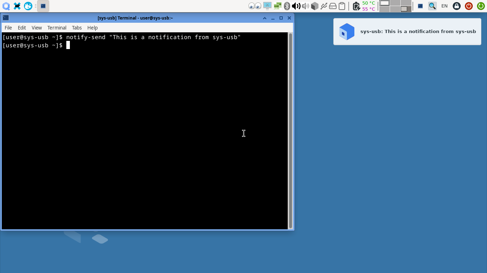
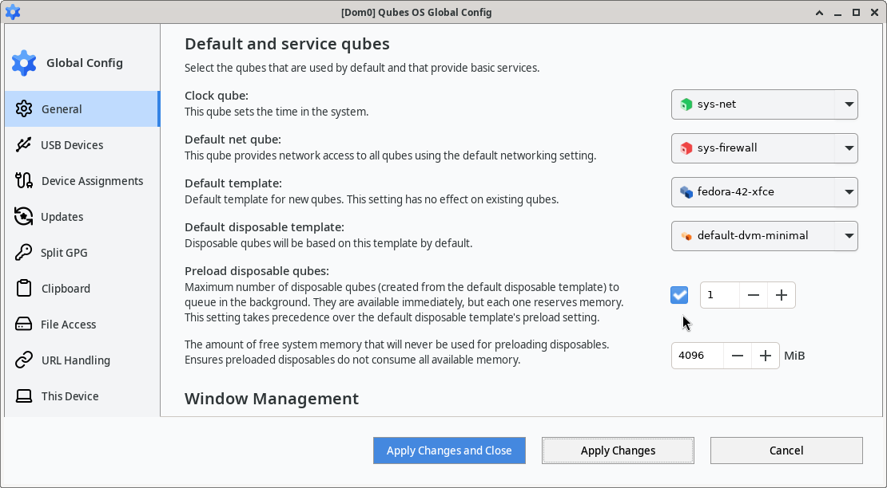
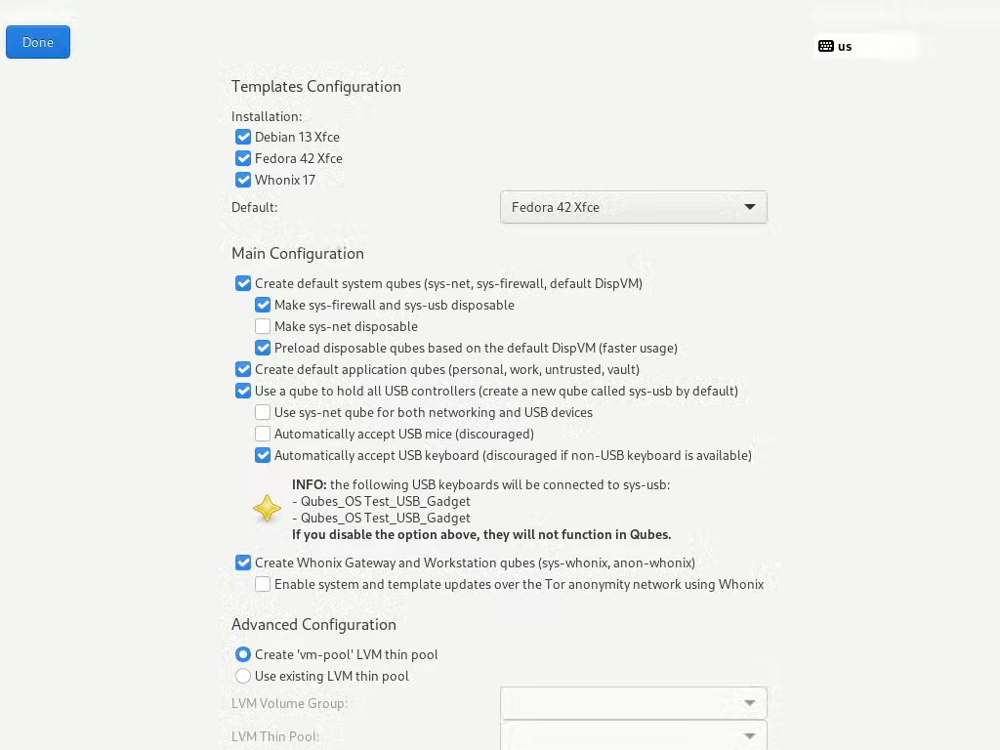

# Qubes OS updates Weekly Review - Y2025-W32

### Introduction
Weekly review of new packages uploaded to Qubes OS repositories. Link to previous Newsletter [here](https://forum.qubes-os.org/t/qubes-os-updates-weekly-review-y2025-w31).

<details>
<summary>Alphabetically sorted list of new packages uploaded to Qubes OS repositories</summary>

```bash
pipewire-qubes-4.3.10-1-x86_64.pkg.tar.zst
pipewire-qubes-4.3.10-1.fc41.x86_64.rpm
pipewire-qubes-4.3.10-1.fc42.x86_64.rpm
pipewire-qubes-dbgsym_4.3.10-1+deb12u1_amd64.deb
pipewire-qubes-dbgsym_4.3.10-1+deb13u1_amd64.deb
pipewire-qubes_4.3.10-1+deb12u1_amd64.deb
pipewire-qubes_4.3.10-1+deb13u1_amd64.deb
pipewire-qubes_4.3.10-1+jammy1_amd64.deb
pipewire-qubes_4.3.10-1+noble1_amd64.deb
pulseaudio-qubes-4.3.10-1.fc41.x86_64.rpm
pulseaudio-qubes-4.3.10-1.fc42.x86_64.rpm
pulseaudio-qubes-dbgsym_4.3.10-1+deb12u1_amd64.deb
pulseaudio-qubes-dbgsym_4.3.10-1+deb13u1_amd64.deb
pulseaudio-qubes_4.3.10-1+deb12u1_amd64.deb
pulseaudio-qubes_4.3.10-1+deb13u1_amd64.deb
pulseaudio-qubes_4.3.10-1+jammy1_amd64.deb
pulseaudio-qubes_4.3.10-1+noble1_amd64.deb
python3-qubes-menu_1.2.8-1+deb12u1_amd64.deb
python3-qubes-menu_1.2.8-1+deb13u1_amd64.deb
python3-qubes-menu_1.2.8-1+jammy1_amd64.deb
python3-qubes-menu_1.2.8-1+noble1_amd64.deb
python3-qubesadmin-4.3.20-1.fc41.noarch.rpm
python3-qubesadmin-4.3.20-1.fc42.noarch.rpm
python3-qubesadmin_4.3.20-1+deb12u1_amd64.deb
python3-qubesadmin_4.3.20-1+deb13u1_amd64.deb
python3-qubesadmin_4.3.20-1+jammy1_amd64.deb
python3-qubesadmin_4.3.20-1+noble1_amd64.deb
python3-qui_4.3.17-1+deb12u1_amd64.deb
python3-qui_4.3.17-1+deb13u1_amd64.deb
python3-qui_4.3.17-1+jammy1_amd64.deb
python3-qui_4.3.17-1+noble1_amd64.deb
python3-splitgpg2_1.1.9+deb12u1_amd64.deb
python3-splitgpg2_1.1.9+deb13u1_amd64.deb
python3-splitgpg2_1.1.9+jammy1_amd64.deb
python3-splitgpg2_1.1.9+noble1_amd64.deb
python3-xen-4.17.5-11.118.fc37.x86_64.rpm
qubes-anaconda-addon-4.3.1-1.fc41.noarch.rpm
qubes-artwork-4.3.8-1.fc41.noarch.rpm
qubes-artwork-4.3.8-1.fc42.noarch.rpm
qubes-artwork-anaconda-4.3.8-1.fc41.noarch.rpm
qubes-artwork-anaconda-4.3.8-1.fc42.noarch.rpm
qubes-artwork-efi-4.3.8-1.fc41.noarch.rpm
qubes-artwork-efi-4.3.8-1.fc42.noarch.rpm
qubes-artwork-plymouth-4.3.8-1.fc41.noarch.rpm
qubes-artwork-plymouth-4.3.8-1.fc42.noarch.rpm
qubes-artwork_4.3.8-1+deb12u1_amd64.deb
qubes-artwork_4.3.8-1+deb13u1_amd64.deb
qubes-artwork_4.3.8-1+jammy1_amd64.deb
qubes-artwork_4.3.8-1+noble1_amd64.deb
qubes-audio-daemon-4.3.11-1.fc41.x86_64.rpm
qubes-audio-daemon-4.3.11-1.fc42.x86_64.rpm
qubes-audio-daemon-4.3.12-1.fc41.x86_64.rpm
qubes-audio-daemon-4.3.12-1.fc42.x86_64.rpm
qubes-audio-daemon-dbgsym_4.3.11-1+deb12u1_amd64.deb
qubes-audio-daemon-dbgsym_4.3.11-1+deb13u1_amd64.deb
qubes-audio-daemon-dbgsym_4.3.12-1+deb12u1_amd64.deb
qubes-audio-daemon-dbgsym_4.3.12-1+deb13u1_amd64.deb
qubes-audio-daemon_4.3.11-1+deb12u1_amd64.deb
qubes-audio-daemon_4.3.11-1+deb13u1_amd64.deb
qubes-audio-daemon_4.3.11-1+jammy1_amd64.deb
qubes-audio-daemon_4.3.11-1+noble1_amd64.deb
qubes-audio-daemon_4.3.12-1+deb12u1_amd64.deb
qubes-audio-daemon_4.3.12-1+deb13u1_amd64.deb
qubes-audio-daemon_4.3.12-1+jammy1_amd64.deb
qubes-audio-daemon_4.3.12-1+noble1_amd64.deb
qubes-audio-dom0-4.3.11-1.fc41.x86_64.rpm
qubes-audio-dom0-4.3.11-1.fc42.x86_64.rpm
qubes-audio-dom0-4.3.12-1.fc41.x86_64.rpm
qubes-audio-dom0-4.3.12-1.fc42.x86_64.rpm
qubes-core-admin-client-4.3.20-1.fc41.noarch.rpm
qubes-core-admin-client-4.3.20-1.fc42.noarch.rpm
qubes-core-admin-client_4.3.20-1+deb12u1_amd64.deb
qubes-core-admin-client_4.3.20-1+deb13u1_amd64.deb
qubes-core-admin-client_4.3.20-1+jammy1_amd64.deb
qubes-core-admin-client_4.3.20-1+noble1_amd64.deb
qubes-core-agent-4.3.28-1.fc41.x86_64.rpm
qubes-core-agent-4.3.28-1.fc42.x86_64.rpm
qubes-core-agent-4.3.29-1.fc41.x86_64.rpm
qubes-core-agent-4.3.29-1.fc42.x86_64.rpm
qubes-core-agent-caja-4.3.28-1.fc41.x86_64.rpm
qubes-core-agent-caja-4.3.28-1.fc42.x86_64.rpm
qubes-core-agent-caja-4.3.29-1.fc41.x86_64.rpm
qubes-core-agent-caja-4.3.29-1.fc42.x86_64.rpm
qubes-core-agent-caja_4.3.28-1+deb12u1_amd64.deb
qubes-core-agent-caja_4.3.28-1+deb13u1_amd64.deb
qubes-core-agent-caja_4.3.28-1+jammy1_amd64.deb
qubes-core-agent-caja_4.3.28-1+noble1_amd64.deb
qubes-core-agent-caja_4.3.29-1+deb12u1_amd64.deb
qubes-core-agent-caja_4.3.29-1+deb13u1_amd64.deb
qubes-core-agent-caja_4.3.29-1+jammy1_amd64.deb
qubes-core-agent-caja_4.3.29-1+noble1_amd64.deb
qubes-core-agent-dbgsym_4.3.28-1+deb12u1_amd64.deb
qubes-core-agent-dbgsym_4.3.28-1+deb13u1_amd64.deb
qubes-core-agent-dbgsym_4.3.29-1+deb12u1_amd64.deb
qubes-core-agent-dbgsym_4.3.29-1+deb13u1_amd64.deb
qubes-core-agent-dom0-updates-4.3.28-1.fc41.noarch.rpm
qubes-core-agent-dom0-updates-4.3.28-1.fc42.noarch.rpm
qubes-core-agent-dom0-updates-4.3.29-1.fc41.noarch.rpm
qubes-core-agent-dom0-updates-4.3.29-1.fc42.noarch.rpm
qubes-core-agent-dom0-updates_4.3.28-1+deb12u1_amd64.deb
qubes-core-agent-dom0-updates_4.3.28-1+deb13u1_amd64.deb
qubes-core-agent-dom0-updates_4.3.28-1+jammy1_amd64.deb
qubes-core-agent-dom0-updates_4.3.28-1+noble1_amd64.deb
qubes-core-agent-dom0-updates_4.3.29-1+deb12u1_amd64.deb
qubes-core-agent-dom0-updates_4.3.29-1+deb13u1_amd64.deb
qubes-core-agent-dom0-updates_4.3.29-1+jammy1_amd64.deb
qubes-core-agent-dom0-updates_4.3.29-1+noble1_amd64.deb
qubes-core-agent-nautilus-4.3.28-1.fc41.x86_64.rpm
qubes-core-agent-nautilus-4.3.28-1.fc42.x86_64.rpm
qubes-core-agent-nautilus-4.3.29-1.fc41.x86_64.rpm
qubes-core-agent-nautilus-4.3.29-1.fc42.x86_64.rpm
qubes-core-agent-nautilus_4.3.28-1+deb12u1_amd64.deb
qubes-core-agent-nautilus_4.3.28-1+deb13u1_amd64.deb
qubes-core-agent-nautilus_4.3.28-1+jammy1_amd64.deb
qubes-core-agent-nautilus_4.3.28-1+noble1_amd64.deb
qubes-core-agent-nautilus_4.3.29-1+deb12u1_amd64.deb
qubes-core-agent-nautilus_4.3.29-1+deb13u1_amd64.deb
qubes-core-agent-nautilus_4.3.29-1+jammy1_amd64.deb
qubes-core-agent-nautilus_4.3.29-1+noble1_amd64.deb
qubes-core-agent-network-manager-4.3.28-1.fc41.noarch.rpm
qubes-core-agent-network-manager-4.3.28-1.fc42.noarch.rpm
qubes-core-agent-network-manager-4.3.29-1.fc41.noarch.rpm
qubes-core-agent-network-manager-4.3.29-1.fc42.noarch.rpm
qubes-core-agent-network-manager_4.3.28-1+deb12u1_amd64.deb
qubes-core-agent-network-manager_4.3.28-1+deb13u1_amd64.deb
qubes-core-agent-network-manager_4.3.28-1+jammy1_amd64.deb
qubes-core-agent-network-manager_4.3.28-1+noble1_amd64.deb
qubes-core-agent-network-manager_4.3.29-1+deb12u1_amd64.deb
qubes-core-agent-network-manager_4.3.29-1+deb13u1_amd64.deb
qubes-core-agent-network-manager_4.3.29-1+jammy1_amd64.deb
qubes-core-agent-network-manager_4.3.29-1+noble1_amd64.deb
qubes-core-agent-networking-4.3.28-1.fc41.noarch.rpm
qubes-core-agent-networking-4.3.28-1.fc42.noarch.rpm
qubes-core-agent-networking-4.3.29-1.fc41.noarch.rpm
qubes-core-agent-networking-4.3.29-1.fc42.noarch.rpm
qubes-core-agent-networking_4.3.28-1+deb12u1_amd64.deb
qubes-core-agent-networking_4.3.28-1+deb13u1_amd64.deb
qubes-core-agent-networking_4.3.28-1+jammy1_amd64.deb
qubes-core-agent-networking_4.3.28-1+noble1_amd64.deb
qubes-core-agent-networking_4.3.29-1+deb12u1_amd64.deb
qubes-core-agent-networking_4.3.29-1+deb13u1_amd64.deb
qubes-core-agent-networking_4.3.29-1+jammy1_amd64.deb
qubes-core-agent-networking_4.3.29-1+noble1_amd64.deb
qubes-core-agent-passwordless-root-4.3.28-1.fc41.noarch.rpm
qubes-core-agent-passwordless-root-4.3.28-1.fc42.noarch.rpm
qubes-core-agent-passwordless-root-4.3.29-1.fc41.noarch.rpm
qubes-core-agent-passwordless-root-4.3.29-1.fc42.noarch.rpm
qubes-core-agent-passwordless-root_4.3.28-1+deb12u1_amd64.deb
qubes-core-agent-passwordless-root_4.3.28-1+deb13u1_amd64.deb
qubes-core-agent-passwordless-root_4.3.28-1+jammy1_amd64.deb
qubes-core-agent-passwordless-root_4.3.28-1+noble1_amd64.deb
qubes-core-agent-passwordless-root_4.3.29-1+deb12u1_amd64.deb
qubes-core-agent-passwordless-root_4.3.29-1+deb13u1_amd64.deb
qubes-core-agent-passwordless-root_4.3.29-1+jammy1_amd64.deb
qubes-core-agent-passwordless-root_4.3.29-1+noble1_amd64.deb
qubes-core-agent-selinux-4.3.28-1.fc41.noarch.rpm
qubes-core-agent-selinux-4.3.28-1.fc42.noarch.rpm
qubes-core-agent-selinux-4.3.29-1.fc41.noarch.rpm
qubes-core-agent-selinux-4.3.29-1.fc42.noarch.rpm
qubes-core-agent-systemd-4.3.28-1.fc41.x86_64.rpm
qubes-core-agent-systemd-4.3.28-1.fc42.x86_64.rpm
qubes-core-agent-systemd-4.3.29-1.fc41.x86_64.rpm
qubes-core-agent-systemd-4.3.29-1.fc42.x86_64.rpm
qubes-core-agent-thunar-4.3.28-1.fc41.x86_64.rpm
qubes-core-agent-thunar-4.3.28-1.fc42.x86_64.rpm
qubes-core-agent-thunar-4.3.29-1.fc41.x86_64.rpm
qubes-core-agent-thunar-4.3.29-1.fc42.x86_64.rpm
qubes-core-agent-thunar_4.3.28-1+deb12u1_amd64.deb
qubes-core-agent-thunar_4.3.28-1+deb13u1_amd64.deb
qubes-core-agent-thunar_4.3.28-1+jammy1_amd64.deb
qubes-core-agent-thunar_4.3.28-1+noble1_amd64.deb
qubes-core-agent-thunar_4.3.29-1+deb12u1_amd64.deb
qubes-core-agent-thunar_4.3.29-1+deb13u1_amd64.deb
qubes-core-agent-thunar_4.3.29-1+jammy1_amd64.deb
qubes-core-agent-thunar_4.3.29-1+noble1_amd64.deb
qubes-core-agent_4.3.28-1+deb12u1_amd64.deb
qubes-core-agent_4.3.28-1+deb13u1_amd64.deb
qubes-core-agent_4.3.28-1+jammy1_amd64.deb
qubes-core-agent_4.3.28-1+noble1_amd64.deb
qubes-core-agent_4.3.29-1+deb12u1_amd64.deb
qubes-core-agent_4.3.29-1+deb13u1_amd64.deb
qubes-core-agent_4.3.29-1+jammy1_amd64.deb
qubes-core-agent_4.3.29-1+noble1_amd64.deb
qubes-core-dom0-4.3.32-1.fc41.noarch.rpm
qubes-core-dom0-4.3.33-1.fc41.noarch.rpm
qubes-core-dom0-4.3.34-1.fc41.noarch.rpm
qubes-desktop-linux-manager-4.3.17-1.fc41.noarch.rpm
qubes-desktop-linux-manager-4.3.17-1.fc42.noarch.rpm
qubes-desktop-linux-manager_4.3.17-1+deb12u1_amd64.deb
qubes-desktop-linux-manager_4.3.17-1+deb13u1_amd64.deb
qubes-desktop-linux-manager_4.3.17-1+jammy1_amd64.deb
qubes-desktop-linux-manager_4.3.17-1+noble1_amd64.deb
qubes-desktop-linux-menu-1.2.8-1.fc41.noarch.rpm
qubes-desktop-linux-menu-1.2.8-1.fc42.noarch.rpm
qubes-desktop-linux-menu_1.2.8-1+deb12u1_amd64.deb
qubes-desktop-linux-menu_1.2.8-1+deb13u1_amd64.deb
qubes-desktop-linux-menu_1.2.8-1+jammy1_amd64.deb
qubes-desktop-linux-menu_1.2.8-1+noble1_amd64.deb
qubes-dist-upgrade-4.2.0-1.fc37.noarch.rpm
qubes-dist-upgrade-4.2.0-1.fc41.noarch.rpm
qubes-dom0-meta-packages-4.3.3-1.fc41.noarch.rpm
qubes-dom0-unwanted-packages-4.3.3-1.fc41.noarch.rpm
qubes-gpg-split-2.0.79-1-x86_64.pkg.tar.zst
qubes-gpg-split-2.0.79-1.fc41.x86_64.rpm
qubes-gpg-split-2.0.79-1.fc42.x86_64.rpm
qubes-gpg-split-dbgsym_2.0.79-1+deb12u1_amd64.deb
qubes-gpg-split-dbgsym_2.0.79-1+deb13u1_amd64.deb
qubes-gpg-split-dom0-2.0.79-1.fc37.noarch.rpm
qubes-gpg-split-dom0-2.0.79-1.fc41.noarch.rpm
qubes-gpg-split-tests-2.0.79-1.fc41.x86_64.rpm
qubes-gpg-split-tests-2.0.79-1.fc42.x86_64.rpm
qubes-gpg-split-tests_2.0.79-1+deb12u1_amd64.deb
qubes-gpg-split-tests_2.0.79-1+deb13u1_amd64.deb
qubes-gpg-split-tests_2.0.79-1+jammy1_amd64.deb
qubes-gpg-split-tests_2.0.79-1+noble1_amd64.deb
qubes-gpg-split_2.0.79-1+deb12u1_amd64.deb
qubes-gpg-split_2.0.79-1+deb13u1_amd64.deb
qubes-gpg-split_2.0.79-1+jammy1_amd64.deb
qubes-gpg-split_2.0.79-1+noble1_amd64.deb
qubes-gui-agent-4.3.10-1.fc41.x86_64.rpm
qubes-gui-agent-4.3.10-1.fc42.x86_64.rpm
qubes-gui-agent-dbgsym_4.3.10-1+deb12u1_amd64.deb
qubes-gui-agent-dbgsym_4.3.10-1+deb13u1_amd64.deb
qubes-gui-agent-selinux-4.3.10-1.fc41.noarch.rpm
qubes-gui-agent-selinux-4.3.10-1.fc42.noarch.rpm
qubes-gui-agent-xfce-4.3.10-1.fc41.x86_64.rpm
qubes-gui-agent-xfce-4.3.10-1.fc42.x86_64.rpm
qubes-gui-agent-xfce_4.3.10-1+deb12u1_amd64.deb
qubes-gui-agent-xfce_4.3.10-1+deb13u1_amd64.deb
qubes-gui-agent-xfce_4.3.10-1+jammy1_amd64.deb
qubes-gui-agent-xfce_4.3.10-1+noble1_amd64.deb
qubes-gui-agent_4.3.10-1+deb12u1_amd64.deb
qubes-gui-agent_4.3.10-1+deb13u1_amd64.deb
qubes-gui-agent_4.3.10-1+jammy1_amd64.deb
qubes-gui-agent_4.3.10-1+noble1_amd64.deb
qubes-gui-daemon-4.3.11-1.fc41.x86_64.rpm
qubes-gui-daemon-4.3.11-1.fc42.x86_64.rpm
qubes-gui-daemon-4.3.12-1.fc41.x86_64.rpm
qubes-gui-daemon-4.3.12-1.fc42.x86_64.rpm
qubes-gui-daemon-dbgsym_4.3.11-1+deb12u1_amd64.deb
qubes-gui-daemon-dbgsym_4.3.11-1+deb13u1_amd64.deb
qubes-gui-daemon-dbgsym_4.3.12-1+deb12u1_amd64.deb
qubes-gui-daemon-dbgsym_4.3.12-1+deb13u1_amd64.deb
qubes-gui-daemon-pulseaudio_4.3.11-1+deb12u1_amd64.deb
qubes-gui-daemon-pulseaudio_4.3.11-1+deb13u1_amd64.deb
qubes-gui-daemon-pulseaudio_4.3.11-1+jammy1_amd64.deb
qubes-gui-daemon-pulseaudio_4.3.11-1+noble1_amd64.deb
qubes-gui-daemon-pulseaudio_4.3.12-1+deb12u1_amd64.deb
qubes-gui-daemon-pulseaudio_4.3.12-1+deb13u1_amd64.deb
qubes-gui-daemon-pulseaudio_4.3.12-1+jammy1_amd64.deb
qubes-gui-daemon-pulseaudio_4.3.12-1+noble1_amd64.deb
qubes-gui-daemon-selinux-4.3.11-1.fc41.x86_64.rpm
qubes-gui-daemon-selinux-4.3.11-1.fc42.x86_64.rpm
qubes-gui-daemon-selinux-4.3.12-1.fc41.x86_64.rpm
qubes-gui-daemon-selinux-4.3.12-1.fc42.x86_64.rpm
qubes-gui-daemon_4.3.11-1+deb12u1_amd64.deb
qubes-gui-daemon_4.3.11-1+deb13u1_amd64.deb
qubes-gui-daemon_4.3.11-1+jammy1_amd64.deb
qubes-gui-daemon_4.3.11-1+noble1_amd64.deb
qubes-gui-daemon_4.3.12-1+deb12u1_amd64.deb
qubes-gui-daemon_4.3.12-1+deb13u1_amd64.deb
qubes-gui-daemon_4.3.12-1+jammy1_amd64.deb
qubes-gui-daemon_4.3.12-1+noble1_amd64.deb
qubes-gui-dom0-4.3.11-1.fc41.x86_64.rpm
qubes-gui-dom0-4.3.11-1.fc42.x86_64.rpm
qubes-gui-dom0-4.3.12-1.fc41.x86_64.rpm
qubes-gui-dom0-4.3.12-1.fc42.x86_64.rpm
qubes-gui-vnc-4.3.10-1.fc41.x86_64.rpm
qubes-gui-vnc-4.3.10-1.fc42.x86_64.rpm
qubes-gui-vnc_4.3.10-1+deb12u1_amd64.deb
qubes-gui-vnc_4.3.10-1+deb13u1_amd64.deb
qubes-gui-vnc_4.3.10-1+jammy1_amd64.deb
qubes-gui-vnc_4.3.10-1+noble1_amd64.deb
qubes-input-proxy-1.0.43-1-x86_64.pkg.tar.zst
qubes-input-proxy-1.0.43-1.fc37.x86_64.rpm
qubes-input-proxy-1.0.43-1.fc41.x86_64.rpm
qubes-input-proxy-1.0.43-1.fc42.x86_64.rpm
qubes-input-proxy-receiver-1.0.43-1.fc37.x86_64.rpm
qubes-input-proxy-receiver-1.0.43-1.fc41.x86_64.rpm
qubes-input-proxy-receiver-1.0.43-1.fc42.x86_64.rpm
qubes-input-proxy-receiver-dbgsym_1.0.43-1+deb12u1_amd64.deb
qubes-input-proxy-receiver-dbgsym_1.0.43-1+deb13u1_amd64.deb
qubes-input-proxy-receiver_1.0.43-1+deb12u1_amd64.deb
qubes-input-proxy-receiver_1.0.43-1+deb13u1_amd64.deb
qubes-input-proxy-receiver_1.0.43-1+jammy1_amd64.deb
qubes-input-proxy-receiver_1.0.43-1+noble1_amd64.deb
qubes-input-proxy-sender-1.0.43-1.fc37.x86_64.rpm
qubes-input-proxy-sender-1.0.43-1.fc41.x86_64.rpm
qubes-input-proxy-sender-1.0.43-1.fc42.x86_64.rpm
qubes-input-proxy-sender-dbgsym_1.0.43-1+deb12u1_amd64.deb
qubes-input-proxy-sender-dbgsym_1.0.43-1+deb13u1_amd64.deb
qubes-input-proxy-sender_1.0.43-1+deb12u1_amd64.deb
qubes-input-proxy-sender_1.0.43-1+deb13u1_amd64.deb
qubes-input-proxy-sender_1.0.43-1+jammy1_amd64.deb
qubes-input-proxy-sender_1.0.43-1+noble1_amd64.deb
qubes-manager-4.2.12-1.fc37.noarch.rpm
qubes-manager-4.2.12-1.fc42.noarch.rpm
qubes-manager_4.2.12-1+deb12u1_amd64.deb
qubes-manager_4.2.12-1+deb13u1_amd64.deb
qubes-manager_4.2.12-1+jammy1_amd64.deb
qubes-manager_4.2.12-1+noble1_amd64.deb
qubes-mgmt-salt-dom0-virtual-machines-4.3.4-1.fc41.noarch.rpm
qubes-mgmt-salt-dom0-virtual-machines-4.3.5-1.fc41.noarch.rpm
qubes-mgmt-salt-dom0-virtual-machines-4.3.6-1.fc41.noarch.rpm
qubes-mgmt-salt-dom0-virtual-machines-4.3.7-1.fc41.noarch.rpm
qubes-notification-agent-1.0.2-1.fc41.x86_64.rpm
qubes-notification-agent-1.0.2-1.fc42.x86_64.rpm
qubes-notification-agent-1.0.3-1.fc41.x86_64.rpm
qubes-notification-agent-1.0.3-1.fc42.x86_64.rpm
qubes-notification-agent-1.0.4-1.fc41.x86_64.rpm
qubes-notification-agent-1.0.4-1.fc42.x86_64.rpm
qubes-notification-agent-dbgsym_1.0.2-1+deb13u1_amd64.deb
qubes-notification-agent-dbgsym_1.0.3-1+deb13u1_amd64.deb
qubes-notification-agent-dbgsym_1.0.4-1+deb13u1_amd64.deb
qubes-notification-agent_1.0.2-1+deb13u1_amd64.deb
qubes-notification-agent_1.0.3-1+deb13u1_amd64.deb
qubes-notification-agent_1.0.4-1+deb13u1_amd64.deb
qubes-notification-daemon-1.0.2-1.fc41.x86_64.rpm
qubes-notification-daemon-1.0.2-1.fc42.x86_64.rpm
qubes-notification-daemon-1.0.3-1.fc41.x86_64.rpm
qubes-notification-daemon-1.0.3-1.fc42.x86_64.rpm
qubes-notification-daemon-1.0.4-1.fc41.x86_64.rpm
qubes-notification-daemon-1.0.4-1.fc42.x86_64.rpm
qubes-notification-daemon-dbgsym_1.0.2-1+deb13u1_amd64.deb
qubes-notification-daemon-dbgsym_1.0.3-1+deb13u1_amd64.deb
qubes-notification-daemon-dbgsym_1.0.4-1+deb13u1_amd64.deb
qubes-notification-daemon_1.0.2-1+deb13u1_amd64.deb
qubes-notification-daemon_1.0.3-1+deb13u1_amd64.deb
qubes-notification-daemon_1.0.4-1+deb13u1_amd64.deb
qubes-notification-license-1.0.2-1.fc41.x86_64.rpm
qubes-notification-license-1.0.2-1.fc42.x86_64.rpm
qubes-notification-license-1.0.3-1.fc41.x86_64.rpm
qubes-notification-license-1.0.3-1.fc42.x86_64.rpm
qubes-notification-license-1.0.4-1.fc41.x86_64.rpm
qubes-notification-license-1.0.4-1.fc42.x86_64.rpm
qubes-release-4.3-0.7.fc41.noarch.rpm
qubes-release-notes-4.3-0.7.fc41.noarch.rpm
qubes-repo-contrib-4.3.3-1.fc41.noarch.rpm
qubes-repo-contrib-4.3.3-1.fc42.noarch.rpm
qubes-repo-contrib_4.3.3-1+deb12u1_amd64.deb
qubes-repo-contrib_4.3.3-1+deb13u1_amd64.deb
qubes-repo-contrib_4.3.3-1+jammy1_amd64.deb
qubes-repo-contrib_4.3.3-1+noble1_amd64.deb
qubes-template-debian-13-4.3.0-202508032011.noarch.rpm
qubes-template-debian-13-minimal-4.3.0-202508032011.noarch.rpm
qubes-template-debian-13-xfce-4.3.0-202508032011.noarch.rpm
qubes-template-debian-13-xfce-4.3.0-202508080122.noarch.rpm
qubes-template-debian-13-xfce-4.3.0-202508090156.noarch.rpm
qubes-template-debian-13-xfce-4.3.0-202508092358.noarch.rpm
qubes-template-fedora-42-xfce-4.3.0-202508080838.noarch.rpm
qubes-template-fedora-42-xfce-4.3.0-202508090156.noarch.rpm
qubes-template-fedora-42-xfce-4.3.0-202508092358.noarch.rpm
qubes-usb-proxy-4.3.2-1-x86_64.pkg.tar.zst
qubes-usb-proxy-4.3.2-1.fc41.noarch.rpm
qubes-usb-proxy-4.3.2-1.fc42.noarch.rpm
qubes-usb-proxy-dom0-4.3.2-1.fc41.noarch.rpm
qubes-usb-proxy_4.3.2+deb12u1_amd64.deb
qubes-usb-proxy_4.3.2+deb13u1_amd64.deb
qubes-usb-proxy_4.3.2+jammy1_amd64.deb
qubes-usb-proxy_4.3.2+noble1_amd64.deb
qubes-vm-caja-4.3.28-1-x86_64.pkg.tar.zst
qubes-vm-caja-4.3.29-1-x86_64.pkg.tar.zst
qubes-vm-core-4.3.28-1-x86_64.pkg.tar.zst
qubes-vm-core-4.3.29-1-x86_64.pkg.tar.zst
qubes-vm-dependencies-4.3.3-1-x86_64.pkg.tar.zst
qubes-vm-dependencies-4.3.3-1.fc41.noarch.rpm
qubes-vm-dependencies-4.3.3-1.fc42.noarch.rpm
qubes-vm-dependencies_4.3.3-1+deb12u1_amd64.deb
qubes-vm-dependencies_4.3.3-1+deb13u1_amd64.deb
qubes-vm-dependencies_4.3.3-1+jammy1_amd64.deb
qubes-vm-dependencies_4.3.3-1+noble1_amd64.deb
qubes-vm-dom0-updates-4.3.28-1-x86_64.pkg.tar.zst
qubes-vm-dom0-updates-4.3.29-1-x86_64.pkg.tar.zst
qubes-vm-gui-4.3.10-1-x86_64.pkg.tar.zst
qubes-vm-guivm-4.3.3-1.fc41.noarch.rpm
qubes-vm-guivm-4.3.3-1.fc42.noarch.rpm
qubes-vm-guivm_4.3.3-1+deb12u1_amd64.deb
qubes-vm-guivm_4.3.3-1+deb13u1_amd64.deb
qubes-vm-guivm_4.3.3-1+jammy1_amd64.deb
qubes-vm-guivm_4.3.3-1+noble1_amd64.deb
qubes-vm-keyring-4.3.28-1-x86_64.pkg.tar.zst
qubes-vm-keyring-4.3.29-1-x86_64.pkg.tar.zst
qubes-vm-meta-packages-4.3.3-1.fc41.noarch.rpm
qubes-vm-meta-packages-4.3.3-1.fc42.noarch.rpm
qubes-vm-nautilus-4.3.28-1-x86_64.pkg.tar.zst
qubes-vm-nautilus-4.3.29-1-x86_64.pkg.tar.zst
qubes-vm-networking-4.3.28-1-x86_64.pkg.tar.zst
qubes-vm-networking-4.3.29-1-x86_64.pkg.tar.zst
qubes-vm-passwordless-root-4.3.28-1-x86_64.pkg.tar.zst
qubes-vm-passwordless-root-4.3.29-1-x86_64.pkg.tar.zst
qubes-vm-pulseaudio-4.3.10-1-x86_64.pkg.tar.zst
qubes-vm-recommended-4.3.3-1-x86_64.pkg.tar.zst
qubes-vm-recommended-4.3.3-1.fc41.noarch.rpm
qubes-vm-recommended-4.3.3-1.fc42.noarch.rpm
qubes-vm-recommended_4.3.3-1+deb12u1_amd64.deb
qubes-vm-recommended_4.3.3-1+deb13u1_amd64.deb
qubes-vm-recommended_4.3.3-1+jammy1_amd64.deb
qubes-vm-recommended_4.3.3-1+noble1_amd64.deb
qubes-vm-repo-4.3.3-1-x86_64.pkg.tar.zst
qubes-vm-thunar-4.3.28-1-x86_64.pkg.tar.zst
qubes-vm-thunar-4.3.29-1-x86_64.pkg.tar.zst
split-gpg2-1.1.9-1.fc41.noarch.rpm
split-gpg2-1.1.9-1.fc42.noarch.rpm
split-gpg2-dom0-1.1.9-1.fc37.noarch.rpm
split-gpg2-dom0-1.1.9-1.fc41.noarch.rpm
split-gpg2-tests-1.1.9-1.fc41.noarch.rpm
split-gpg2-tests-1.1.9-1.fc42.noarch.rpm
split-gpg2-tests_1.1.9+deb12u1_all.deb
split-gpg2-tests_1.1.9+deb13u1_all.deb
split-gpg2-tests_1.1.9+jammy1_all.deb
split-gpg2-tests_1.1.9+noble1_all.deb
split-gpg2_1.1.9+deb12u1_all.deb
split-gpg2_1.1.9+deb13u1_all.deb
split-gpg2_1.1.9+jammy1_all.deb
split-gpg2_1.1.9+noble1_all.deb
xen-4.17.5-11.118.fc37.x86_64.rpm
xen-devel-4.17.5-11.118.fc37.x86_64.rpm
xen-doc-4.17.5-11.118.fc37.noarch.rpm
xen-hypervisor-4.17.5-11.118.fc37.x86_64.rpm
xen-libs-4.17.5-11.118.fc37.x86_64.rpm
xen-licenses-4.17.5-11.118.fc37.x86_64.rpm
xen-runtime-4.17.5-11.118.fc37.x86_64.rpm
xscreensaver-6.12-1.fc41.x86_64.rpm
xscreensaver-6.12-1.fc42.x86_64.rpm
xscreensaver-base-6.12-1.fc41.x86_64.rpm
xscreensaver-base-6.12-1.fc42.x86_64.rpm
xscreensaver-extras-6.12-1.fc41.x86_64.rpm
xscreensaver-extras-6.12-1.fc42.x86_64.rpm
xscreensaver-extras-base-6.12-1.fc41.x86_64.rpm
xscreensaver-extras-base-6.12-1.fc42.x86_64.rpm
xscreensaver-extras-gss-6.12-1.fc41.x86_64.rpm
xscreensaver-extras-gss-6.12-1.fc42.x86_64.rpm
xscreensaver-gl-base-6.12-1.fc41.x86_64.rpm
xscreensaver-gl-base-6.12-1.fc42.x86_64.rpm
xscreensaver-gl-extras-6.12-1.fc41.x86_64.rpm
xscreensaver-gl-extras-6.12-1.fc42.x86_64.rpm
xscreensaver-gl-extras-gss-6.12-1.fc41.x86_64.rpm
xscreensaver-gl-extras-gss-6.12-1.fc42.x86_64.rpm
xserver-xorg-input-qubes-dbgsym_4.3.10-1+deb12u1_amd64.deb
xserver-xorg-input-qubes-dbgsym_4.3.10-1+deb13u1_amd64.deb
xserver-xorg-input-qubes_4.3.10-1+deb12u1_amd64.deb
xserver-xorg-input-qubes_4.3.10-1+deb13u1_amd64.deb
xserver-xorg-input-qubes_4.3.10-1+jammy1_amd64.deb
xserver-xorg-input-qubes_4.3.10-1+noble1_amd64.deb
xserver-xorg-qubes-common-dbgsym_4.3.10-1+deb12u1_amd64.deb
xserver-xorg-qubes-common-dbgsym_4.3.10-1+deb13u1_amd64.deb
xserver-xorg-qubes-common_4.3.10-1+deb12u1_amd64.deb
xserver-xorg-qubes-common_4.3.10-1+deb13u1_amd64.deb
xserver-xorg-qubes-common_4.3.10-1+jammy1_amd64.deb
xserver-xorg-qubes-common_4.3.10-1+noble1_amd64.deb
xserver-xorg-video-dummyqbs-dbgsym_4.3.10-1+deb12u1_amd64.deb
xserver-xorg-video-dummyqbs-dbgsym_4.3.10-1+deb13u1_amd64.deb
xserver-xorg-video-dummyqbs_4.3.10-1+deb12u1_amd64.deb
xserver-xorg-video-dummyqbs_4.3.10-1+deb13u1_amd64.deb
xserver-xorg-video-dummyqbs_4.3.10-1+jammy1_amd64.deb
xserver-xorg-video-dummyqbs_4.3.10-1+noble1_amd64.deb
```

</details>

### Highlights
- **Qubes OS r4.3 RC1** is released. Official announcement [here](https://forum.qubes-os.org/t/qubes-os-4-3-0-rc1-is-available-for-testing/35435).
- Extremely busy week due to final steps for rc1 release.
- Introduction of Qubes Centralized Tray **Notification Proxy**.
- Major work on Debian 13 full support.

### Details
In addition to the usual minor fixes and patches (full list [here](https://github.com/QubesOS/updates-status/issues?q=is%3Aissue+created%3A2025-08-04..2025-08-10)):

* **qubes-template-fedora-42-xfce** [4.3.0-202508092358](https://github.com/QubesOS/updates-status/issues/5916) (r4.3)
  **qubes-template-debian-13-xfce** [4.3.0-202508092358](https://github.com/QubesOS/updates-status/issues/5915) (r4.3)
  **qubes-template-fedora-42-xfce** [4.3.0-202508090156](https://github.com/QubesOS/updates-status/issues/5911) (r4.3)
  **qubes-template-debian-13-xfce** [4.3.0-202508090156](https://github.com/QubesOS/updates-status/issues/5910) (r4.3)
  **qubes-template-fedora-42-xfce** [4.3.0-202508080838](https://github.com/QubesOS/updates-status/issues/5902) (r4.3)
  **qubes-template-fedora-42-xfce** [4.3.0-202508080122](https://github.com/QubesOS/updates-status/issues/5901) (r4.3)
  **qubes-template-debian-13-xfce** [4.3.0-202508080122](https://github.com/QubesOS/updates-status/issues/5900) (r4.3)

It looks like that the official templates had to be built 3 or 4 times before being good for rc1.

* **notification-proxy** [v1.0.4](https://github.com/QubesOS/updates-status/issues/5914) (r4.3)
  **notification-proxy** [v1.0.3](https://github.com/QubesOS/updates-status/issues/5907) (r4.3)
  **notification-proxy** [v1.0.2](https://github.com/QubesOS/updates-status/issues/5892) (r4.3)

. The initial idea of [Centralized Tray Notification](https://github.com/QubesOS/qubes-issues/issues/889) Proxy was first shared mid 2014. And finally it is available.
. Instead of relying on GUI agent/daemon to relay tray notification from individual qubes, a Qubes built-in solution is written from scratch.
. Unlike the old method where notification from qubes were highlited only with colored border, the new mechanism shows qube icon and name. Screenshot below:

. The new mechanism might support notifications from GUI-less qubes. Such as Mirage firewall.
. It is entirely written in Rust language. Possibly the 1st major component of Qubes which is entirely written in Rust. Excellent opportunity for ambitious Rust lovers who are interested in contributing to Qubes OS. 

* **mgmt-salt-dom0-virtual-machines** [v4.3.7](https://github.com/QubesOS/updates-status/issues/5912) (r4.3)
  **mgmt-salt-dom0-virtual-machines** [v4.3.6](https://github.com/QubesOS/updates-status/issues/5895) (r4.3)
  **mgmt-salt-dom0-virtual-machines** [v4.3.5](https://github.com/QubesOS/updates-status/issues/5886) (r4.3)
  **mgmt-salt-dom0-virtual-machines** [v4.3.4](https://github.com/QubesOS/updates-status/issues/5881) (r4.3)

. If a USB keyboard is used during installation, `sys-usb` startup will get priority after installation.
. Removing two packages from `sys-gui*` which are not available in Debian 13 anymore.
. Dropping *XScreenSaver* in favor of *XFCE4 Screensaver* (in `sys-gui*`).
. Setting number of preloaded disposables based on total system memory.
. Policy for Notification Proxy.

* **core-admin** [v4.3.34](https://github.com/QubesOS/updates-status/issues/5909) (r4.3)
  **core-admin** [v4.3.33](https://github.com/QubesOS/updates-status/issues/5897) (r4.3)
  **core-admin** [v4.3.32](https://github.com/QubesOS/updates-status/issues/5884) (r4.3)

. Refreshing preloaded disposables on parent template update.
. A fix for changing the default NetVM.
. Default policy for Notification Proxy.
. Icons for RemoteVM class (Qubes Air).
. Whonix workstation qubes will show a confirmation prompt before opening files in a DispVM.
. Some Debian 13 related patches.
. Preloaded disposables memory threshold and some benchmark tests.

* **xscreensaver** [v6.12-1](https://github.com/QubesOS/updates-status/issues/5908) (r4.3)
The 1st sign of work on Fedora 43 template, building XScreenSaver on Fedora 43.

* **desktop-linux-manager** [v4.3.17](https://github.com/QubesOS/updates-status/issues/5906) (r4.3)

. Hiding internal qubes from Qubes Devices widget (mostly good for preloaded disposables).
. Notification of usage of preloaded disposables.
. Preloaded disposable settings is added to Global Config. Memory threshold is user configurable. Screenshot below:

. Some SVG icon optimizations (not change in look and feel).

* **dist-upgrade** [v4.2.0](https://github.com/QubesOS/updates-status/issues/5904) (r4.3)
  **dist-upgrade** [v4.2.0](https://github.com/QubesOS/updates-status/issues/5903) (r4.2)

. Improved `qubes-dist-upgrade` to allow users do in-place upgrade from Qubes OS 4.2 to 4.3.
. Automatically enabling preloaded disposables if enough memory is available (16GiB or over that).
. Option to enable testing repos during in-place upgrade.
. Rejecting ancient unsupported templates during in-place upgrade (but user could override that).
. Replacing XScreenSaver with XFCE4 Screensaver during in-place upgrade.
. Option to upgrade old templates restored from backups to new release repos.

* **qubes-release** [v4.3-0.7](https://github.com/QubesOS/updates-status/issues/5899) (r4.3)

. Set full version to `4.3.0-rc1`.
. Including `debian-13-xfce` template in installation image (instead of Debian 12).
. Switching to `fedora-42-xfce` template in installation image (instead of Fedora 41).

* **core-agent-linux** [v4.3.29](https://github.com/QubesOS/updates-status/issues/5898) (r4.3)
  **core-agent-linux** [v4.3.28](https://github.com/QubesOS/updates-status/issues/5888) (r4.3)

. Do not starting `xfce4-notifyd` as it is replaced with Qubes built-in notification proxy.
. Some chore and cleanup.
. On Archlinux, `qubes-core-agent-*` is now synonym to `qubes-vm-*` packages. This was done to unify naming conventions with Debian & Fedora packaging scheme and allowing salt formulas to be used seamlessly cross-distro.

* **artwork** [v4.3.8-1](https://github.com/QubesOS/updates-status/issues/5896) (r4.3)

. Adding icons for RemoteVMs (Qubes Air).
. Setting default desktop background for Debian too (in case it is used as GUIVM).

* **gui-daemon** [v4.3.12](https://github.com/QubesOS/updates-status/issues/5894) (r4.3)
  **gui-daemon** [v4.3.11](https://github.com/QubesOS/updates-status/issues/5885) (r4.3)

. Pulling in Notification proxy.
. Notifying users on clipboard paste denied by policies.

* **meta-packages** [v4.3.3](https://github.com/QubesOS/updates-status/issues/5893) (r4.3)

. More patches for Notification Proxy.

* **desktop-linux-menu** [v1.2.8](https://github.com/QubesOS/updates-status/issues/5891) (r4.3)

Adding a dependency to enable App Menu to be used on Debian 13 based GUIVMs.

* **gui-agent-linux** [v4.3.10](https://github.com/QubesOS/updates-status/issues/5889) (r4.3)

. In the previous version, a patch was made to send window content from GUI Agent to GUI Daemon only if window is realized (and there is something to show). But this patch was partially buggy and had to be reverted. A simpler patch is prepared in this version.
. Pipewire, HVM related (to unbind the Xen virtual VGA adapter) & EWMH compliance fixes.

* **anaconda-addon** [v4.3.1](https://github.com/QubesOS/updates-status/issues/5887) (r4.3)

Option to configure preloaded disposables during installation. Screenshot below:


* **core-admin-client** [v4.3.20](https://github.com/QubesOS/updates-status/issues/5883) (r4.3)

. Debian 13 support related patches.
. `preload-dispvm-threshold` feature documentation.

* **app-linux-usb-proxy** [v4.3.2](https://github.com/QubesOS/updates-status/issues/5880) (r4.3)

. Accepting USB 3.2 Gen 2x2 (20Gbps) devices. But attaching it as USB 3.1 for now. This requires Kernel 6.12 or newer on source/destination qubes.
. The 1st sign that Qubes might support `doas` instead of `sudo` at some point far in future.

* **manager** [v4.2.12-1](https://github.com/QubesOS/updates-status/issues/5879) (r4.2)

Backporting a minor fix for an issue while creating StandaloneVMs (which are not cloned from existing templates).

* **app-linux-split-gpg2** [v1.1.9](https://github.com/QubesOS/updates-status/issues/5878) (r4.3)
  **app-linux-split-gpg2** [v1.1.9](https://github.com/QubesOS/updates-status/issues/5877) (r4.2)
  **app-linux-split-gpg** [v2.0.79](https://github.com/QubesOS/updates-status/issues/5875) (r4.3)
  **app-linux-split-gpg** [v2.0.79](https://github.com/QubesOS/updates-status/issues/5874) (r4.2)

Adjusting tests for Dovecot 2.4.

* **app-linux-input-proxy** [v1.0.43](https://github.com/QubesOS/updates-status/issues/5873) (r4.3)
  **app-linux-input-proxy** [v1.0.43](https://github.com/QubesOS/updates-status/issues/5872) (r4.2)

Fix to handle virtual tablet device on qubes with disabled GUI.

#### Epilogue
After an extremely busy week, I would expect some resting period and fewer than usual changes next week. It is also the summer break period in many parts of the world.
