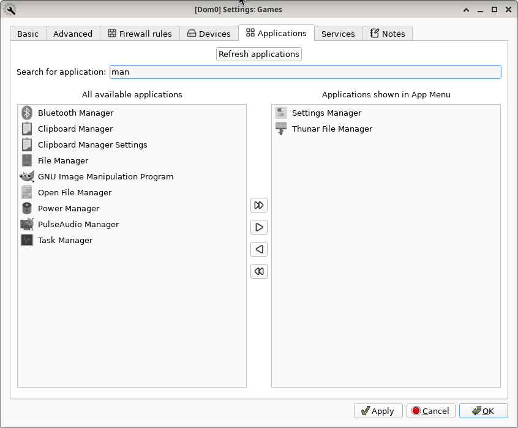

# Qubes OS updates Weekly Review - Y2025-W41

### Introduction
Weekly review of new packages uploaded to Qubes OS repositories. Link to previous Newsletter [here](https://forum.qubes-os.org/t/qubes-os-updates-weekly-review-y2025-w40).

<details>
<summary>Alphabetically sorted list of new packages uploaded to Qubes OS repositories</summary>

```bash
amd-gpu-firmware-20251011-1.fc37.noarch.rpm
amd-gpu-firmware-20251011-1.fc41.noarch.rpm
amd-ucode-firmware-20251011-1.fc37.noarch.rpm
amd-ucode-firmware-20251011-1.fc41.noarch.rpm
anaconda-41.28-3.fc41.x86_64.rpm
anaconda-core-41.28-3.fc41.x86_64.rpm
anaconda-dracut-41.28-3.fc41.x86_64.rpm
anaconda-gui-41.28-3.fc41.x86_64.rpm
anaconda-install-env-deps-41.28-3.fc41.x86_64.rpm
anaconda-install-img-deps-41.28-3.fc41.x86_64.rpm
anaconda-live-41.28-3.fc41.noarch.rpm
anaconda-tui-41.28-3.fc41.x86_64.rpm
anaconda-widgets-41.28-3.fc41.x86_64.rpm
anaconda-widgets-devel-41.28-3.fc41.x86_64.rpm
atheros-firmware-20251011-1.fc37.noarch.rpm
atheros-firmware-20251011-1.fc41.noarch.rpm
brcmfmac-firmware-20251011-1.fc37.noarch.rpm
brcmfmac-firmware-20251011-1.fc41.noarch.rpm
cirrus-audio-firmware-20251011-1.fc37.noarch.rpm
cirrus-audio-firmware-20251011-1.fc41.noarch.rpm
dvb-firmware-20251011-1.fc37.noarch.rpm
dvb-firmware-20251011-1.fc41.noarch.rpm
intel-audio-firmware-20251011-1.fc37.noarch.rpm
intel-audio-firmware-20251011-1.fc41.noarch.rpm
intel-gpu-firmware-20251011-1.fc37.noarch.rpm
intel-gpu-firmware-20251011-1.fc41.noarch.rpm
intel-vsc-firmware-20251011-1.fc37.noarch.rpm
intel-vsc-firmware-20251011-1.fc41.noarch.rpm
iwlegacy-firmware-20251011-1.fc37.noarch.rpm
iwlegacy-firmware-20251011-1.fc41.noarch.rpm
iwlwifi-dvm-firmware-20251011-1.fc37.noarch.rpm
iwlwifi-dvm-firmware-20251011-1.fc41.noarch.rpm
iwlwifi-mvm-firmware-20251011-1.fc37.noarch.rpm
iwlwifi-mvm-firmware-20251011-1.fc41.noarch.rpm
libertas-firmware-20251011-1.fc37.noarch.rpm
libertas-firmware-20251011-1.fc41.noarch.rpm
libnvpair3-2.3.4-1.fc37.x86_64.rpm
libnvpair3-2.3.4-1.fc41.x86_64.rpm
libqubes-pure-dev_4.3.13+deb12u1_amd64.deb
libqubes-pure-dev_4.3.13+jammy1_amd64.deb
libqubes-pure-dev_4.3.13+noble1_amd64.deb
libqubes-pure0-dbgsym_4.3.13+deb12u1_amd64.deb
libqubes-pure0_4.3.13+deb12u1_amd64.deb
libqubes-pure0_4.3.13+jammy1_amd64.deb
libqubes-pure0_4.3.13+noble1_amd64.deb
libqubes-rpc-filecopy-dev_4.3.13+deb12u1_amd64.deb
libqubes-rpc-filecopy-dev_4.3.13+jammy1_amd64.deb
libqubes-rpc-filecopy-dev_4.3.13+noble1_amd64.deb
libqubes-rpc-filecopy2-dbgsym_4.3.13+deb12u1_amd64.deb
libqubes-rpc-filecopy2_4.3.13+deb12u1_amd64.deb
libqubes-rpc-filecopy2_4.3.13+jammy1_amd64.deb
libqubes-rpc-filecopy2_4.3.13+noble1_amd64.deb
libuutil3-2.3.4-1.fc37.x86_64.rpm
libuutil3-2.3.4-1.fc41.x86_64.rpm
libzfs6-2.3.4-1.fc37.x86_64.rpm
libzfs6-2.3.4-1.fc41.x86_64.rpm
libzfs6-devel-2.3.4-1.fc37.x86_64.rpm
libzfs6-devel-2.3.4-1.fc41.x86_64.rpm
libzpool6-2.3.4-1.fc37.x86_64.rpm
libzpool6-2.3.4-1.fc41.x86_64.rpm
linux-firmware-20251011-1.fc37.noarch.rpm
linux-firmware-20251011-1.fc41.noarch.rpm
linux-firmware-whence-20251011-1.fc37.noarch.rpm
linux-firmware-whence-20251011-1.fc41.noarch.rpm
liquidio-firmware-20251011-1.fc37.noarch.rpm
liquidio-firmware-20251011-1.fc41.noarch.rpm
mlxsw_spectrum-firmware-20251011-1.fc37.noarch.rpm
mlxsw_spectrum-firmware-20251011-1.fc41.noarch.rpm
mrvlprestera-firmware-20251011-1.fc37.noarch.rpm
mrvlprestera-firmware-20251011-1.fc41.noarch.rpm
mt7xxx-firmware-20251011-1.fc37.noarch.rpm
mt7xxx-firmware-20251011-1.fc41.noarch.rpm
netronome-firmware-20251011-1.fc37.noarch.rpm
netronome-firmware-20251011-1.fc41.noarch.rpm
nvidia-gpu-firmware-20251011-1.fc37.noarch.rpm
nvidia-gpu-firmware-20251011-1.fc41.noarch.rpm
nxpwireless-firmware-20251011-1.fc37.noarch.rpm
nxpwireless-firmware-20251011-1.fc41.noarch.rpm
python3-pyzfs-2.3.4-1.fc37.noarch.rpm
python3-pyzfs-2.3.4-1.fc41.noarch.rpm
python3-qubesimgconverter-4.3.13-1.fc41.x86_64.rpm
python3-qubesimgconverter-4.3.13-1.fc42.x86_64.rpm
python3-qubesimgconverter-4.3.13-1.fc43.x86_64.rpm
python3-qubesimgconverter_4.3.13+deb12u1_amd64.deb
python3-qubesimgconverter_4.3.13+jammy1_amd64.deb
python3-qubesimgconverter_4.3.13+noble1_amd64.deb
qcom-firmware-20251011-1.fc37.noarch.rpm
qcom-firmware-20251011-1.fc41.noarch.rpm
qed-firmware-20251011-1.fc37.noarch.rpm
qed-firmware-20251011-1.fc41.noarch.rpm
qubes-ansible-1.2.3-1.fc41.noarch.rpm
qubes-ansible-1.2.3-1.fc42.noarch.rpm
qubes-ansible-1.2.3-1.fc43.noarch.rpm
qubes-ansible-1.2.4-1.fc41.noarch.rpm
qubes-ansible-1.2.4-1.fc42.noarch.rpm
qubes-ansible-1.2.4-1.fc43.noarch.rpm
qubes-ansible-dom0-1.2.3-1.fc41.noarch.rpm
qubes-ansible-dom0-1.2.3-1.fc42.noarch.rpm
qubes-ansible-dom0-1.2.3-1.fc43.noarch.rpm
qubes-ansible-dom0-1.2.4-1.fc41.noarch.rpm
qubes-ansible-dom0-1.2.4-1.fc42.noarch.rpm
qubes-ansible-dom0-1.2.4-1.fc43.noarch.rpm
qubes-ansible-tests-1.2.3-1.fc41.noarch.rpm
qubes-ansible-tests-1.2.3-1.fc42.noarch.rpm
qubes-ansible-tests-1.2.3-1.fc43.noarch.rpm
qubes-ansible-tests-1.2.4-1.fc41.noarch.rpm
qubes-ansible-tests-1.2.4-1.fc42.noarch.rpm
qubes-ansible-tests-1.2.4-1.fc43.noarch.rpm
qubes-ansible-vm-1.2.3-1-any.pkg.tar.zst
qubes-ansible-vm-1.2.3-1.fc41.noarch.rpm
qubes-ansible-vm-1.2.3-1.fc42.noarch.rpm
qubes-ansible-vm-1.2.3-1.fc43.noarch.rpm
qubes-ansible-vm-1.2.4-1-any.pkg.tar.zst
qubes-ansible-vm-1.2.4-1.fc41.noarch.rpm
qubes-ansible-vm-1.2.4-1.fc42.noarch.rpm
qubes-ansible-vm-1.2.4-1.fc43.noarch.rpm
qubes-ansible-vm_1.2.3-1+deb12u1_amd64.deb
qubes-ansible-vm_1.2.3-1+deb13u1_amd64.deb
qubes-ansible-vm_1.2.3-1+jammy1_amd64.deb
qubes-ansible-vm_1.2.3-1+noble1_amd64.deb
qubes-ansible-vm_1.2.4-1+deb12u1_amd64.deb
qubes-ansible-vm_1.2.4-1+deb13u1_amd64.deb
qubes-ansible-vm_1.2.4-1+jammy1_amd64.deb
qubes-ansible-vm_1.2.4-1+noble1_amd64.deb
qubes-core-agent-4.3.32-1.fc41.x86_64.rpm
qubes-core-agent-4.3.32-1.fc42.x86_64.rpm
qubes-core-agent-4.3.32-1.fc43.x86_64.rpm
qubes-core-agent-4.3.33-1.fc41.x86_64.rpm
qubes-core-agent-4.3.33-1.fc42.x86_64.rpm
qubes-core-agent-4.3.33-1.fc43.x86_64.rpm
qubes-core-agent-caja-4.3.32-1.fc41.x86_64.rpm
qubes-core-agent-caja-4.3.32-1.fc42.x86_64.rpm
qubes-core-agent-caja-4.3.32-1.fc43.x86_64.rpm
qubes-core-agent-caja-4.3.33-1.fc41.x86_64.rpm
qubes-core-agent-caja-4.3.33-1.fc42.x86_64.rpm
qubes-core-agent-caja-4.3.33-1.fc43.x86_64.rpm
qubes-core-agent-caja_4.3.33-1+deb12u1_amd64.deb
qubes-core-agent-caja_4.3.33-1+deb13u1_amd64.deb
qubes-core-agent-caja_4.3.33-1+jammy1_amd64.deb
qubes-core-agent-caja_4.3.33-1+noble1_amd64.deb
qubes-core-agent-dbgsym_4.3.33-1+deb12u1_amd64.deb
qubes-core-agent-dbgsym_4.3.33-1+deb13u1_amd64.deb
qubes-core-agent-dom0-updates-4.3.32-1.fc41.noarch.rpm
qubes-core-agent-dom0-updates-4.3.32-1.fc42.noarch.rpm
qubes-core-agent-dom0-updates-4.3.32-1.fc43.noarch.rpm
qubes-core-agent-dom0-updates-4.3.33-1.fc41.noarch.rpm
qubes-core-agent-dom0-updates-4.3.33-1.fc42.noarch.rpm
qubes-core-agent-dom0-updates-4.3.33-1.fc43.noarch.rpm
qubes-core-agent-dom0-updates_4.3.33-1+deb12u1_amd64.deb
qubes-core-agent-dom0-updates_4.3.33-1+deb13u1_amd64.deb
qubes-core-agent-dom0-updates_4.3.33-1+jammy1_amd64.deb
qubes-core-agent-dom0-updates_4.3.33-1+noble1_amd64.deb
qubes-core-agent-nautilus-4.3.32-1.fc41.x86_64.rpm
qubes-core-agent-nautilus-4.3.32-1.fc42.x86_64.rpm
qubes-core-agent-nautilus-4.3.32-1.fc43.x86_64.rpm
qubes-core-agent-nautilus-4.3.33-1.fc41.x86_64.rpm
qubes-core-agent-nautilus-4.3.33-1.fc42.x86_64.rpm
qubes-core-agent-nautilus-4.3.33-1.fc43.x86_64.rpm
qubes-core-agent-nautilus_4.3.33-1+deb12u1_amd64.deb
qubes-core-agent-nautilus_4.3.33-1+deb13u1_amd64.deb
qubes-core-agent-nautilus_4.3.33-1+jammy1_amd64.deb
qubes-core-agent-nautilus_4.3.33-1+noble1_amd64.deb
qubes-core-agent-network-manager-4.3.32-1.fc41.noarch.rpm
qubes-core-agent-network-manager-4.3.32-1.fc42.noarch.rpm
qubes-core-agent-network-manager-4.3.32-1.fc43.noarch.rpm
qubes-core-agent-network-manager-4.3.33-1.fc41.noarch.rpm
qubes-core-agent-network-manager-4.3.33-1.fc42.noarch.rpm
qubes-core-agent-network-manager-4.3.33-1.fc43.noarch.rpm
qubes-core-agent-network-manager_4.3.33-1+deb12u1_amd64.deb
qubes-core-agent-network-manager_4.3.33-1+deb13u1_amd64.deb
qubes-core-agent-network-manager_4.3.33-1+jammy1_amd64.deb
qubes-core-agent-network-manager_4.3.33-1+noble1_amd64.deb
qubes-core-agent-networking-4.3.32-1.fc41.noarch.rpm
qubes-core-agent-networking-4.3.32-1.fc42.noarch.rpm
qubes-core-agent-networking-4.3.32-1.fc43.noarch.rpm
qubes-core-agent-networking-4.3.33-1.fc41.noarch.rpm
qubes-core-agent-networking-4.3.33-1.fc42.noarch.rpm
qubes-core-agent-networking-4.3.33-1.fc43.noarch.rpm
qubes-core-agent-networking_4.3.33-1+deb12u1_amd64.deb
qubes-core-agent-networking_4.3.33-1+deb13u1_amd64.deb
qubes-core-agent-networking_4.3.33-1+jammy1_amd64.deb
qubes-core-agent-networking_4.3.33-1+noble1_amd64.deb
qubes-core-agent-passwordless-root-4.3.32-1.fc41.noarch.rpm
qubes-core-agent-passwordless-root-4.3.32-1.fc42.noarch.rpm
qubes-core-agent-passwordless-root-4.3.32-1.fc43.noarch.rpm
qubes-core-agent-passwordless-root-4.3.33-1.fc41.noarch.rpm
qubes-core-agent-passwordless-root-4.3.33-1.fc42.noarch.rpm
qubes-core-agent-passwordless-root-4.3.33-1.fc43.noarch.rpm
qubes-core-agent-passwordless-root_4.3.33-1+deb12u1_amd64.deb
qubes-core-agent-passwordless-root_4.3.33-1+deb13u1_amd64.deb
qubes-core-agent-passwordless-root_4.3.33-1+jammy1_amd64.deb
qubes-core-agent-passwordless-root_4.3.33-1+noble1_amd64.deb
qubes-core-agent-pcmanfm-qt_4.3.33-1+deb12u1_amd64.deb
qubes-core-agent-pcmanfm-qt_4.3.33-1+deb13u1_amd64.deb
qubes-core-agent-pcmanfm-qt_4.3.33-1+jammy1_amd64.deb
qubes-core-agent-pcmanfm-qt_4.3.33-1+noble1_amd64.deb
qubes-core-agent-selinux-4.3.32-1.fc41.noarch.rpm
qubes-core-agent-selinux-4.3.32-1.fc42.noarch.rpm
qubes-core-agent-selinux-4.3.32-1.fc43.noarch.rpm
qubes-core-agent-selinux-4.3.33-1.fc41.noarch.rpm
qubes-core-agent-selinux-4.3.33-1.fc42.noarch.rpm
qubes-core-agent-selinux-4.3.33-1.fc43.noarch.rpm
qubes-core-agent-systemd-4.3.32-1.fc41.x86_64.rpm
qubes-core-agent-systemd-4.3.32-1.fc42.x86_64.rpm
qubes-core-agent-systemd-4.3.32-1.fc43.x86_64.rpm
qubes-core-agent-systemd-4.3.33-1.fc41.x86_64.rpm
qubes-core-agent-systemd-4.3.33-1.fc42.x86_64.rpm
qubes-core-agent-systemd-4.3.33-1.fc43.x86_64.rpm
qubes-core-agent-thunar-4.3.32-1.fc41.x86_64.rpm
qubes-core-agent-thunar-4.3.32-1.fc42.x86_64.rpm
qubes-core-agent-thunar-4.3.32-1.fc43.x86_64.rpm
qubes-core-agent-thunar-4.3.33-1.fc41.x86_64.rpm
qubes-core-agent-thunar-4.3.33-1.fc42.x86_64.rpm
qubes-core-agent-thunar-4.3.33-1.fc43.x86_64.rpm
qubes-core-agent-thunar_4.3.33-1+deb12u1_amd64.deb
qubes-core-agent-thunar_4.3.33-1+deb13u1_amd64.deb
qubes-core-agent-thunar_4.3.33-1+jammy1_amd64.deb
qubes-core-agent-thunar_4.3.33-1+noble1_amd64.deb
qubes-core-agent_4.3.33-1+deb12u1_amd64.deb
qubes-core-agent_4.3.33-1+deb13u1_amd64.deb
qubes-core-agent_4.3.33-1+jammy1_amd64.deb
qubes-core-agent_4.3.33-1+noble1_amd64.deb
qubes-desktop-linux-common-4.3.1-1.fc41.noarch.rpm
qubes-desktop-linux-common-4.3.1-1.fc42.noarch.rpm
qubes-desktop-linux-common-4.3.1-1.fc43.noarch.rpm
qubes-desktop-linux-common-wayland-4.3.1-1.fc41.noarch.rpm
qubes-desktop-linux-common-wayland-4.3.1-1.fc42.noarch.rpm
qubes-desktop-linux-common-wayland-4.3.1-1.fc43.noarch.rpm
qubes-desktop-linux-common_4.3.1-1+deb12u1_amd64.deb
qubes-desktop-linux-common_4.3.1-1+deb13u1_amd64.deb
qubes-desktop-linux-common_4.3.1-1+jammy1_amd64.deb
qubes-desktop-linux-common_4.3.1-1+noble1_amd64.deb
qubes-img-converter-1.2.19-1-x86_64.pkg.tar.zst
qubes-img-converter-1.2.19-1.fc41.noarch.rpm
qubes-img-converter-1.2.19-1.fc42.noarch.rpm
qubes-img-converter-1.2.19-1.fc43.noarch.rpm
qubes-img-converter-dom0-1.2.19-1.fc37.noarch.rpm
qubes-img-converter-dom0-1.2.19-1.fc41.noarch.rpm
qubes-img-converter_1.2.19-1+deb12u1_amd64.deb
qubes-img-converter_1.2.19-1+deb13u1_amd64.deb
qubes-img-converter_1.2.19-1+jammy1_amd64.deb
qubes-img-converter_1.2.19-1+noble1_amd64.deb
qubes-kernel-vm-support-4.3.13-1.fc41.x86_64.rpm
qubes-kernel-vm-support-4.3.13-1.fc42.x86_64.rpm
qubes-kernel-vm-support-4.3.13-1.fc43.x86_64.rpm
qubes-kernel-vm-support-dbgsym_4.3.13+deb12u1_amd64.deb
qubes-kernel-vm-support_4.3.13+deb12u1_amd64.deb
qubes-kernel-vm-support_4.3.13+jammy1_amd64.deb
qubes-kernel-vm-support_4.3.13+noble1_amd64.deb
qubes-manager-4.3.15-1.fc41.noarch.rpm
qubes-manager-4.3.15-1.fc42.noarch.rpm
qubes-manager-4.3.15-1.fc43.noarch.rpm
qubes-manager-4.3.16-1.fc41.noarch.rpm
qubes-manager-4.3.16-1.fc42.noarch.rpm
qubes-manager-4.3.16-1.fc43.noarch.rpm
qubes-manager_4.3.16-1+deb12u1_amd64.deb
qubes-manager_4.3.16-1+deb13u1_amd64.deb
qubes-manager_4.3.16-1+noble1_amd64.deb
qubes-menus-4.3.1-1.fc41.noarch.rpm
qubes-menus-4.3.1-1.fc42.noarch.rpm
qubes-menus-4.3.1-1.fc43.noarch.rpm
qubes-menus_4.3.1-1+deb12u1_amd64.deb
qubes-menus_4.3.1-1+deb13u1_amd64.deb
qubes-menus_4.3.1-1+jammy1_amd64.deb
qubes-menus_4.3.1-1+noble1_amd64.deb
qubes-pdf-converter-2.1.25-1-x86_64.pkg.tar.zst
qubes-pdf-converter-2.1.25-1.fc41.noarch.rpm
qubes-pdf-converter-2.1.25-1.fc42.noarch.rpm
qubes-pdf-converter-2.1.25-1.fc43.noarch.rpm
qubes-pdf-converter-dom0-2.1.25-1.fc37.noarch.rpm
qubes-pdf-converter-dom0-2.1.25-1.fc41.noarch.rpm
qubes-pdf-converter_2.1.25-1+deb12u1_amd64.deb
qubes-pdf-converter_2.1.25-1+deb13u1_amd64.deb
qubes-pdf-converter_2.1.25-1+jammy1_amd64.deb
qubes-pdf-converter_2.1.25-1+noble1_amd64.deb
qubes-utils-4.3.13-1.fc41.x86_64.rpm
qubes-utils-4.3.13-1.fc42.x86_64.rpm
qubes-utils-4.3.13-1.fc43.x86_64.rpm
qubes-utils-dbgsym_4.3.13+deb12u1_amd64.deb
qubes-utils-devel-4.3.13-1.fc41.x86_64.rpm
qubes-utils-devel-4.3.13-1.fc42.x86_64.rpm
qubes-utils-devel-4.3.13-1.fc43.x86_64.rpm
qubes-utils-libs-4.3.13-1.fc41.x86_64.rpm
qubes-utils-libs-4.3.13-1.fc42.x86_64.rpm
qubes-utils-libs-4.3.13-1.fc43.x86_64.rpm
qubes-utils-selinux-4.3.13-1.fc41.x86_64.rpm
qubes-utils-selinux-4.3.13-1.fc42.x86_64.rpm
qubes-utils-selinux-4.3.13-1.fc43.x86_64.rpm
qubes-utils_4.3.13+deb12u1_amd64.deb
qubes-utils_4.3.13+jammy1_amd64.deb
qubes-utils_4.3.13+noble1_amd64.deb
qubes-vm-kernel-support-4.3.13-1-x86_64.pkg.tar.zst
qubes-vm-utils-4.3.13-1-x86_64.pkg.tar.zst
realtek-firmware-20251011-1.fc37.noarch.rpm
realtek-firmware-20251011-1.fc41.noarch.rpm
tiwilink-firmware-20251011-1.fc37.noarch.rpm
tiwilink-firmware-20251011-1.fc41.noarch.rpm
zfs-2.3.4-1.fc37.x86_64.rpm
zfs-2.3.4-1.fc41.x86_64.rpm
zfs-dkms-2.3.4-1.fc37.noarch.rpm
zfs-dkms-2.3.4-1.fc41.noarch.rpm
zfs-dracut-2.3.4-1.fc37.noarch.rpm
zfs-dracut-2.3.4-1.fc41.noarch.rpm
zfs-test-2.3.4-1.fc37.x86_64.rpm
zfs-test-2.3.4-1.fc41.x86_64.rpm
```

</details>

### Highlights
- Continuation of fixes for r4.3 final release
- Whonix & Kicksecure 18 progress
- New Ansible features

### Details
In addition to the usual minor fixes and patches (full list [here](https://github.com/QubesOS/updates-status/issues?q=is%3Aissue+created%3A2025-10-06..2025-10-12)):

* **anaconda** [v41.28-3](https://github.com/QubesOS/updates-status/issues/6089) (r4.3)
The installer will check if the system time/date is after installation ISO creation date. And will warn user about wrong system clock otherwise. There will be a `.buildstamp` file in the ISO root for this purpose.

* **linux-utils** [v4.3.13](https://github.com/QubesOS/updates-status/issues/6088) (r4.3)
Added exceptions to qubes udev device export

* **linux-firmware** [v20251011-1](https://github.com/QubesOS/updates-status/issues/6087) (r4.3)
  **linux-firmware** [v20251011-1](https://github.com/QubesOS/updates-status/issues/6085) (r4.2)
The latest firmwares for Linux Kernel. The detailed list of changes [here](https://packages.fedoraproject.org/pkgs/linux-firmware/linux-firmware/fedora-rawhide.html#changelog).

* **manager** [v4.3.16-1](https://github.com/QubesOS/updates-status/issues/6086) (r4.3)
    - Fixing a bug of Qube Manager crashing if a qube was removed while Qube Manager is updating the disk usage statistics.
    - Application search for qube settings -> Application Tab. Screenshot:


* **core-agent-linux** [v4.3.33](https://github.com/QubesOS/updates-status/issues/6084) (r4.3)
Fixing multiple issues of `qvm-copy/move` with empty directories and symlinks.

* **desktop-linux-common** [v4.3.1](https://github.com/QubesOS/updates-status/issues/6083) (r4.3)
Fixing a bug during Qubes OS Summit 2025 Hackathon (the 3rd day). As educational material for the participants.

* **zfs** [v2.3.4-1](https://github.com/QubesOS/updates-status/issues/6081) (r4.3)
  **zfs** [v2.3.4-1](https://github.com/QubesOS/updates-status/issues/6082) (r4.2)
  **zfs-dkms** [v2.3.4-1](https://github.com/QubesOS/updates-status/issues/6079) (r4.3)
  **zfs-dkms** [v2.3.4-1](https://github.com/QubesOS/updates-status/issues/6080) (r4.2)
Upgrading to ZFS 2.3.4 (from 2.3.0). The change log is very long. Details for [2.3.4](https://github.com/openzfs/zfs/releases/tag/zfs-2.3.4), [2.3.3](https://github.com/openzfs/zfs/releases/tag/zfs-2.3.3), [2.3.2](https://github.com/openzfs/zfs/releases/tag/zfs-2.3.2) and [2.3.1](https://github.com/openzfs/zfs/releases/tag/zfs-2.3.1).

* **ansible** [v1.2.4-1](https://github.com/QubesOS/updates-status/issues/6078) (r4.3)
  **ansible** [v1.2.3-1](https://github.com/QubesOS/updates-status/issues/6071) (r4.3)
    - The README file is updated.
    - Allowing modifying features directly. Previously features were nested in properties (this is still possible).
    - Allowing setting qube notes directly from Ansible.
    - Stopping Ansible execution if a proxy is not used.
    - The Ansible proxy DispVM will be marked as internal.

* **app-linux-pdf-converter** [v2.1.25](https://github.com/QubesOS/updates-status/issues/6077) (r4.3)
  **app-linux-pdf-converter** [v2.1.25](https://github.com/QubesOS/updates-status/issues/6076) (r4.2)
  **app-linux-img-converter** [v1.2.19](https://github.com/QubesOS/updates-status/issues/6075) (r4.3)
  **app-linux-img-converter** [v1.2.19](https://github.com/QubesOS/updates-status/issues/6074) (r4.2)
The Whonix & Kicksecure project is planning to switch to LXQt GUI tools for their v18 templates (rather than XFCE). Plugin for [PCMan File Manager](https://en.wikipedia.org/wiki/PCMan_File_Manager) for converting images & PDFs.

* **vmm-xen-windows-pvdrivers** [v4.2.0-1](https://github.com/QubesOS/updates-status/issues/6072) (r4.3)
This package is a lie. The build Bot got confused and built it. More info in issue replies.

#### Epilogue
There has been discussions and debates on the two main GUI Toolkits currently used for Qubes OS GUI tools & widgets (i.e. PyGTK and PyQt). Based on the outcome and conclusion of those discussions, it appears that PyQt is the currently preferred toolkit for most new GUI tools & widgets. And if anyone is considering a 3rd option (wxWidgets, tkinter, ...), it would be highly appreciated if you would reconsider.
