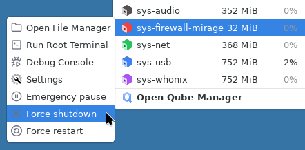
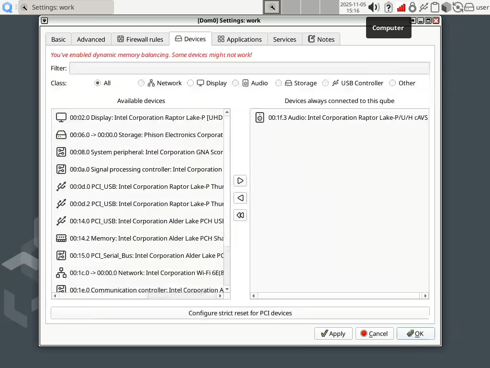

# Qubes OS updates Weekly Review - Y2025-W45

### Introduction
Weekly review of new packages uploaded to Qubes OS repositories. Link to previous Newsletter [here](https://forum.qubes-os.org/t/qubes-os-updates-weekly-review-y2025-w43).

<details>
<summary>Alphabetically sorted list of new packages uploaded to Qubes OS repositories</summary>

```bash
pipewire-qubes-4.3.13-1-x86_64.pkg.tar.zst
pipewire-qubes-4.3.13-1.fc41.x86_64.rpm
pipewire-qubes-4.3.13-1.fc42.x86_64.rpm
pipewire-qubes-4.3.13-1.fc43.x86_64.rpm
pipewire-qubes-dbgsym_4.3.13-1+deb12u1_amd64.deb
pipewire-qubes-dbgsym_4.3.13-1+deb13u1_amd64.deb
pipewire-qubes_4.3.13-1+deb12u1_amd64.deb
pipewire-qubes_4.3.13-1+deb13u1_amd64.deb
pipewire-qubes_4.3.13-1+jammy1_amd64.deb
pipewire-qubes_4.3.13-1+noble1_amd64.deb
pulseaudio-qubes-4.3.13-1.fc41.x86_64.rpm
pulseaudio-qubes-4.3.13-1.fc42.x86_64.rpm
pulseaudio-qubes-4.3.13-1.fc43.x86_64.rpm
pulseaudio-qubes-dbgsym_4.3.13-1+deb12u1_amd64.deb
pulseaudio-qubes-dbgsym_4.3.13-1+deb13u1_amd64.deb
pulseaudio-qubes_4.3.13-1+deb12u1_amd64.deb
pulseaudio-qubes_4.3.13-1+deb13u1_amd64.deb
pulseaudio-qubes_4.3.13-1+jammy1_amd64.deb
pulseaudio-qubes_4.3.13-1+noble1_amd64.deb
python3-qubes-menu_1.2.10-1+deb12u1_amd64.deb
python3-qubes-menu_1.2.10-1+deb13u1_amd64.deb
python3-qubes-menu_1.2.10-1+jammy1_amd64.deb
python3-qubes-menu_1.2.10-1+noble1_amd64.deb
python3-qubesadmin-4.3.24-1.fc41.noarch.rpm
python3-qubesadmin-4.3.24-1.fc42.noarch.rpm
python3-qubesadmin-4.3.24-1.fc43.noarch.rpm
python3-qubesadmin_4.3.24-1+deb12u1_amd64.deb
python3-qubesadmin_4.3.24-1+deb13u1_amd64.deb
python3-qubesadmin_4.3.24-1+jammy1_amd64.deb
python3-qubesadmin_4.3.24-1+noble1_amd64.deb
python3-qui_4.3.22-1+deb12u1_amd64.deb
python3-qui_4.3.22-1+deb13u1_amd64.deb
python3-qui_4.3.22-1+jammy1_amd64.deb
python3-qui_4.3.22-1+noble1_amd64.deb
qubes-core-admin-client-4.3.24-1.fc41.noarch.rpm
qubes-core-admin-client-4.3.24-1.fc42.noarch.rpm
qubes-core-admin-client-4.3.24-1.fc43.noarch.rpm
qubes-core-admin-client_4.3.24-1+deb12u1_amd64.deb
qubes-core-admin-client_4.3.24-1+deb13u1_amd64.deb
qubes-core-admin-client_4.3.24-1+jammy1_amd64.deb
qubes-core-admin-client_4.3.24-1+noble1_amd64.deb
qubes-core-agent-4.3.35-1.fc41.x86_64.rpm
qubes-core-agent-4.3.35-1.fc42.x86_64.rpm
qubes-core-agent-4.3.35-1.fc43.x86_64.rpm
qubes-core-agent-caja-4.3.35-1.fc41.x86_64.rpm
qubes-core-agent-caja-4.3.35-1.fc42.x86_64.rpm
qubes-core-agent-caja-4.3.35-1.fc43.x86_64.rpm
qubes-core-agent-caja_4.3.35-1+deb12u1_amd64.deb
qubes-core-agent-caja_4.3.35-1+deb13u1_amd64.deb
qubes-core-agent-caja_4.3.35-1+jammy1_amd64.deb
qubes-core-agent-caja_4.3.35-1+noble1_amd64.deb
qubes-core-agent-dbgsym_4.3.35-1+deb12u1_amd64.deb
qubes-core-agent-dbgsym_4.3.35-1+deb13u1_amd64.deb
qubes-core-agent-dom0-updates-4.3.35-1.fc41.noarch.rpm
qubes-core-agent-dom0-updates-4.3.35-1.fc42.noarch.rpm
qubes-core-agent-dom0-updates-4.3.35-1.fc43.noarch.rpm
qubes-core-agent-dom0-updates_4.3.35-1+deb12u1_amd64.deb
qubes-core-agent-dom0-updates_4.3.35-1+deb13u1_amd64.deb
qubes-core-agent-dom0-updates_4.3.35-1+jammy1_amd64.deb
qubes-core-agent-dom0-updates_4.3.35-1+noble1_amd64.deb
qubes-core-agent-nautilus-4.3.35-1.fc41.x86_64.rpm
qubes-core-agent-nautilus-4.3.35-1.fc42.x86_64.rpm
qubes-core-agent-nautilus-4.3.35-1.fc43.x86_64.rpm
qubes-core-agent-nautilus_4.3.35-1+deb12u1_amd64.deb
qubes-core-agent-nautilus_4.3.35-1+deb13u1_amd64.deb
qubes-core-agent-nautilus_4.3.35-1+jammy1_amd64.deb
qubes-core-agent-nautilus_4.3.35-1+noble1_amd64.deb
qubes-core-agent-network-manager-4.3.35-1.fc41.noarch.rpm
qubes-core-agent-network-manager-4.3.35-1.fc42.noarch.rpm
qubes-core-agent-network-manager-4.3.35-1.fc43.noarch.rpm
qubes-core-agent-network-manager_4.3.35-1+deb12u1_amd64.deb
qubes-core-agent-network-manager_4.3.35-1+deb13u1_amd64.deb
qubes-core-agent-network-manager_4.3.35-1+jammy1_amd64.deb
qubes-core-agent-network-manager_4.3.35-1+noble1_amd64.deb
qubes-core-agent-networking-4.3.35-1.fc41.noarch.rpm
qubes-core-agent-networking-4.3.35-1.fc42.noarch.rpm
qubes-core-agent-networking-4.3.35-1.fc43.noarch.rpm
qubes-core-agent-networking_4.3.35-1+deb12u1_amd64.deb
qubes-core-agent-networking_4.3.35-1+deb13u1_amd64.deb
qubes-core-agent-networking_4.3.35-1+jammy1_amd64.deb
qubes-core-agent-networking_4.3.35-1+noble1_amd64.deb
qubes-core-agent-passwordless-root-4.3.35-1.fc41.noarch.rpm
qubes-core-agent-passwordless-root-4.3.35-1.fc42.noarch.rpm
qubes-core-agent-passwordless-root-4.3.35-1.fc43.noarch.rpm
qubes-core-agent-passwordless-root_4.3.35-1+deb12u1_amd64.deb
qubes-core-agent-passwordless-root_4.3.35-1+deb13u1_amd64.deb
qubes-core-agent-passwordless-root_4.3.35-1+jammy1_amd64.deb
qubes-core-agent-passwordless-root_4.3.35-1+noble1_amd64.deb
qubes-core-agent-pcmanfm-qt_4.3.35-1+deb12u1_amd64.deb
qubes-core-agent-pcmanfm-qt_4.3.35-1+deb13u1_amd64.deb
qubes-core-agent-pcmanfm-qt_4.3.35-1+jammy1_amd64.deb
qubes-core-agent-pcmanfm-qt_4.3.35-1+noble1_amd64.deb
qubes-core-agent-selinux-4.3.35-1.fc41.noarch.rpm
qubes-core-agent-selinux-4.3.35-1.fc42.noarch.rpm
qubes-core-agent-selinux-4.3.35-1.fc43.noarch.rpm
qubes-core-agent-systemd-4.3.35-1.fc41.x86_64.rpm
qubes-core-agent-systemd-4.3.35-1.fc42.x86_64.rpm
qubes-core-agent-systemd-4.3.35-1.fc43.x86_64.rpm
qubes-core-agent-thunar-4.3.35-1.fc41.x86_64.rpm
qubes-core-agent-thunar-4.3.35-1.fc42.x86_64.rpm
qubes-core-agent-thunar-4.3.35-1.fc43.x86_64.rpm
qubes-core-agent-thunar_4.3.35-1+deb12u1_amd64.deb
qubes-core-agent-thunar_4.3.35-1+deb13u1_amd64.deb
qubes-core-agent-thunar_4.3.35-1+jammy1_amd64.deb
qubes-core-agent-thunar_4.3.35-1+noble1_amd64.deb
qubes-core-agent_4.3.35-1+deb12u1_amd64.deb
qubes-core-agent_4.3.35-1+deb13u1_amd64.deb
qubes-core-agent_4.3.35-1+jammy1_amd64.deb
qubes-core-agent_4.3.35-1+noble1_amd64.deb
qubes-core-dom0-4.3.38-1.fc41.noarch.rpm
qubes-core-dom0-linux-4.3.20-1.fc41.x86_64.rpm
qubes-core-dom0-linux-kernel-install-4.3.20-1.fc41.x86_64.rpm
qubes-core-dom0-vaio-fixes-4.3.20-1.fc41.x86_64.rpm
qubes-desktop-linux-manager-4.3.22-1.fc41.noarch.rpm
qubes-desktop-linux-manager-4.3.22-1.fc42.noarch.rpm
qubes-desktop-linux-manager-4.3.22-1.fc43.noarch.rpm
qubes-desktop-linux-manager_4.3.22-1+deb12u1_amd64.deb
qubes-desktop-linux-manager_4.3.22-1+deb13u1_amd64.deb
qubes-desktop-linux-manager_4.3.22-1+jammy1_amd64.deb
qubes-desktop-linux-manager_4.3.22-1+noble1_amd64.deb
qubes-desktop-linux-menu-1.2.10-1.fc41.noarch.rpm
qubes-desktop-linux-menu-1.2.10-1.fc42.noarch.rpm
qubes-desktop-linux-menu-1.2.10-1.fc43.noarch.rpm
qubes-desktop-linux-menu_1.2.10-1+deb12u1_amd64.deb
qubes-desktop-linux-menu_1.2.10-1+deb13u1_amd64.deb
qubes-desktop-linux-menu_1.2.10-1+jammy1_amd64.deb
qubes-desktop-linux-menu_1.2.10-1+noble1_amd64.deb
qubes-gui-agent-4.3.13-1.fc41.x86_64.rpm
qubes-gui-agent-4.3.13-1.fc42.x86_64.rpm
qubes-gui-agent-4.3.13-1.fc43.x86_64.rpm
qubes-gui-agent-dbgsym_4.3.13-1+deb12u1_amd64.deb
qubes-gui-agent-dbgsym_4.3.13-1+deb13u1_amd64.deb
qubes-gui-agent-selinux-4.3.13-1.fc41.noarch.rpm
qubes-gui-agent-selinux-4.3.13-1.fc42.noarch.rpm
qubes-gui-agent-selinux-4.3.13-1.fc43.noarch.rpm
qubes-gui-agent-xfce-4.3.13-1.fc41.x86_64.rpm
qubes-gui-agent-xfce-4.3.13-1.fc42.x86_64.rpm
qubes-gui-agent-xfce-4.3.13-1.fc43.x86_64.rpm
qubes-gui-agent-xfce_4.3.13-1+deb12u1_amd64.deb
qubes-gui-agent-xfce_4.3.13-1+deb13u1_amd64.deb
qubes-gui-agent-xfce_4.3.13-1+jammy1_amd64.deb
qubes-gui-agent-xfce_4.3.13-1+noble1_amd64.deb
qubes-gui-agent_4.3.13-1+deb12u1_amd64.deb
qubes-gui-agent_4.3.13-1+deb13u1_amd64.deb
qubes-gui-agent_4.3.13-1+jammy1_amd64.deb
qubes-gui-agent_4.3.13-1+noble1_amd64.deb
qubes-gui-vnc-4.3.13-1.fc41.x86_64.rpm
qubes-gui-vnc-4.3.13-1.fc42.x86_64.rpm
qubes-gui-vnc-4.3.13-1.fc43.x86_64.rpm
qubes-gui-vnc_4.3.13-1+deb12u1_amd64.deb
qubes-gui-vnc_4.3.13-1+deb13u1_amd64.deb
qubes-gui-vnc_4.3.13-1+jammy1_amd64.deb
qubes-gui-vnc_4.3.13-1+noble1_amd64.deb
qubes-manager-4.3.18-1.fc41.noarch.rpm
qubes-manager-4.3.18-1.fc42.noarch.rpm
qubes-manager-4.3.18-1.fc43.noarch.rpm
qubes-manager_4.3.18-1+deb12u1_amd64.deb
qubes-manager_4.3.18-1+deb13u1_amd64.deb
qubes-manager_4.3.18-1+noble1_amd64.deb
qubes-release-4.2-13.fc37.noarch.rpm
qubes-release-4.3-0.10.fc41.noarch.rpm
qubes-release-notes-4.2-13.fc37.noarch.rpm
qubes-release-notes-4.3-0.10.fc41.noarch.rpm
qubes-template-fedora-43-4.3.0-202511070311.noarch.rpm
qubes-template-fedora-43-minimal-4.3.0-202511070311.noarch.rpm
qubes-template-fedora-43-xfce-4.3.0-202511070311.noarch.rpm
qubes-template-kicksecure-18-4.3.0-202511091326.noarch.rpm
qubes-template-whonix-gateway-18-4.3.0-202511091326.noarch.rpm
qubes-video-companion-1.1.6-1.fc43.noarch.rpm
qubes-video-companion-docs-1.1.6-1.fc43.noarch.rpm
qubes-video-companion-license-1.1.6-1.fc43.noarch.rpm
qubes-video-companion-receiver-1.1.6-1.fc43.noarch.rpm
qubes-video-companion-sender-1.1.6-1.fc43.noarch.rpm
qubes-vm-caja-4.3.35-1-x86_64.pkg.tar.zst
qubes-vm-core-4.3.35-1-x86_64.pkg.tar.zst
qubes-vm-dom0-updates-4.3.35-1-x86_64.pkg.tar.zst
qubes-vm-gui-4.3.13-1-x86_64.pkg.tar.zst
qubes-vm-keyring-4.3.35-1-x86_64.pkg.tar.zst
qubes-vm-nautilus-4.3.35-1-x86_64.pkg.tar.zst
qubes-vm-networking-4.3.35-1-x86_64.pkg.tar.zst
qubes-vm-passwordless-root-4.3.35-1-x86_64.pkg.tar.zst
qubes-vm-pulseaudio-4.3.13-1-x86_64.pkg.tar.zst
qubes-vm-thunar-4.3.35-1-x86_64.pkg.tar.zst
xserver-xorg-input-qubes-dbgsym_4.3.13-1+deb12u1_amd64.deb
xserver-xorg-input-qubes-dbgsym_4.3.13-1+deb13u1_amd64.deb
xserver-xorg-input-qubes_4.3.13-1+deb12u1_amd64.deb
xserver-xorg-input-qubes_4.3.13-1+deb13u1_amd64.deb
xserver-xorg-input-qubes_4.3.13-1+jammy1_amd64.deb
xserver-xorg-input-qubes_4.3.13-1+noble1_amd64.deb
xserver-xorg-qubes-common-dbgsym_4.3.13-1+deb12u1_amd64.deb
xserver-xorg-qubes-common-dbgsym_4.3.13-1+deb13u1_amd64.deb
xserver-xorg-qubes-common_4.3.13-1+deb12u1_amd64.deb
xserver-xorg-qubes-common_4.3.13-1+deb13u1_amd64.deb
xserver-xorg-qubes-common_4.3.13-1+jammy1_amd64.deb
xserver-xorg-qubes-common_4.3.13-1+noble1_amd64.deb
xserver-xorg-video-dummyqbs-dbgsym_4.3.13-1+deb12u1_amd64.deb
xserver-xorg-video-dummyqbs-dbgsym_4.3.13-1+deb13u1_amd64.deb
xserver-xorg-video-dummyqbs_4.3.13-1+deb12u1_amd64.deb
xserver-xorg-video-dummyqbs_4.3.13-1+deb13u1_amd64.deb
xserver-xorg-video-dummyqbs_4.3.13-1+jammy1_amd64.deb
xserver-xorg-video-dummyqbs_4.3.13-1+noble1_amd64.deb
```

</details>

### Highlights
- **Fedora 43** (testing) templates.
- Caching of device assignments/attachments.
- Multiple UI/UX fixes and improvements.
- Better and more responsive keyboard layout switching.

### Details
In addition to the usual minor fixes and patches (full list [here](https://github.com/QubesOS/updates-status/issues?q=is%3Aissue+created%3A2025-11-03..2025-11-09)):

* **qubes-template-whonix-workstation-18** [4.3.0-202511091326](https://github.com/QubesOS/updates-status/issues/6174) (r4.3)
Building of the latest Whonix Workstation failed with `ExecutorError` error message.

* **qubes-template-whonix-gateway-18** [4.3.0-202511091326](https://github.com/QubesOS/updates-status/issues/6173) (r4.3)
  **qubes-template-kicksecure-18** [4.3.0-202511091326](https://github.com/QubesOS/updates-status/issues/6171) (r4.3)
A fresh build of Whonix gateway (with the latest patches). Whonix gateway, Workstation & Kicksecure are under heavy development at the moment.

* **qubes-release** [v4.2-13](https://github.com/QubesOS/updates-status/issues/6172) (r4.2)
The default Fedora template for r4.2 is changed to Fedora 42. Fedora 41 will be EOL soon (announcement [here](https://forum.qubes-os.org/t/fedora-41-approaching-end-of-life/37214)).

* **video-companion** [v1.1.6-1](https://github.com/QubesOS/updates-status/issues/6170) (r4.3)
Minor changes.

* **core-admin** [v4.3.38](https://github.com/QubesOS/updates-status/issues/6169) (r4.3)
    - Improved docstrings (in-code documentation) for preloaded disposables. The PR for online documentation is not yet merged.
    - The core fix for keyboard layout switching inconsistency issue.
    - Multiple fixes for preloaded disposables. One for property change of the disposable template, one fix for cleaning up of preloaded disposables.
    - There was a patch two weeks ago to prevent backing up dom0 to itself (within dom0 home directory). This resulted in another bug which prevented backing up dom0 to home directory in any target qube. This is now fixed.
    - It is now possible to attach block devices (e.g. external USB drives) to dom0. But only with `qvm-block` utility and not via Qui Devices widget. This is an advanced and potentially dangerous operation. Use at your own risk.

* **core-agent-linux** [v4.3.35](https://github.com/QubesOS/updates-status/issues/6168) (r4.3)
    - Mounting `/rw` before temporary files which is needed for Whonix qubes.
    - Setting up dnf5 proxy on Whonix templates (for .onion mirrors) is moved from core agent to Whonix `uwt`.
    - Assuring updating dom0 via `sys-whonix` gateway works properly and does generate errors.
    - Trim filesystem of TemplateVMs and StandaloneVMs after update operation.

* **core-admin-client** [v4.3.24](https://github.com/QubesOS/updates-status/issues/6167) (r4.3)
    - Documenting `servicevm` feature (see last newsletter).
    - Assuring preloaded disposables are not counted as dependency of other qubes.
    - Documentation fixes for `qvm-remove` and `qvm-template`.
    - Caching keyboard layout directly in gui-daemon instead of depending on the core. This should have significant improvement of keyboard layout switching specifically on XFCE systems.
    - Caching device attachments/assignments. This should improve Qui Devices widget responsiveness.

* **qubes-release** [v4.3-0.10](https://github.com/QubesOS/updates-status/issues/6165) (r4.3)
Protecting `qubes-core-dom0` from removal during upgrades.

* **qubes-template-fedora-43-minimal** [4.3.0-202511070311](https://github.com/QubesOS/updates-status/issues/6164) (r4.3)
  **qubes-template-fedora-43** [4.3.0-202511070311](https://github.com/QubesOS/updates-status/issues/6163) (r4.3)
  **qubes-template-fedora-43-xfce** [4.3.0-202511070311](https://github.com/QubesOS/updates-status/issues/6162) (r4.3)
Introduction of Fedora 43 (GNOME), minimal and XFCE templates. It is highly likely that Fedora 43 will come only to Qubes OS r4.3 and not r4.2. I have been using (in-place upgraded) Fedora 43 templates for weeks. Even before the upstream stable release.

* **gui-agent-linux** [v4.3.13](https://github.com/QubesOS/updates-status/issues/6158) (r4.3)
Application icons with 256x256 resolution were excluded and the default qube icon was shown for some applications. But according to the (re-opened) issue, some applications have only 512x512 (or even 1024x1024!) icons. Signal messenger is an example. This is work in progress.

* **core-admin-linux** [v4.3.20](https://github.com/QubesOS/updates-status/issues/6157) (r4.3)
By running `qubes-vm-update` with sudo, the log file permissions would not have allowed running it again without sudo (or using the GUI updater). This is now fixed.

* **desktop-linux-manager** [v4.3.22](https://github.com/QubesOS/updates-status/issues/6156) (r4.3)
    - If shutting down a qube via Qui Domain widget fails, user will be provided with a dialog to allow force-shutdown.
    - By holding the `shift` key while on Qui Domains sub-menu, shutdown and restart will be morphed to force-shutdown and force-restart. Picture below:


* **desktop-linux-menu** [v1.2.10](https://github.com/QubesOS/updates-status/issues/6155) (r4.3)
    - Removing `Start qube` menu item for Disposable Templates (only in APPS tab).
    - Also some other improvements with start/shutdown launchers to avoid confusion.

* **manager** [v4.3.18-1](https://github.com/QubesOS/updates-status/issues/6154) (r4.3)
Option to filter PCI devices based on their class or text search (in qube settings -> Devices tab). Screenshot:


#### Epilogue
It appears that there is already over 5000 Qubes OS r4.3 users (according to [statistics](https://doc.qubes-os.org/en/latest/introduction/statistics.html)). The last few r4.3 related pending issues are expected to be solved soon.
