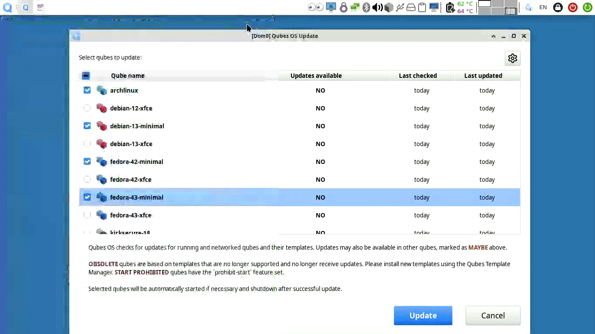
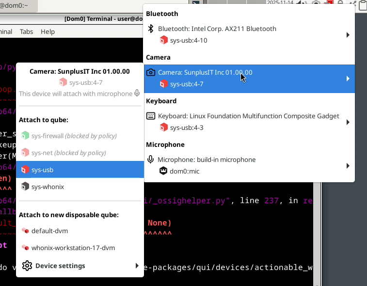

# Qubes OS updates Weekly Review - Y2025-W48

### Introduction
Weekly review of new packages uploaded to Qubes OS repositories. Link to previous Newsletter [here](https://forum.qubes-os.org/t/qubes-os-updates-weekly-review-y2025-w47).

<details>
<summary>Alphabetically sorted list of new packages uploaded to Qubes OS repositories</summary>

```bash
amd-gpu-firmware-20251125-1.fc37.noarch.rpm
amd-gpu-firmware-20251125-1.fc41.noarch.rpm
amd-ucode-firmware-20251125-1.fc37.noarch.rpm
amd-ucode-firmware-20251125-1.fc41.noarch.rpm
atheros-firmware-20251125-1.fc37.noarch.rpm
atheros-firmware-20251125-1.fc41.noarch.rpm
brcmfmac-firmware-20251125-1.fc37.noarch.rpm
brcmfmac-firmware-20251125-1.fc41.noarch.rpm
cirrus-audio-firmware-20251125-1.fc37.noarch.rpm
cirrus-audio-firmware-20251125-1.fc41.noarch.rpm
dvb-firmware-20251125-1.fc37.noarch.rpm
dvb-firmware-20251125-1.fc41.noarch.rpm
intel-audio-firmware-20251125-1.fc37.noarch.rpm
intel-audio-firmware-20251125-1.fc41.noarch.rpm
intel-gpu-firmware-20251125-1.fc37.noarch.rpm
intel-gpu-firmware-20251125-1.fc41.noarch.rpm
intel-vsc-firmware-20251125-1.fc37.noarch.rpm
intel-vsc-firmware-20251125-1.fc41.noarch.rpm
iwlegacy-firmware-20251125-1.fc37.noarch.rpm
iwlegacy-firmware-20251125-1.fc41.noarch.rpm
iwlwifi-dvm-firmware-20251125-1.fc37.noarch.rpm
iwlwifi-dvm-firmware-20251125-1.fc41.noarch.rpm
iwlwifi-mld-firmware-20251125-1.fc37.noarch.rpm
iwlwifi-mld-firmware-20251125-1.fc41.noarch.rpm
iwlwifi-mvm-firmware-20251125-1.fc37.noarch.rpm
iwlwifi-mvm-firmware-20251125-1.fc41.noarch.rpm
kernel-6.12.59-1.qubes.fc37.x86_64.rpm
kernel-6.12.59-1.qubes.fc41.x86_64.rpm
kernel-66-6.6.117-1.qubes.fc37.x86_64.rpm
kernel-66-devel-6.6.117-1.qubes.fc37.x86_64.rpm
kernel-66-modules-6.6.117-1.qubes.fc37.x86_64.rpm
kernel-66-qubes-vm-6.6.117-1.qubes.fc37.x86_64.rpm
kernel-devel-6.12.59-1.qubes.fc37.x86_64.rpm
kernel-devel-6.12.59-1.qubes.fc41.x86_64.rpm
kernel-latest-6.17.9-1.qubes.fc37.x86_64.rpm
kernel-latest-6.17.9-1.qubes.fc41.x86_64.rpm
kernel-latest-devel-6.17.9-1.qubes.fc37.x86_64.rpm
kernel-latest-devel-6.17.9-1.qubes.fc41.x86_64.rpm
kernel-latest-modules-6.17.9-1.qubes.fc37.x86_64.rpm
kernel-latest-modules-6.17.9-1.qubes.fc41.x86_64.rpm
kernel-latest-qubes-vm-6.17.9-1.qubes.fc37.x86_64.rpm
kernel-latest-qubes-vm-6.17.9-1.qubes.fc41.x86_64.rpm
kernel-modules-6.12.59-1.qubes.fc37.x86_64.rpm
kernel-modules-6.12.59-1.qubes.fc41.x86_64.rpm
kernel-qubes-vm-6.12.59-1.qubes.fc37.x86_64.rpm
kernel-qubes-vm-6.12.59-1.qubes.fc41.x86_64.rpm
libertas-firmware-20251125-1.fc37.noarch.rpm
libertas-firmware-20251125-1.fc41.noarch.rpm
linux-firmware-20251125-1.fc37.noarch.rpm
linux-firmware-20251125-1.fc41.noarch.rpm
linux-firmware-whence-20251125-1.fc37.noarch.rpm
linux-firmware-whence-20251125-1.fc41.noarch.rpm
liquidio-firmware-20251125-1.fc37.noarch.rpm
liquidio-firmware-20251125-1.fc41.noarch.rpm
mlxsw_spectrum-firmware-20251125-1.fc37.noarch.rpm
mlxsw_spectrum-firmware-20251125-1.fc41.noarch.rpm
mrvlprestera-firmware-20251125-1.fc37.noarch.rpm
mrvlprestera-firmware-20251125-1.fc41.noarch.rpm
mt7xxx-firmware-20251125-1.fc37.noarch.rpm
mt7xxx-firmware-20251125-1.fc41.noarch.rpm
netronome-firmware-20251125-1.fc37.noarch.rpm
netronome-firmware-20251125-1.fc41.noarch.rpm
nvidia-gpu-firmware-20251125-1.fc37.noarch.rpm
nvidia-gpu-firmware-20251125-1.fc41.noarch.rpm
nxpwireless-firmware-20251125-1.fc37.noarch.rpm
nxpwireless-firmware-20251125-1.fc41.noarch.rpm
pipewire-qubes-4.3.15-1-x86_64.pkg.tar.zst
pipewire-qubes-4.3.15-1.fc41.x86_64.rpm
pipewire-qubes-4.3.15-1.fc42.x86_64.rpm
pipewire-qubes-4.3.15-1.fc43.x86_64.rpm
pipewire-qubes-dbgsym_4.3.15-1+deb12u1_amd64.deb
pipewire-qubes-dbgsym_4.3.15-1+deb13u1_amd64.deb
pipewire-qubes_4.3.15-1+deb12u1_amd64.deb
pipewire-qubes_4.3.15-1+deb13u1_amd64.deb
pipewire-qubes_4.3.15-1+jammy1_amd64.deb
pipewire-qubes_4.3.15-1+noble1_amd64.deb
pulseaudio-qubes-4.3.15-1.fc41.x86_64.rpm
pulseaudio-qubes-4.3.15-1.fc42.x86_64.rpm
pulseaudio-qubes-4.3.15-1.fc43.x86_64.rpm
pulseaudio-qubes-dbgsym_4.3.15-1+deb12u1_amd64.deb
pulseaudio-qubes-dbgsym_4.3.15-1+deb13u1_amd64.deb
pulseaudio-qubes_4.3.15-1+deb12u1_amd64.deb
pulseaudio-qubes_4.3.15-1+deb13u1_amd64.deb
pulseaudio-qubes_4.3.15-1+jammy1_amd64.deb
pulseaudio-qubes_4.3.15-1+noble1_amd64.deb
python3-qubesadmin-4.3.25-1.fc41.noarch.rpm
python3-qubesadmin-4.3.25-1.fc42.noarch.rpm
python3-qubesadmin-4.3.25-1.fc43.noarch.rpm
python3-qubesadmin_4.3.25-1+deb12u1_amd64.deb
python3-qubesadmin_4.3.25-1+deb13u1_amd64.deb
python3-qubesadmin_4.3.25-1+jammy1_amd64.deb
python3-qubesadmin_4.3.25-1+noble1_amd64.deb
python3-qui_4.3.24-1+deb12u1_amd64.deb
python3-qui_4.3.24-1+deb13u1_amd64.deb
python3-qui_4.3.24-1+jammy1_amd64.deb
python3-qui_4.3.24-1+noble1_amd64.deb
qcom-firmware-20251125-1.fc37.noarch.rpm
qcom-firmware-20251125-1.fc41.noarch.rpm
qed-firmware-20251125-1.fc37.noarch.rpm
qed-firmware-20251125-1.fc41.noarch.rpm
qubes-ansible-1.2.6-1.fc41.noarch.rpm
qubes-ansible-1.2.6-1.fc42.noarch.rpm
qubes-ansible-1.2.6-1.fc43.noarch.rpm
qubes-ansible-1.2.7-1.fc41.noarch.rpm
qubes-ansible-1.2.7-1.fc42.noarch.rpm
qubes-ansible-1.2.7-1.fc43.noarch.rpm
qubes-ansible-dom0-1.2.6-1.fc41.noarch.rpm
qubes-ansible-dom0-1.2.6-1.fc42.noarch.rpm
qubes-ansible-dom0-1.2.6-1.fc43.noarch.rpm
qubes-ansible-dom0-1.2.7-1.fc41.noarch.rpm
qubes-ansible-dom0-1.2.7-1.fc42.noarch.rpm
qubes-ansible-dom0-1.2.7-1.fc43.noarch.rpm
qubes-ansible-tests-1.2.6-1.fc41.noarch.rpm
qubes-ansible-tests-1.2.6-1.fc42.noarch.rpm
qubes-ansible-tests-1.2.6-1.fc43.noarch.rpm
qubes-ansible-tests-1.2.7-1.fc41.noarch.rpm
qubes-ansible-tests-1.2.7-1.fc42.noarch.rpm
qubes-ansible-tests-1.2.7-1.fc43.noarch.rpm
qubes-ansible-vm-1.2.6-1-any.pkg.tar.zst
qubes-ansible-vm-1.2.6-1.fc41.noarch.rpm
qubes-ansible-vm-1.2.6-1.fc42.noarch.rpm
qubes-ansible-vm-1.2.6-1.fc43.noarch.rpm
qubes-ansible-vm-1.2.7-1-any.pkg.tar.zst
qubes-ansible-vm-1.2.7-1.fc41.noarch.rpm
qubes-ansible-vm-1.2.7-1.fc42.noarch.rpm
qubes-ansible-vm-1.2.7-1.fc43.noarch.rpm
qubes-ansible-vm_1.2.6-1+deb12u1_amd64.deb
qubes-ansible-vm_1.2.6-1+deb13u1_amd64.deb
qubes-ansible-vm_1.2.6-1+jammy1_amd64.deb
qubes-ansible-vm_1.2.6-1+noble1_amd64.deb
qubes-ansible-vm_1.2.7-1+deb12u1_amd64.deb
qubes-ansible-vm_1.2.7-1+deb13u1_amd64.deb
qubes-ansible-vm_1.2.7-1+jammy1_amd64.deb
qubes-ansible-vm_1.2.7-1+noble1_amd64.deb
qubes-core-admin-client-4.3.25-1.fc41.noarch.rpm
qubes-core-admin-client-4.3.25-1.fc42.noarch.rpm
qubes-core-admin-client-4.3.25-1.fc43.noarch.rpm
qubes-core-admin-client_4.3.25-1+deb12u1_amd64.deb
qubes-core-admin-client_4.3.25-1+deb13u1_amd64.deb
qubes-core-admin-client_4.3.25-1+jammy1_amd64.deb
qubes-core-admin-client_4.3.25-1+noble1_amd64.deb
qubes-core-agent-4.3.37-1.fc41.x86_64.rpm
qubes-core-agent-4.3.37-1.fc42.x86_64.rpm
qubes-core-agent-4.3.37-1.fc43.x86_64.rpm
qubes-core-agent-caja-4.3.37-1.fc41.x86_64.rpm
qubes-core-agent-caja-4.3.37-1.fc42.x86_64.rpm
qubes-core-agent-caja-4.3.37-1.fc43.x86_64.rpm
qubes-core-agent-caja_4.3.37-1+deb12u1_amd64.deb
qubes-core-agent-caja_4.3.37-1+deb13u1_amd64.deb
qubes-core-agent-caja_4.3.37-1+jammy1_amd64.deb
qubes-core-agent-caja_4.3.37-1+noble1_amd64.deb
qubes-core-agent-dbgsym_4.3.37-1+deb12u1_amd64.deb
qubes-core-agent-dbgsym_4.3.37-1+deb13u1_amd64.deb
qubes-core-agent-dom0-updates-4.3.37-1.fc41.noarch.rpm
qubes-core-agent-dom0-updates-4.3.37-1.fc42.noarch.rpm
qubes-core-agent-dom0-updates-4.3.37-1.fc43.noarch.rpm
qubes-core-agent-dom0-updates_4.3.37-1+deb12u1_amd64.deb
qubes-core-agent-dom0-updates_4.3.37-1+deb13u1_amd64.deb
qubes-core-agent-dom0-updates_4.3.37-1+jammy1_amd64.deb
qubes-core-agent-dom0-updates_4.3.37-1+noble1_amd64.deb
qubes-core-agent-nautilus-4.3.37-1.fc41.x86_64.rpm
qubes-core-agent-nautilus-4.3.37-1.fc42.x86_64.rpm
qubes-core-agent-nautilus-4.3.37-1.fc43.x86_64.rpm
qubes-core-agent-nautilus_4.3.37-1+deb12u1_amd64.deb
qubes-core-agent-nautilus_4.3.37-1+deb13u1_amd64.deb
qubes-core-agent-nautilus_4.3.37-1+jammy1_amd64.deb
qubes-core-agent-nautilus_4.3.37-1+noble1_amd64.deb
qubes-core-agent-network-manager-4.3.37-1.fc41.noarch.rpm
qubes-core-agent-network-manager-4.3.37-1.fc42.noarch.rpm
qubes-core-agent-network-manager-4.3.37-1.fc43.noarch.rpm
qubes-core-agent-network-manager_4.3.37-1+deb12u1_amd64.deb
qubes-core-agent-network-manager_4.3.37-1+deb13u1_amd64.deb
qubes-core-agent-network-manager_4.3.37-1+jammy1_amd64.deb
qubes-core-agent-network-manager_4.3.37-1+noble1_amd64.deb
qubes-core-agent-networking-4.3.37-1.fc41.noarch.rpm
qubes-core-agent-networking-4.3.37-1.fc42.noarch.rpm
qubes-core-agent-networking-4.3.37-1.fc43.noarch.rpm
qubes-core-agent-networking_4.3.37-1+deb12u1_amd64.deb
qubes-core-agent-networking_4.3.37-1+deb13u1_amd64.deb
qubes-core-agent-networking_4.3.37-1+jammy1_amd64.deb
qubes-core-agent-networking_4.3.37-1+noble1_amd64.deb
qubes-core-agent-passwordless-root-4.3.37-1.fc41.noarch.rpm
qubes-core-agent-passwordless-root-4.3.37-1.fc42.noarch.rpm
qubes-core-agent-passwordless-root-4.3.37-1.fc43.noarch.rpm
qubes-core-agent-passwordless-root_4.3.37-1+deb12u1_amd64.deb
qubes-core-agent-passwordless-root_4.3.37-1+deb13u1_amd64.deb
qubes-core-agent-passwordless-root_4.3.37-1+jammy1_amd64.deb
qubes-core-agent-passwordless-root_4.3.37-1+noble1_amd64.deb
qubes-core-agent-pcmanfm-qt_4.3.37-1+deb12u1_amd64.deb
qubes-core-agent-pcmanfm-qt_4.3.37-1+deb13u1_amd64.deb
qubes-core-agent-pcmanfm-qt_4.3.37-1+jammy1_amd64.deb
qubes-core-agent-pcmanfm-qt_4.3.37-1+noble1_amd64.deb
qubes-core-agent-selinux-4.3.37-1.fc41.noarch.rpm
qubes-core-agent-selinux-4.3.37-1.fc42.noarch.rpm
qubes-core-agent-selinux-4.3.37-1.fc43.noarch.rpm
qubes-core-agent-systemd-4.3.37-1.fc41.x86_64.rpm
qubes-core-agent-systemd-4.3.37-1.fc42.x86_64.rpm
qubes-core-agent-systemd-4.3.37-1.fc43.x86_64.rpm
qubes-core-agent-thunar-4.3.37-1.fc41.x86_64.rpm
qubes-core-agent-thunar-4.3.37-1.fc42.x86_64.rpm
qubes-core-agent-thunar-4.3.37-1.fc43.x86_64.rpm
qubes-core-agent-thunar_4.3.37-1+deb12u1_amd64.deb
qubes-core-agent-thunar_4.3.37-1+deb13u1_amd64.deb
qubes-core-agent-thunar_4.3.37-1+jammy1_amd64.deb
qubes-core-agent-thunar_4.3.37-1+noble1_amd64.deb
qubes-core-agent_4.3.37-1+deb12u1_amd64.deb
qubes-core-agent_4.3.37-1+deb13u1_amd64.deb
qubes-core-agent_4.3.37-1+jammy1_amd64.deb
qubes-core-agent_4.3.37-1+noble1_amd64.deb
qubes-desktop-linux-manager-4.3.24-1.fc41.noarch.rpm
qubes-desktop-linux-manager-4.3.24-1.fc42.noarch.rpm
qubes-desktop-linux-manager-4.3.24-1.fc43.noarch.rpm
qubes-desktop-linux-manager_4.3.24-1+deb12u1_amd64.deb
qubes-desktop-linux-manager_4.3.24-1+deb13u1_amd64.deb
qubes-desktop-linux-manager_4.3.24-1+jammy1_amd64.deb
qubes-desktop-linux-manager_4.3.24-1+noble1_amd64.deb
qubes-gui-agent-4.3.15-1.fc41.x86_64.rpm
qubes-gui-agent-4.3.15-1.fc42.x86_64.rpm
qubes-gui-agent-4.3.15-1.fc43.x86_64.rpm
qubes-gui-agent-dbgsym_4.3.15-1+deb12u1_amd64.deb
qubes-gui-agent-dbgsym_4.3.15-1+deb13u1_amd64.deb
qubes-gui-agent-selinux-4.3.15-1.fc41.noarch.rpm
qubes-gui-agent-selinux-4.3.15-1.fc42.noarch.rpm
qubes-gui-agent-selinux-4.3.15-1.fc43.noarch.rpm
qubes-gui-agent-xfce-4.3.15-1.fc41.x86_64.rpm
qubes-gui-agent-xfce-4.3.15-1.fc42.x86_64.rpm
qubes-gui-agent-xfce-4.3.15-1.fc43.x86_64.rpm
qubes-gui-agent-xfce_4.3.15-1+deb12u1_amd64.deb
qubes-gui-agent-xfce_4.3.15-1+deb13u1_amd64.deb
qubes-gui-agent-xfce_4.3.15-1+jammy1_amd64.deb
qubes-gui-agent-xfce_4.3.15-1+noble1_amd64.deb
qubes-gui-agent_4.3.15-1+deb12u1_amd64.deb
qubes-gui-agent_4.3.15-1+deb13u1_amd64.deb
qubes-gui-agent_4.3.15-1+jammy1_amd64.deb
qubes-gui-agent_4.3.15-1+noble1_amd64.deb
qubes-gui-vnc-4.3.15-1.fc41.x86_64.rpm
qubes-gui-vnc-4.3.15-1.fc42.x86_64.rpm
qubes-gui-vnc-4.3.15-1.fc43.x86_64.rpm
qubes-gui-vnc_4.3.15-1+deb12u1_amd64.deb
qubes-gui-vnc_4.3.15-1+deb13u1_amd64.deb
qubes-gui-vnc_4.3.15-1+jammy1_amd64.deb
qubes-gui-vnc_4.3.15-1+noble1_amd64.deb
qubes-notification-1.0.6-1.fc41.x86_64.rpm
qubes-notification-1.0.6-1.fc42.x86_64.rpm
qubes-notification-1.0.6-1.fc43.x86_64.rpm
qubes-notification-agent-1.0.6-1.fc41.x86_64.rpm
qubes-notification-agent-1.0.6-1.fc42.x86_64.rpm
qubes-notification-agent-1.0.6-1.fc43.x86_64.rpm
qubes-notification-agent-dbgsym_1.0.6-1+deb13u1_amd64.deb
qubes-notification-agent_1.0.6-1+deb13u1_amd64.deb
qubes-notification-daemon-1.0.6-1.fc41.x86_64.rpm
qubes-notification-daemon-1.0.6-1.fc42.x86_64.rpm
qubes-notification-daemon-1.0.6-1.fc43.x86_64.rpm
qubes-notification-daemon-dbgsym_1.0.6-1+deb13u1_amd64.deb
qubes-notification-daemon_1.0.6-1+deb13u1_amd64.deb
qubes-notification-license-1.0.6-1.fc41.x86_64.rpm
qubes-notification-license-1.0.6-1.fc42.x86_64.rpm
qubes-notification-license-1.0.6-1.fc43.x86_64.rpm
qubes-template-kicksecure-18-4.3.0-202511271158.noarch.rpm
qubes-template-whonix-gateway-18-4.3.0-202511271158.noarch.rpm
qubes-template-whonix-workstation-18-4.3.0-202511280612.noarch.rpm
qubes-template-whonix-workstation-18-4.3.0-202511282227.noarch.rpm
qubes-vm-caja-4.3.37-1-x86_64.pkg.tar.zst
qubes-vm-core-4.3.37-1-x86_64.pkg.tar.zst
qubes-vm-dom0-updates-4.3.37-1-x86_64.pkg.tar.zst
qubes-vm-gui-4.3.15-1-x86_64.pkg.tar.zst
qubes-vm-keyring-4.3.37-1-x86_64.pkg.tar.zst
qubes-vm-nautilus-4.3.37-1-x86_64.pkg.tar.zst
qubes-vm-networking-4.3.37-1-x86_64.pkg.tar.zst
qubes-vm-passwordless-root-4.3.37-1-x86_64.pkg.tar.zst
qubes-vm-pulseaudio-4.3.15-1-x86_64.pkg.tar.zst
qubes-vm-thunar-4.3.37-1-x86_64.pkg.tar.zst
realtek-firmware-20251125-1.fc37.noarch.rpm
realtek-firmware-20251125-1.fc41.noarch.rpm
tiwilink-firmware-20251125-1.fc37.noarch.rpm
tiwilink-firmware-20251125-1.fc41.noarch.rpm
xserver-xorg-input-qubes-dbgsym_4.3.15-1+deb12u1_amd64.deb
xserver-xorg-input-qubes-dbgsym_4.3.15-1+deb13u1_amd64.deb
xserver-xorg-input-qubes_4.3.15-1+deb12u1_amd64.deb
xserver-xorg-input-qubes_4.3.15-1+deb13u1_amd64.deb
xserver-xorg-input-qubes_4.3.15-1+jammy1_amd64.deb
xserver-xorg-input-qubes_4.3.15-1+noble1_amd64.deb
xserver-xorg-qubes-common-dbgsym_4.3.15-1+deb12u1_amd64.deb
xserver-xorg-qubes-common-dbgsym_4.3.15-1+deb13u1_amd64.deb
xserver-xorg-qubes-common_4.3.15-1+deb12u1_amd64.deb
xserver-xorg-qubes-common_4.3.15-1+deb13u1_amd64.deb
xserver-xorg-qubes-common_4.3.15-1+jammy1_amd64.deb
xserver-xorg-qubes-common_4.3.15-1+noble1_amd64.deb
xserver-xorg-video-dummyqbs-dbgsym_4.3.15-1+deb12u1_amd64.deb
xserver-xorg-video-dummyqbs-dbgsym_4.3.15-1+deb13u1_amd64.deb
xserver-xorg-video-dummyqbs_4.3.15-1+deb12u1_amd64.deb
xserver-xorg-video-dummyqbs_4.3.15-1+deb13u1_amd64.deb
xserver-xorg-video-dummyqbs_4.3.15-1+jammy1_amd64.deb
xserver-xorg-video-dummyqbs_4.3.15-1+noble1_amd64.deb
```

</details>

### Highlights
- Webcam attach via Qubes Video Companion by default (if it is installed).

### Details
In addition to the usual minor fixes and patches (full list [here](https://github.com/QubesOS/updates-status/issues?q=is%3Aissue+created%3A2025-11-24..2025-11-30)):

* **linux-kernel** (current stable) [v6.12.59-1](https://github.com/QubesOS/updates-status/issues/6238) (r4.3)
  **linux-kernel** (current stable) [v6.12.59-1](https://github.com/QubesOS/updates-status/issues/6241) (r4.2)
  **linux-kernel-latest** [v6.17.9-1-latest](https://github.com/QubesOS/updates-status/issues/6240) (r4.3)
  **linux-kernel-latest** [v6.17.9-1-latest](https://github.com/QubesOS/updates-status/issues/6237) (r4.2)
  **linux-kernel-66** (old stable) [v6.6.117-1](https://github.com/QubesOS/updates-status/issues/6239) (r4.2)
    Weekly Kernel updates with usual patches and fixes. In the meantime, Kernel 6.18 is announced few hours ago. However, it might take a long time for it to be tested and released for Qubes OS usage. Based on the hints I have received, this release might break ZFS (according to Alpine Linux project lead).

* **core-admin-client** [v4.3.25](https://github.com/QubesOS/updates-status/issues/6236) (r4.3)
    - A side patch for Qui Devices widget to disable devices with denied policies.
    - Mock Class (for programmers) is updated to provide preloaded property.
    - Fix to invalidate device cache (was added to accelerate `qvm-device` and Qui Devices widget) on `device-removed` event.

* **linux-firmware** [v20251125-1](https://github.com/QubesOS/updates-status/issues/6233) (r4.3)
  **linux-firmware** [v20251125-1](https://github.com/QubesOS/updates-status/issues/6234) (r4.2)
    Hardware support firmware fixes and updates mostly submitted by hardware vendors. This reverts an issue with AMD GPUs in previous version, support for some bluetooth devices, other AMD GPU & CPU related updates, etc. The change log is available [here](https://packages.fedoraproject.org/pkgs/linux-firmware/linux-firmware/fedora-rawhide.html).

* **qubes-template-whonix-workstation-18** [4.3.0-202511282227](https://github.com/QubesOS/updates-status/issues/6232) (r4.3)
  **qubes-template-whonix-gateway-18** [4.3.0-202511271158](https://github.com/QubesOS/updates-status/issues/6229) (r4.3)
  **qubes-template-kicksecure-18** [4.3.0-202511271158](https://github.com/QubesOS/updates-status/issues/6228) (r4.3)
    A fresh set of Whonix & Kicksecure templates. There has been an official announcement for VirtualBox and KVM based Whonix release candidates [on Whonix forum](https://forums.whonix.org/t/whonix-18-0-7-5-major-release-upgrade-testers-wanted/22469). A separate announcement for Qubes OS templates should be expected soon.

* **ansible** [v1.2.7-1](https://github.com/QubesOS/updates-status/issues/6227) (r4.3)
  **ansible** [v1.2.6-1](https://github.com/QubesOS/updates-status/issues/6225) (r4.3)
    - Fix to update tags, features, etc even if no properties are changed.
    - Supporting `*default*` magic value for all properties. This is equivalent to `qvm-prefs VMNAME PROPERTY -D`.
    - Assuring (assigned) device are not changed if not requested.

* **core-agent-linux** [v4.3.37](https://github.com/QubesOS/updates-status/issues/6223) (r4.3)
    - Showing a message to user on update while qube storage is trimmed.
    - Fixing trim on Debian based qubes.

* **desktop-linux-manager** [v4.3.24](https://github.com/QubesOS/updates-status/issues/6222) (r4.3)
    - It is now possible to resize GUI Updater details & qube list pans. Screenshot:

    - Qui Devices widget will automatically disable option to attach devices to qubes which are blocked by policies. Screenshot:

    - The final pieces of the puzzle to attach Webcams to the destination qube with Qubes Video Companion (rather than USB passthrough). If user has the QVC packages installed in relevant places, then Qui Devices will automatically favour it. There is a special `device-qvc-resolution` feature which should allow setting the favoured resolution/frame-rate. However, it is not documented in `qvm-features` manpage and I did not manage to get it to work. So if you have a 4K and 8K webcam which is too much for video calls, it might be problematic. Ideally the backend should have reported all possible resolutions to Qui Devices widget to allow user to select the desired one based on the occasion (video calls, streaming, selfie, ...). However, the entire feature appears to be an opt-in feature and not a default behaviour on r4.3.

#### Epilogue
Recently I needed to work on some microcontrollers (something like Arduino). This is unfortunately not possible via Qubes OS unless a USB controller could be dedicated to the qube containing the flashing software. This is not the case on my test laptop. Therefore, I had to revert to another distro on a USB SSD and had very little time to work on Qubes. Sadly the r4.3 USB port assignment is too slow for flashing operation. But that is life. We could not have everything.
