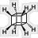
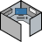

# Background
Icons to use with `qubes-label-tt` and for other Qubes OS related purposes.
Some of the icons are my personal original sketches. Some are based on public 
domain designs or other type of free licensed designs (e.g. CC-BY-SA). Here I
try to list all of them with proper attribution to the original designer. If you
find anything inappropriate or any license infringement, kindly open an issue to
inform me.

Table of the beautiful Qubes 
[Vector Perfect Qute Sushi icons](https://github.com/QubesOS/qubes-artwork) 
is linked directly from Qubes OS Artwork repository for reference (designed by
[@ninavizz](https://github.com/ninavizz)).

Since modifying logos of most of distros might violate their trademark policies,
an independent table of distro icons & primary color code of their logos is 
included. Color codes should be useful if user wants to tint the default Qubes 
VM icons with those colors.

### Icons

| Icon | Qube Name | License | Description |
| :---: | :---: | :---: | :--- |
|  | Axonometric | CC-BY-SA | Based on [Nevit Dilmen's design](https://be.m.wikimedia.org/wiki/File:Axonometric-cube.svg). |
|  | CAM | CC-BY-SA | Cube based on Vector Perfect Qute Sushi. Drill bit from [Inductiveload's design](https://en.m.wikipedia.org/wiki/File:Machined_Holes.svg) |
|  | CFOP Zero | CC-BY-SA | Original sketch by myself. Based on Rubik's Cube CFOP method - Inspection stage |
|  | CFOP Cross | CC-BY-SA | Original sketch by myself. Based on Rubik's Cube CFOP method - Cross stage |
|  | CFOP F2L | CC-BY-SA | Original sketch by myself. Based on Rubik's Cube CFOP method - First two layers stage |
|  | CFOP OLL 1 | CC-BY-SA | Original sketch by myself. Based on Rubik's Cube CFOP method - Two look OLL 1 stage |
|  | CFOP OLL 2 | CC-BY-SA | Original sketch by myself. Based on Rubik's Cube CFOP method - Two look OLL 2 stage |
|  | CFOP PLL | CC-BY-SA | Original sketch by myself. Based on Rubik's Cube CFOP method - PLL stage |
|  | Cubane | CC0 | Based on [NEUROtiker's design](https://commons.wikimedia.org/wiki/File:Cuban.svg) on Wikimedia |
|  | Cubicle | CC-BY-SA | Original sketch by myself. Monitor by Michaël Bégin, Keyboard by David Peters, Screen from Qubes Artwork |
|  | Rubik's | CC-BY-SA | Original sketch by myself. Unsolved Rubik's Cube |
|  | Dice(Die) | CC-BY-SA | Based on [Steaphan Greene's design](https://commons.wikimedia.org/wiki/File:2-Dice-Icon.svg). |
|  | Engraved | CC0 | Based on [Jarda's design](https://openclipart.org/detail/177642/engraved-cube-2). |
|  | Impossible 1 | CC-BY-SA | Original sketch by myself. |
|  | Impossible 3 | CC0 | Based on [Jarda's design](https://openclipart.org/detail/176610/impossible-cubes). |
|  | Impossible Hexagon | CC-BY-SA | Original sketch by myself. |
|  | Infinity | CC-BY-SA | Original sketch by myself. |
|  | Isometric | CC-BY-SA | Original sketch by myself. |
|  | Isometric Shapes | CC0 | Based on [Gramzon's design](https://openclipart.org/detail/279989/isometric-shapes-1-cubes). |
|  | NAS | CC-BY-SA | Original sketch by myself. |
|  | Optical Illusion | CC-BY-SA | Original sketch by myself. |
|  | Qube&#x00B2; | CC-BY-SA | Based on [Qubes OS Artwork](https://github.com/QubesOS/qubes-artwork). |
|  | Qube&#x00B3; | CC-BY-SA | Based on [ninavizz's designs](https://github.com/QubesOS/qubes-artwork). |
|  | Sticky Notes | CC0 | Based on [crisg's design](https://openclipart.org/detail/183333/sticky-cube-notes). |
|  | Tesseract | CC-BY-SA | Original sketch by myself. |
|  | Web Colors | CC-BY-SA | Based on [Denis N Gour's design](https://commons.wikimedia.org/wiki/File:Web_Color_Cube.svg). |

### Qubes OS Vector Perfect Qute Sushi Icons

| Label | Hex Value | App VM | Disp VM | Sys VM | Stand alone  | Template VM |
| :--- | :---: | :---: | :---: | :---: | :---: | :---: |
| red | `#cc0000` |  |  |  |  |  |
| orange | `#f57900` |  |  |  |  |  |
| yellow | `#edd400` |  |  |  |  |  |
| green | `#73d216` |  |  |  |  |  |
| gray | `#555555` |  |  |  |  |  |
| blue | `#3465a4` |  |  |  |  |  |
| purple | `#75507b` |  |  |  |  |  |
| black | `#000000` |  |  |  |  |  |

### Distro Icons & Color Codes

Distro logo icons are linked directly from their websites or Wikipedia. N/A
means not available as SVG or logo is non-square size. Distro artwork guidelines
are linked if available.

| Icon | Color | Hex Value | Distro name & artwork guidelines |
| :---: | :--- | :---: | :--- |
| N/A |  | `#0d597f` | Alpine |
|  |  | `#1793d1` | [Archlinux](https://archlinux.org/art/) |
|  |  | `#DD1155` | [Debian](https://wiki.debian.org/DebianLogo) |
|  |   | `#3c6eb4` `#294172` | [Fedora](https://fedoraproject.org/wiki/Logo/UsageGuidelines#Colors) Blue & Dark Blue |
|  |    | `#54487A` `#61538D` `#6E56AF` | [Gentoo](https://wiki.gentoo.org/wiki/Project:Artwork/Colors) purle, purple light 1 & 2|
|  |  | `#34be5b` | [Manjaro](https://gitlab.manjaro.org/artwork) |
|  |  | `#86BE43` | Linux Mint |
|  |   | `#7EBAE4` `#5277C3` |[NixOS](https://github.com/NixOS/nixos-artwork/blob/master/logo/README.md) Light Blue and Dark Blue |
|  |  | `#73ba25` | [openSUSE](https://en.opensuse.org/Help:Colors) |
|  |   | `#00B5E2` `#002B49` | [OpenWrt](https://github.com/openwrt/branding) |
|  |  | `#7D4698` | [Tor](https://styleguide.torproject.org/brand-assets/) |
|  |  | `#7dcff3` | [Whonix](https://www.whonix.org/wiki/Dev/Logo) |

### Automatic Label Creation & Removal
A Makefile is included in the current directory which would create my personal
set of labels. Run `make info` at the current directory for more information.

### Icons to consider
PCB qube, [Melting ice qube](https://openclipart.org/detail/182951/ice-cube), 
Roughing end milling qube, Acoustic qube, 3D puzzle cube,
Cube Speaker, Wooden block qubes of
[different species](https://openclipart.org/detail/256779/wood-grain-filter-pack-3), 
[Cardboard qube](https://openclipart.org/detail/231068/3d-isometric-cardboard-box),
[Earth qube](https://openclipart.org/detail/259468/cube-earth-silhouette),
[Blank die](https://openclipart.org/detail/304802/blank-dice),
Prism qube.

### Qubes which might be possible due to expired patents or trademarks
Bauhaus qubes, Peter Keler D1, Lego qube

### Impossible qubes due to licensing concerns
WALL.E qube
