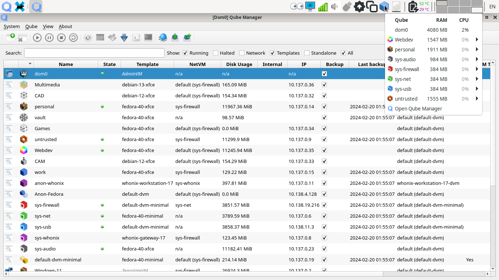
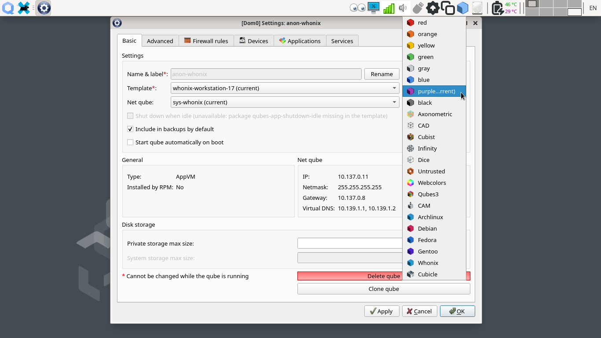
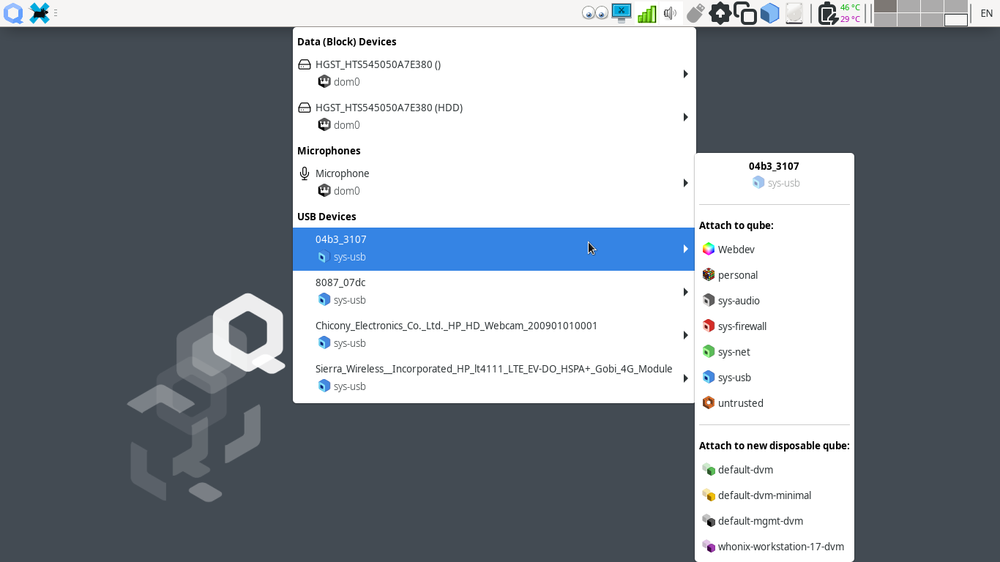
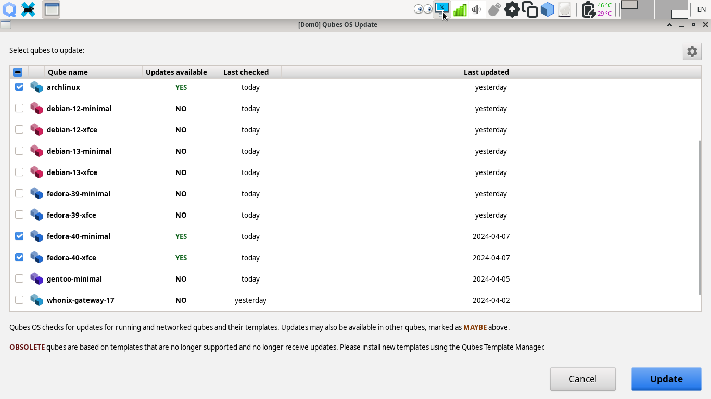
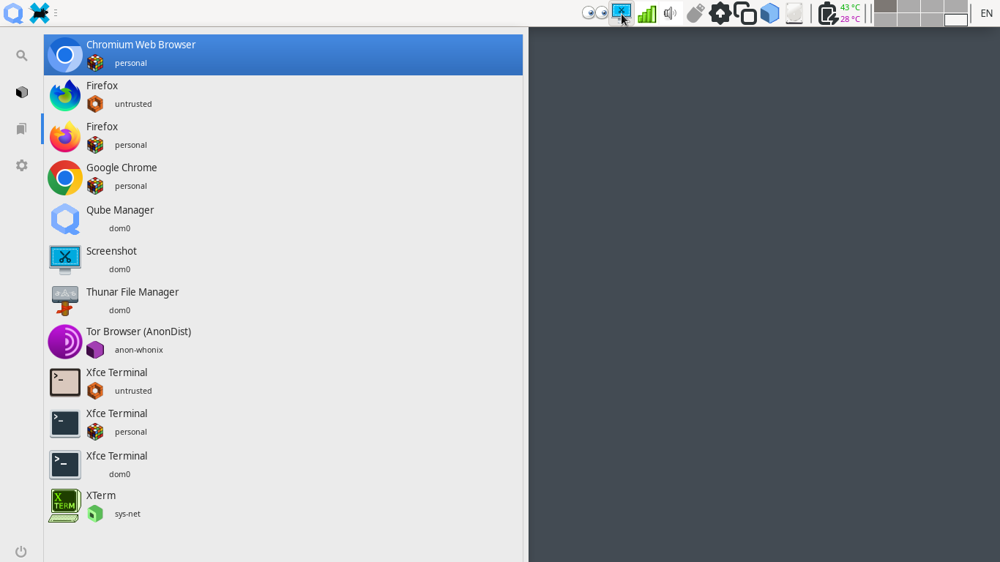
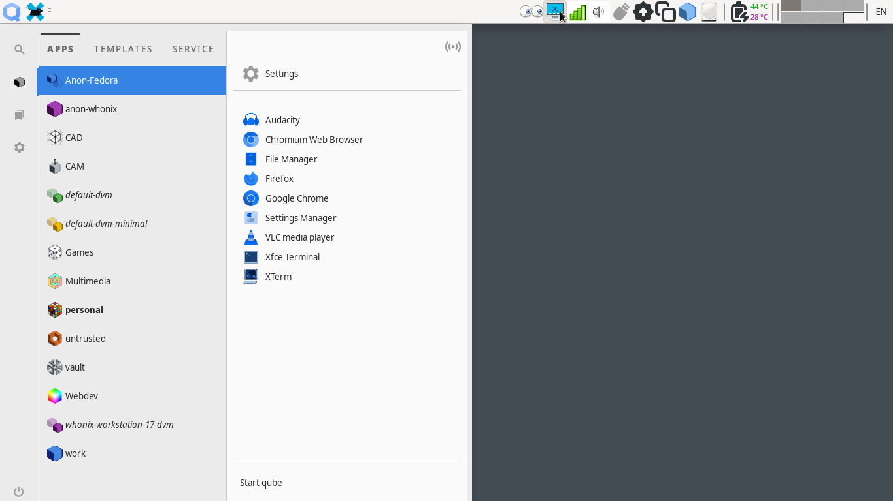
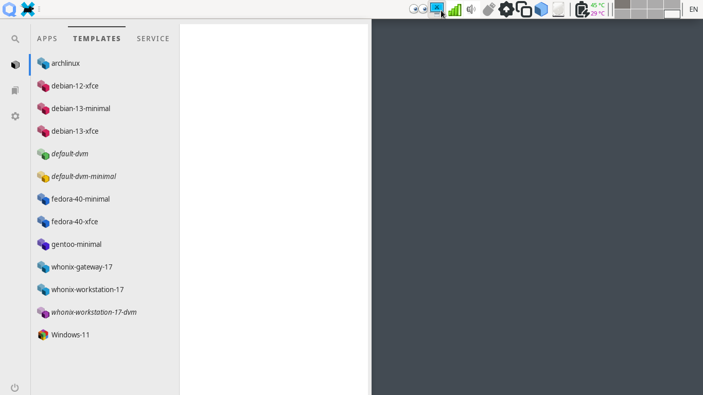
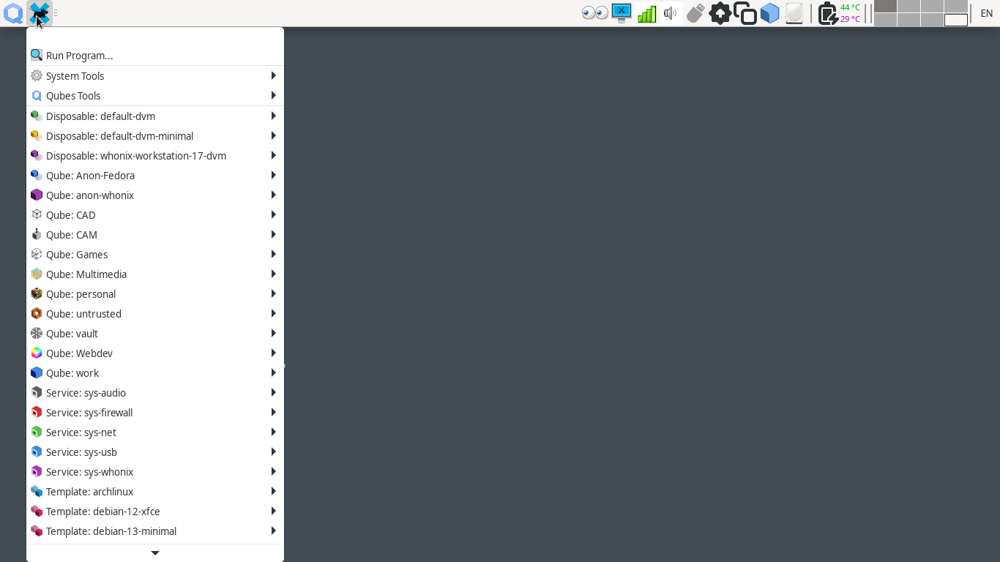

# `qubes-label-tt` notes
A utility to list, create, get value, get index or remove Qubes OS labels.
It could use default Vector Perfect Qute Sushi icons for new labels and tint 
them, or user could provide their own custom SVG icons for all or some classes
of VMs. A fairly self explanatory command help is at the top of the script. A
set of Qubes themed icons suitable to be used with this tool are included in
[icons](../icons) sub-directory.

## Internals & Features
This tool is fully modular. Most of operations are wrapped in individual
functions. It entirely works in user-space. Icons for new labels are copied to
`~/.local/share/icons/hicolor/` directory. No need for _sudo_ or _root_
privileges. _RGB-to-HSV, HSV-to-RGB_ and _tinting_ are implemented in pure bash
without any floating point calculations. Most probably only of its kind.

## Installation & Removal
To install the tool at your `~/bin` directory, run this command in the current
directory
```
make install
```
To remove it from your system, run this command in the current directory:
```
make remove
```

## Limitations & Issues
These are the current known limitation with this tool or Qubes OS custom labels:
- Rewrite of the project in Python is necessary, keeping its skeleton, function
and syntax but implement it in Python. This would be absolutely essential if it
is going to be submitted as a community package. Few days work.
- Installation & removal of icons via
[xdg-icon-resource(1)](https://linux.die.net/man/1/xdg-icon-resource)
 is necessary. As it is the right way. Proper study of XDG documents is needed.
- Proper unit tests should be written.
- Only tested on Qubes OS 4.2.1. Backward compatibility is unknown.
- Qubes OS [Admin API](https://www.qubes-os.org/doc/admin-api/) calls are made
via `qubesd-query(1)` which is only available in dom0. I did not manage to find
proper package to install it in a GUIVM. Full rewrite in Python or a Python 
bridge should be possible to resolve this issue..
- RGB-to-HSV and back might be 0.4% off due to Bash's integer-only calculation.
- Color presentation via `--ANSI` option is limited to 256 colors of 
xfce4-terminal or xterm.
- Qubes OS Update GUI (`qubes-update-gui`) Qube name text render for custom
labels is wrong in light themes. It is because of hard-coded CSS tags. Add this
line to `/usr/lib/python3.11/site-packages/qui/styles/qubes-colors-light.css`
to fix the issue:
```
label {color: #000000;}
```
or run:
```
sudo make fixupdategui
```
- Use of (-) character in labels crashes some of the GUI tools. For example
[this line](https://github.com/QubesOS/qubes-manager/blob/main/qubesmanager/qube_manager.py#L479)
in Qubes Manager should be:
```
vmtype, vmcolor = vm.icon.split("-", 1)
```
- User custom labels might conflict with future official labels. Maybe adding
a suffix (e.g., custom, user, my, ...) to label name would mitigate conflicts.
- Maximum allowed label length is not specified by the API. Valid characters are
not specified by the API documentation. It is not clear if the tool should
perform text sanitization or API will do it.
- It is not clear if deleting of standard labels should be allowed or
disallowed. Currently only removal of 'red' label is prohibited.
- A GUI version of this tool might be necessary for non-tech-savvy users.

## Credits
[Qubes-Scripts](https://github.com/Willy-JL/Qubes-Scripts)
has been an inspiration for this tool.

## Screenshots
Qubes Manager & Qubes Domains after adding some of my personal labels:



Qubes Label Picker look and feel:



Qubes Devices Systray App:



Qubes Update after applying the CSS patch:



Qubes Appmenu Favorite tab (including some other Tweak Tool effects):



Qubes Appmenu Apps tab:



Qubes Appmenu Template tab. Mostly tinted Qute Sushi icons for new labels:



Traditional Orthodox XFCE Appmenu:


