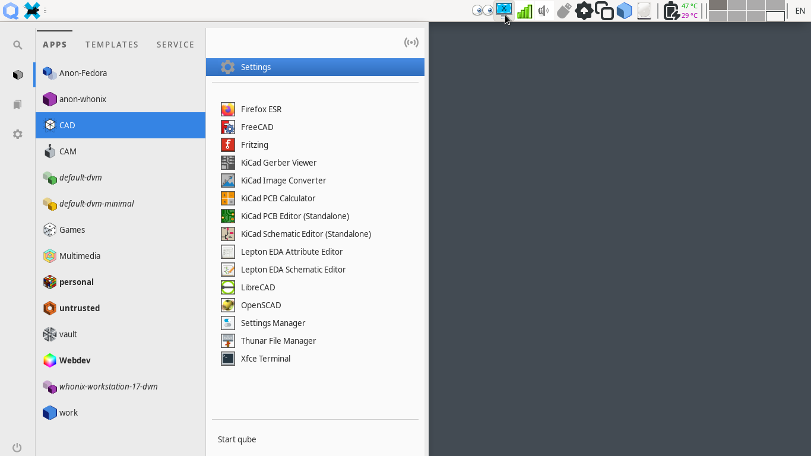
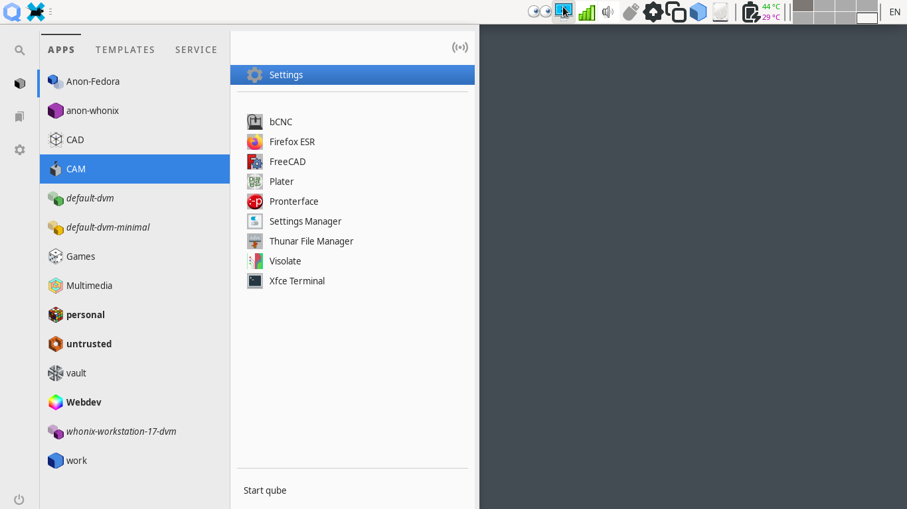
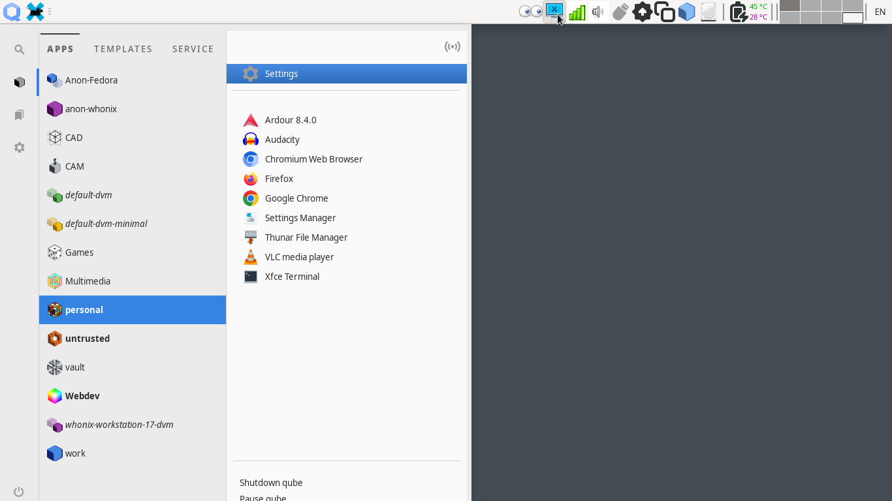
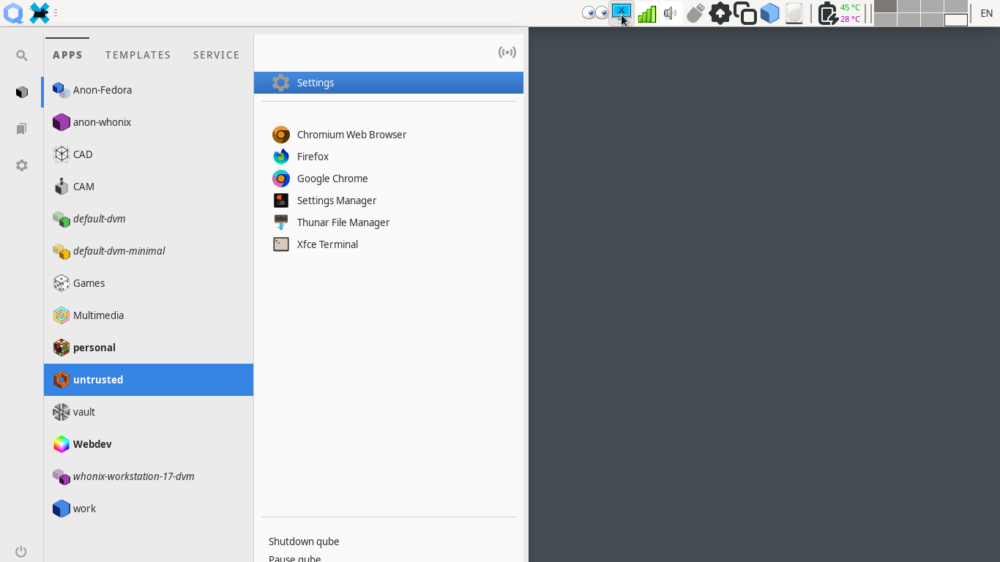
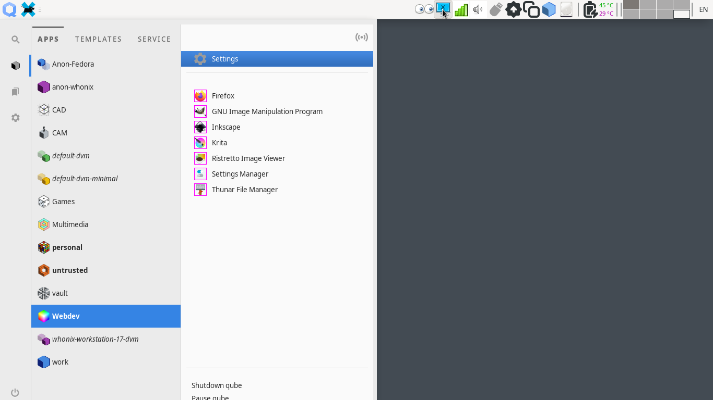
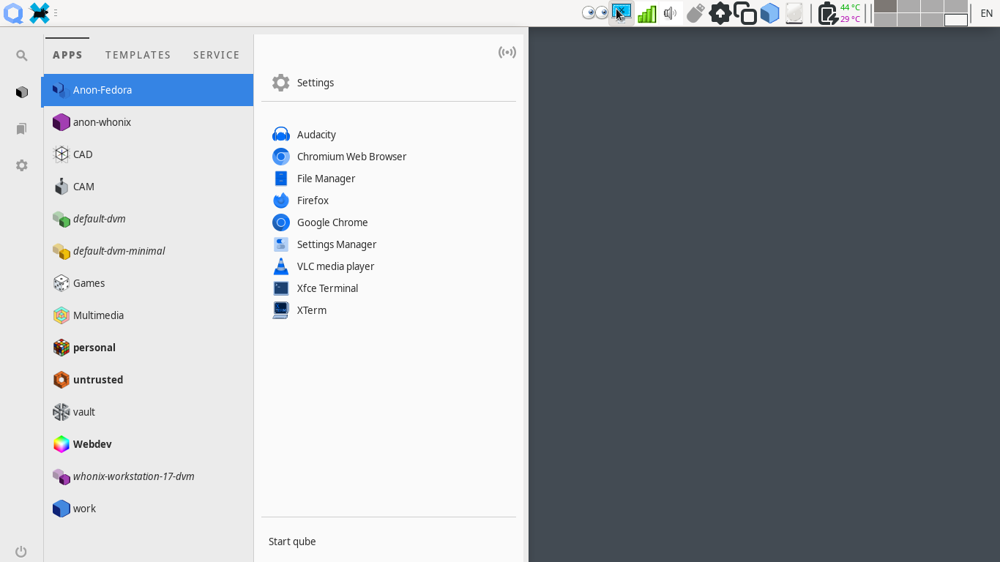
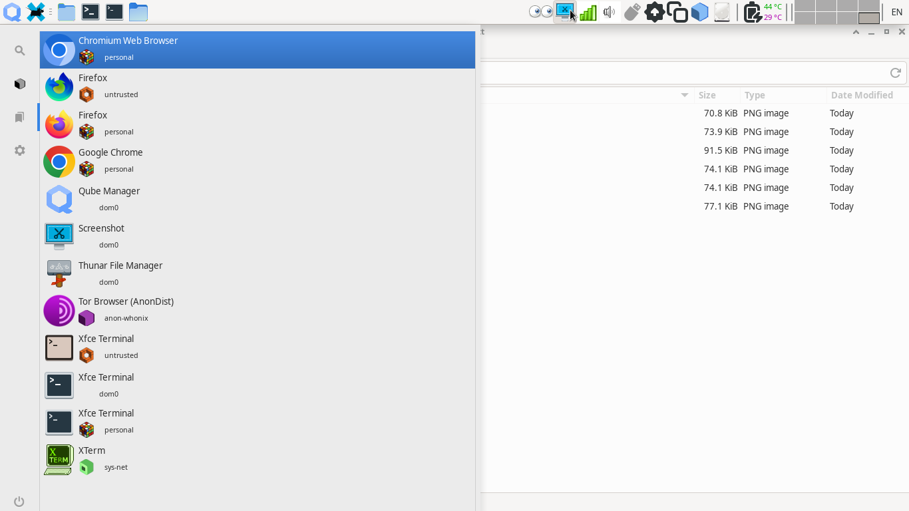

# `qubesappmenustt` & `qvm-appmenus-tt` notes
Custom effects for Qubes OS Appmenu icons. Provided effects are explained at 
[qubesimgconvertertt](/qubesimgconvertertt) page which is a dependency of the
above tools. Screenshots and use cases of effects are included at the bottom of
this page.

## Internals & Features
The `qubesappmenustt` library is derived from the original
[qubesappmenus](https://github.com/QubesOS/qubes-desktop-linux-common/tree/main/qubesappmenus)
library and __Appmenus__ class. The only derived function is the 
__appicons_create__ and the rest are inherited. The library checks for an 
special *ttfilter* VM feature and uses it to determine the custom effect per VM.
If the __ttfilter__ key is not present or is invalid, the default tint effect
will be applied.

`qvm-appmenus-tt` is the front end to the qubesappmenustt library. It is derived
from the original __qubesappmenus__ code. It could be used as a drop-in
replacement to __qvm-appmenus__, or could be run independently as follow:

```
qvm-features VMNAME ttfilter <tint|overlay|thin-border|thick-border|untouched|invert|mirror|flip>
qvm-appmenus-tt VMNAME --update --force
```
Updating all Appmenu Tweak Tool effect might be necessary after each template
update, new package installation etc. It takes 22.875s or my Intel Gen 4 testing
laptop.
```
qvm-appmenus-tt --all --update --force
```

## Installation & Removal
To install the library & tool at your __~/.local/lib__ & __~/bin__ directories, 
run this command in the current directory:
```
make install
```
To remove them from your system, run this command in the current directory:
```
make remove
```

## Limitations, Issues & ToDo
These are the currently known limitation with the tool & library:
- Every time user updates their template or adds/removes a single App to 
VM's AppMenu, the original __qubesappmenus__ & __qvm-appmenus__ are invoked,
effectively overwriting Tweak Tool custom icon effects. Proper study of AppMenus
service is needed to determine if it would be possible to replace it with our
own service or to use a hook to run our tool after it. Ideally all of this
should happen in user space without any requirement for root privileges or sudo.
- Launching applications in user defined Workspace/VM could be added to this
tool. This could be done via customizing .desktop files __Exec=__ entry, using
`wmctrl(1)` utility. Or an alternative to *qvm-run* could be written for this
purpose.

## Screenshots

CAD AppVM with custom label & icons with black thin-border effect:



CAM AppVM with custom label & icons with overlay on gray color effect:



My highly trusted personal VM with untouched Icons:



Invert paranoid icons looks nice for untrusted AppVM:



Wedev AppVM with colorful custom label and bright colored thin-border icons:



The default tint effect:



Appmenu favorite tab after all of these effects:


