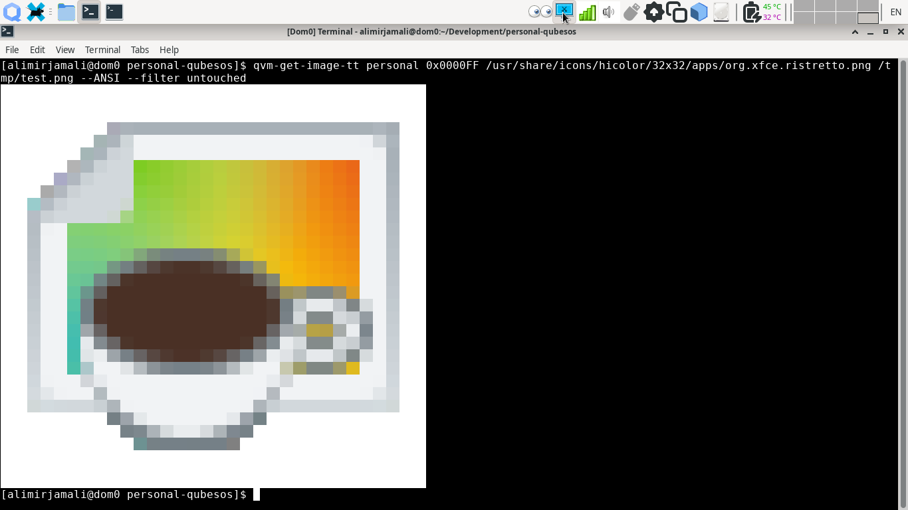
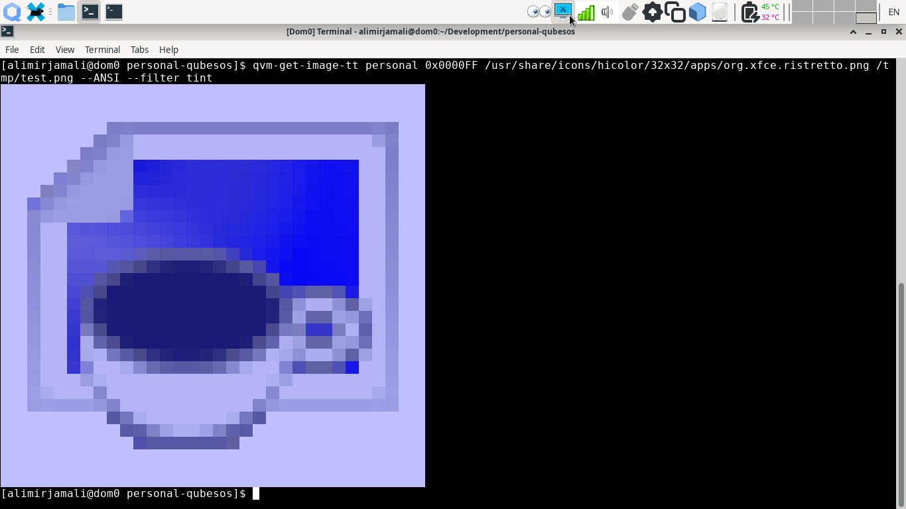
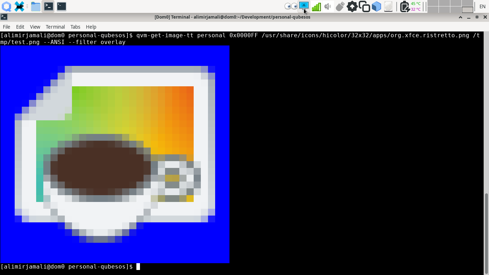
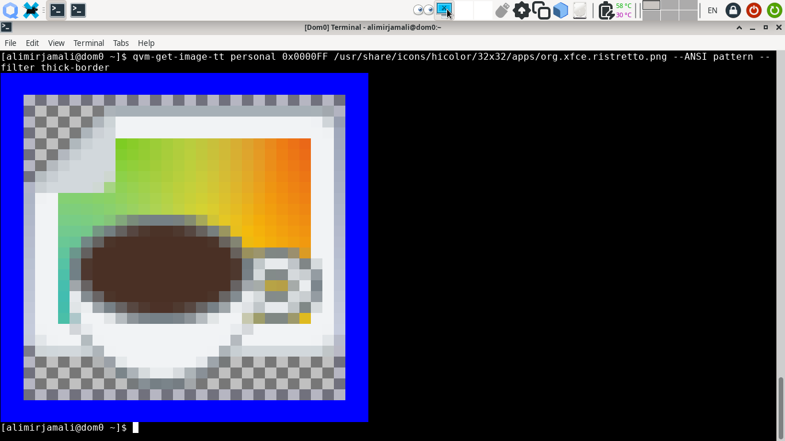
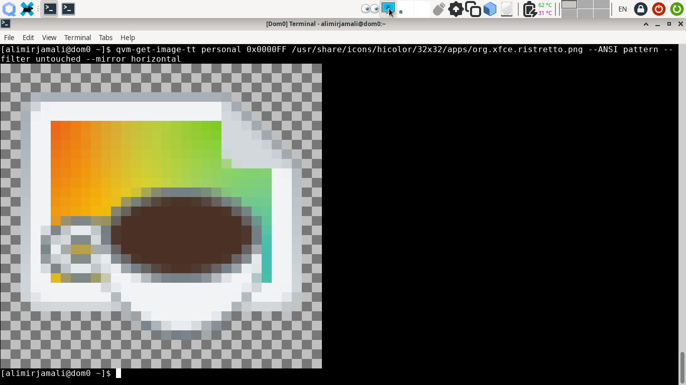
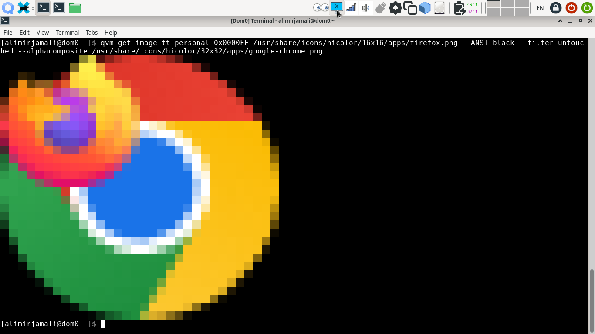
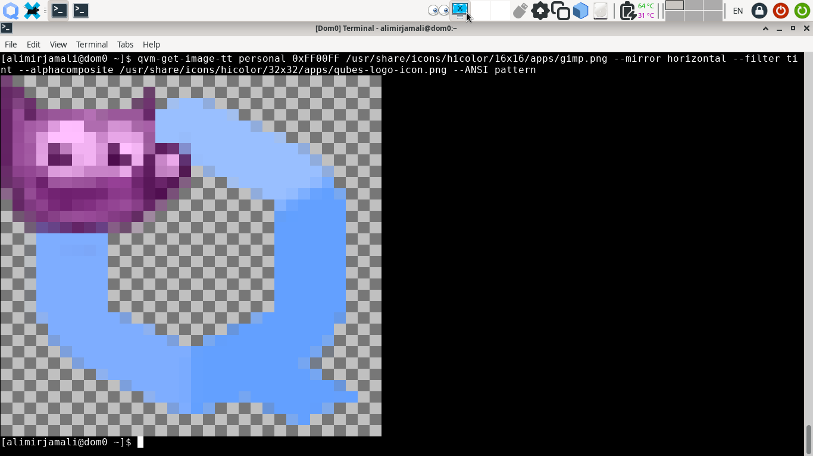

# `qubesimgconvertertt` & `qvm-get-image-tt` notes
Library and Utility for custom effects of Qubes OS VM icons. Provided effects 
are **overlay, thin-border, thick-border** as well as the standard _tint_ which
use the label color for their effects. Special filters of **untouched, invert,
mirror, flip** are also available. [Screenshots](#screenshots--demo) of Tweak
Tools effects are at the bottom of this page. Real-life use cases are 
documented and explained in [qubesappmenustt](/qubesappmenustt) and
[window-icon-updater-tt](/window-icon-updater-tt) sub-directories.

### Internals & Features
The `qubesimgconvertertt` library is derived from the original
[qubesimgconverter](https://github.com/QubesOS/qubes-linux-utils/tree/main/imgconverter/qubesimgconverter)
library and _Image_ class. Effects are written as individual methods.

The `qvm-get-image-tt` is a utility which could be used as a drop-in replacement
for `qvm-get-tinted-image`. It is based on
[qubes-app-linux-img-converter](https://github.com/QubesOS/qubes-app-linux-img-converter)
utilities with additional _--filter_ & _--mirror_ options which allows user to
select the desired filter. An extra _--ANSI_ function is provided to quickly
check the results directly within the terminal. A special _--alphacomposite_
option is available which allows composition of one image on another. By default,
`qvm-get-image-tt` checks for an special **ttfilter** VM feature and uses it to
determine the current Tweak Tool filter effect per VM. If the _ttfilter_ key is
not present or is invalid, the default tint effect will be applied. To change
the Tweak Tool filter effect of any VM:

```
qvm-features VMNAME ttfilter <tint|overlay|thin-border|thick-border|untouched|invert|mirror|flip>
```

### Installation & Removal
To install the library & tool at your _~/.local/lib_ & _~/bin_ directories, 
run this command in the current directory:
```
make install
```
The policy file to allow _VM1_ to read images from _VM2_. Both VMs could be
disposable and do not need network connection. It is better to use an XFCE or
GNOME based template to have some Images in VM2 and an image viewer application
in VM2
```
admin.vm.List		*	VM1 VM1	 allow target=dom0
admin.vm.List		*	VM1 VM2	 allow target=dom0
admin.vm.List		*	VM1 @adminvm	 allow target=dom0
qubes.GetImageRGBA	*	VM1 VM2	 allow target=VM2
```

To remove them from your system, run this command in the current directory:
```
make remove
```

### Limitations, Issues & ToDo
These are the current known limitation with the tool & library:
- Performance of the effects could be evaluated via the provided `benchmark.py`:
```
vendor_id	 :  GenuineIntel
model name	 :  Intel(R) Core(TM) i5-4300U CPU @ 1.90GHz
cpu MHz		 :  2494.228
cpu cores	 :  2
Performing benchmarks on a 32x32 image for 10000 times...
Untouched Image (no effect):  0.0008901969995349646
The original tint effect:     1.021499689999473
Alpha Compositor:             2.7155920950026484
Overlay Effect:               0.8482616449982743
Border Effects:               3.3331768399984867
Invert Effect:                0.30216739200113807
Mirror Effect:                0.30468669399851933
```
- Performance of the border effects is nearly 3 times slower than tint. This is
because of the Anti-Aliased Alpha Compositor implementation. Considering the
superior quality, it is well worth it as 1 pixel borders are barely
distinguishable. Individual implementation of _thick-border_ with integer based
calculation would improve its speed. It is already darn fast on my 10 year old
_i5-4300U_ test machine.
- Original unit tests are performed on a 2x2 image. Mostly done from security
perspective. Not suitable for most of the Tweak Tool effects. Individual unit
tests are developed to represent effects via ANSI output.
- Currently tested only on Qubes OS 4.2.1
- Theoretically it should be possible to install the library and utility within
any Qube if the dependency (`python3-qubesimgconverter`) is installed in its
template. And if the necessary policies to allow it to retrieve Image from
destination VM(s) is granted. This is yet to be tested and documented.
- It should be noted that the current _systray_ effects are not implemented via
the `qubesimgconverter` library but are rather written in C language and a part of
[qubes-gui-daemon](https://github.com/QubesOS/qubes-gui-daemon/tree/main/gui-daemon)
repository. Further study of its mechanism is needed. Github Issue
[#2846](https://github.com/QubesOS/qubes-issues/issues/2846) provides better
context.

### Credits
- Inspirational piece of code 
[by Mark Setchell on Stackoverflow](https://stackoverflow.com/questions/60398939/how-to-do-alpha-compositing-with-a-list-of-rgba-data-in-numpy-arrays#answer-60401248)
on [Alpha Compositing](https://en.wikipedia.org/wiki/Alpha_compositing).

### Screenshots & Demo
The untouched 32x32 pixel Icon of Ristretto. ANSI color representation of
output is printed to the terminal via __--ANSI__ option.
```
qvm-get-image-tt personal 0x0000FF /usr/share/icons/hicolor/32x32/apps/org.xfce.ristretto.png --ANSI pattern --filter untouched
```


The default __Tint__ effect. Original work by Wojciech Porczyk et. al.
```
qvm-get-image-tt personal 0x0000FF /usr/share/icons/hicolor/32x32/apps/org.xfce.ristretto.png --ANSI pattern --filter tint
```


Overlaying image on the provided color using images Alpha channel.
```
qvm-get-image-tt personal 0x0000FF /usr/share/icons/hicolor/32x32/apps/org.xfce.ristretto.png --ANSI pattern --filter overlay
```


Thin and Thick borders. Bordering supports percentage of image instead of fixed
pixel count. This allows consistent results on HiDPI displays. The anti-aliased 
1.536 pixel width thin-border for 32x32 icons is much more distinguishable and
comfortable than the fixed 1 pixel width.
```
qvm-get-image-tt personal 0x0000FF /usr/share/icons/hicolor/32x32/apps/org.xfce.ristretto.png --ANSI pattern --filter thin-border
```

```
qvm-get-image-tt personal 0x0000FF /usr/share/icons/hicolor/32x32/apps/org.xfce.ristretto.png --ANSI pattern --filter thick-border
```


Special invert effect is very useful for __untrusted__ VM. As it implies a
paranoid effect.
```
qvm-get-image-tt personal 0x0000FF /usr/share/icons/hicolor/32x32/apps/org.xfce.ristretto.png --ANSI pattern --filter invert
```


Mirrored or flipped icons are not that much usable as in practice, our brains do
not register them well as distinguishable effects.
```
qvm-get-image-tt personal 0x0000FF /usr/share/icons/hicolor/32x32/apps/org.xfce.ristretto.png --ANSI pattern --filter untouched --mirror horizontal
```


Alpha Compositing 16x16 pixel Firefox icon on Chrome icon. This effect could be
useful for compositing qube icon on application icons. It is necessary to
consult professional UI/UX experts for better feedback.
```
qvm-get-image-tt personal 0x0000FF /usr/share/icons/hicolor/16x16/apps/firefox.png --ANSI pattern --filter untouched --alphacomposite /usr/share/icons/hicolor/32x32/apps/google-chrome.png
```


Mixed effects are feasible. Here is a mirrored Wilber (GIMP’s macot), tinted
with Magenta, finally composited on Qubes OS icon.
```
qvm-get-image-tt personal 0xFF00FF /usr/share/icons/hicolor/16x16/apps/gimp.png --mirror horizontal --filter tint --alphacomposite /usr/share/icons/hicolor/32x32/apps/qubes-logo-icon.png --ANSI pattern
```

