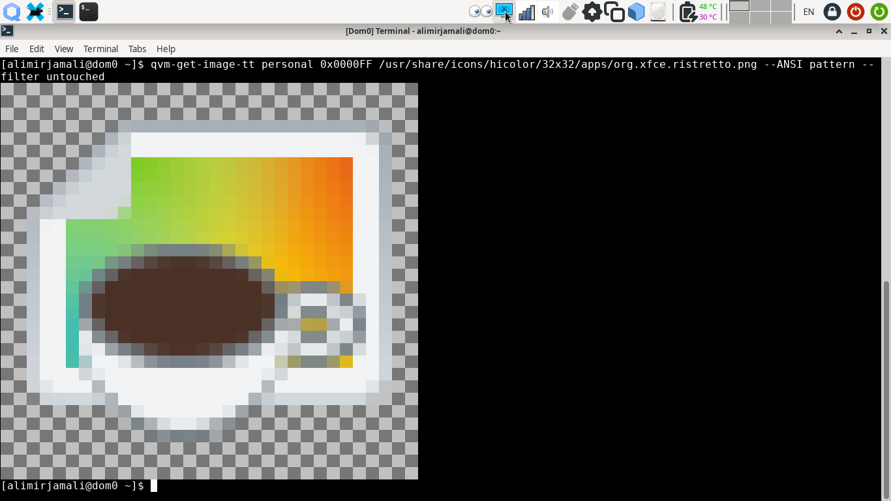
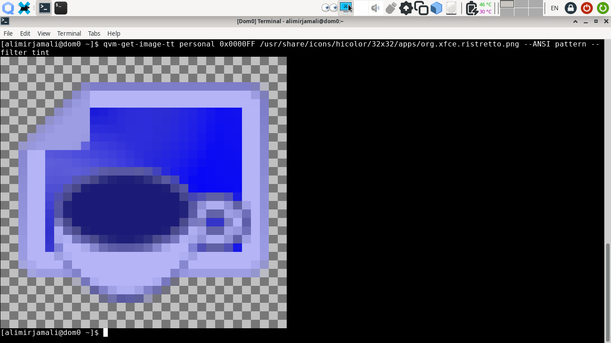
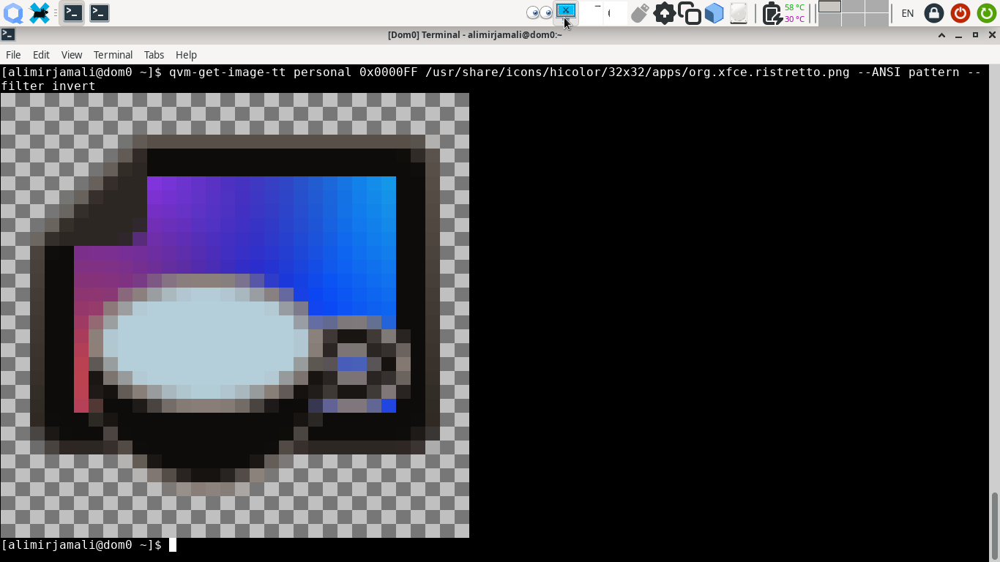

# `qubesimgconvertertt` & `qvm-get-image-tt` notes
Custom effects for Qubes OS application icons. Provided effects are **overlay, 
thin-border, thick-border** as well as the standard _tint_ which use the label 
color for their effects. Special filters of **untouched, invert, mirror, flip**
are also available. Screenshot of the effects are at the bottom of this page.
Real-life use cases are documented and explained in
[qubesappmenustt](/qubesappmenustt) and
[window-icon-updater-tt](/window-icon-updater-tt) directories.

### Internals & Features
The `qubesimgconvertertt` library is derived from the original
[qubesimgconverter](https://github.com/QubesOS/qubes-linux-utils/tree/main/imgconverter/qubesimgconverter)
library and _Image_ class. Effects are written as individual methods.

The `qvm-get-image-tt` is an independent utility which could be used as a
drop-in replacement for `qvm-get-image` or `qvm-get-tinted-image`. Based on
[qubes-app-linux-img-converter](https://github.com/QubesOS/qubes-app-linux-img-converter)
utilities with additional _--filter_ & _--mirror_ options which allows user to
select the desired filter. An extra _--ANSI_ function is provided to quickly
check the results directly within the terminal. A special _--alphacomposite_
option is available which allows composition of one image on another. By default,
`qvm-get-image-tt` checks for an special **ttfilter** VM feature and uses it to
determine the current Tweak Tool filter effect per VM. If the _ttfilter_ key is
not present or is invalid, the default tint effect will be applied. To change
the Tweak Tool filter effect of any VM:

```
qvm-features VMNAME ttfilter <tint|overlay|thin-border|thick-border|untouched|invert|mirror|flip>
```

### Installation & Removal
To install the library & tool at your _~/.local/lib_ & _~/bin_ directories, 
run this command in the current directory:
```
make install
```
To remove them from your system, run this command in the current directory:
```
make remove
```

### Limitations, Issues & ToDo
These are the current known limitation with the tool & library:
- It should be noted that the current _systray_ effects are not implemented via
the `qubesimgconverter` library but are rather written in C language and a part of
[qubes-gui-daemon](https://github.com/QubesOS/qubes-gui-daemon/tree/main/gui-daemon)
repository. Further study of its mechanism is needed.
- Performance of the Tweak Tool effects are not evaluated and compared with the
default tint. They are already fast but there is always room for improvements.
- Test Units should be added.
- Currently tested only on Qubes OS 4.2.1

### Credits
- Inspirational piece of code 
[by Mark Setchell on Stackoverflow](https://stackoverflow.com/questions/60398939/how-to-do-alpha-compositing-with-a-list-of-rgba-data-in-numpy-arrays#answer-60401248)
on [Alpha Compositing](https://en.wikipedia.org/wiki/Alpha_compositing).

### Screenshots & Demo
The untouched 32x32 pixel Icon of Ristretto. ANSI color representation of
output is printed to the terminal via __--ANSI__ option.



The default __Tint__ effect. Original work by Wojciech Porczyk and others.



Overlaying image on provided color using its Alpha channel.


Thin and Thick borders. Bordering supports percentage of image instead of fixed
pixel count. This allows consistent results on HiDPI displays. The anti-aliased 
1.5 pixel width thin border for 32x32 icons is much more distinguishable and
comfortable than 1 pixel width.


Special invert effect is very useful for __untrusted__ VM. As it implies a
paranoid effect.



Mirrored or flipped icons are not that much usable as in practice, our brains do
not register them well as distinguishable effects.


Alpha Compositing 16x16 pixel Firefox icon on Chrome icon. This effect could be
useful for compositing qube icon on application icons. It is necessary to
consult professional UIUX experts for better feedback.


Mixed effects are feasible. Here is a mirrored Wilber (GIMP’s macot), tinted
with Magenta, finally composited on Qubes OS icon.


