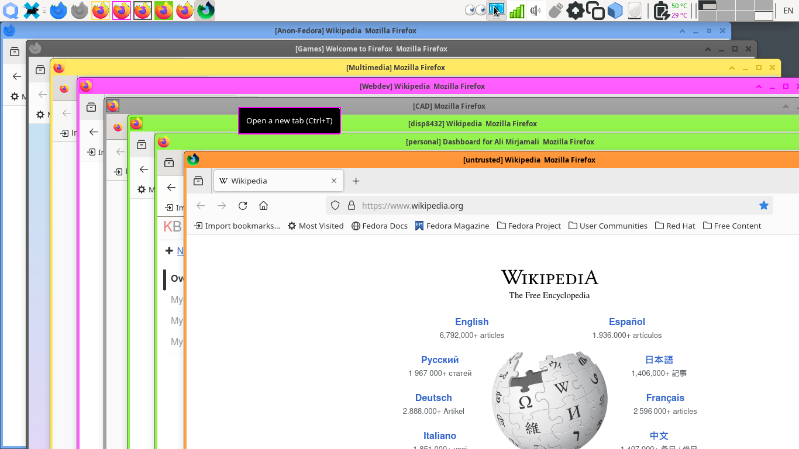

# `icon-receiver-tt` notes
This is a tweaked version of the original
[icon-receiver](https://github.com/QubesOS/qubes-gui-daemon/tree/main/window-icon-updater)
`window-icon-updater` daemon. It will check for *ttfilter* feature tag of the VM
and provides alternative effects to the default tint for running application
icons. Available alternative effects are listed at
[qubesimgconvertertt](/qubesimgconvertertt) page. Screenshot of the result is
at the bottom of this page.

## Internals & Features
Original daemon is suppressed via special XDG .desktop file at
__~/.config/autostart__ and the tweaked daemon is loaded via another .desktop
file. The daemon itself is installed at __~/bin__ directory. It uses the
original __icon-receiver__ like a Python library and overloads the tweaks on top
of it. VM restart is necessary after changing the *ttfilter* feature tag for
changes to take effect.

## Installation & Removal
To install the tool & .desktop files at your __~/bin__ & __~/.config/autostart__
directories, run this command in the current directory:
```
make install
```
To remove them from your system, run this command in the current directory:
```
make remove
```
System restart or login/logoff is necessary to properly reload the icon
receiver daemon.

## Limitations, Issues & ToDo
These are the currently known limitation with the tool & library:
- Daemon does not properly register running VMs after logoff/login. This is a
random behaviour which demands further study.
- Systray icon effects are implemented via other means which demands further
study.

## Screenshots
Firfox icons with different effects, from left to right: Blue tint, Gray tint,
thin-border bright yellowish, thin-border pink, thick border black, overlay on
green, untouched, inverted.


